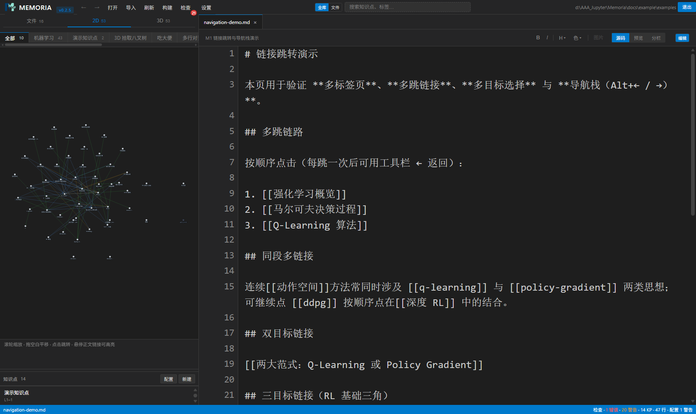
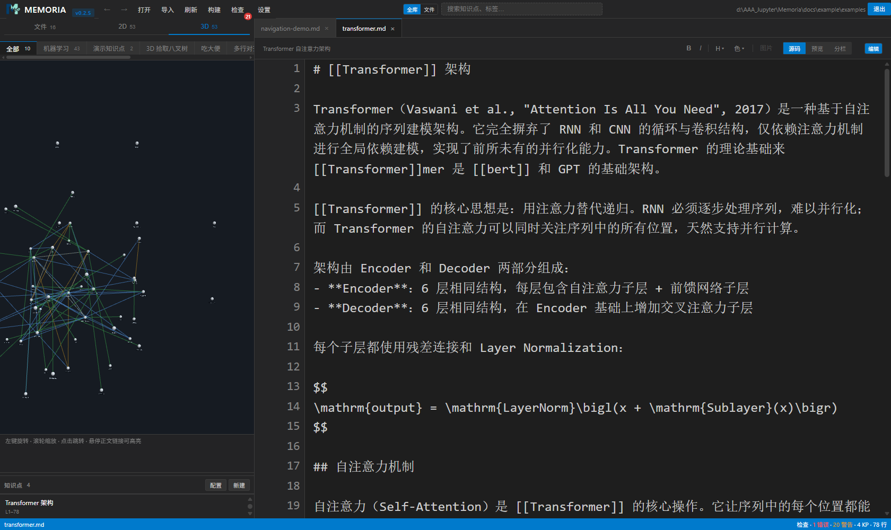
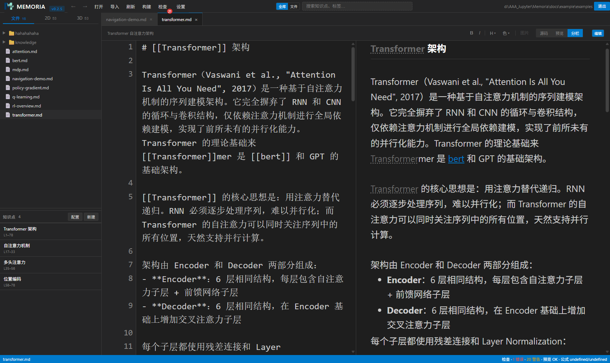
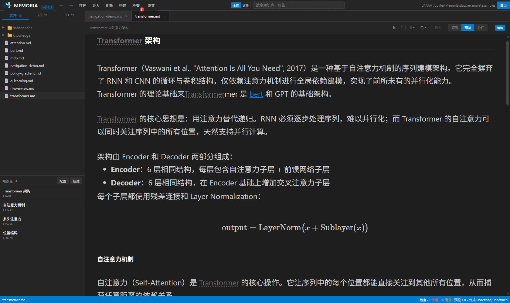
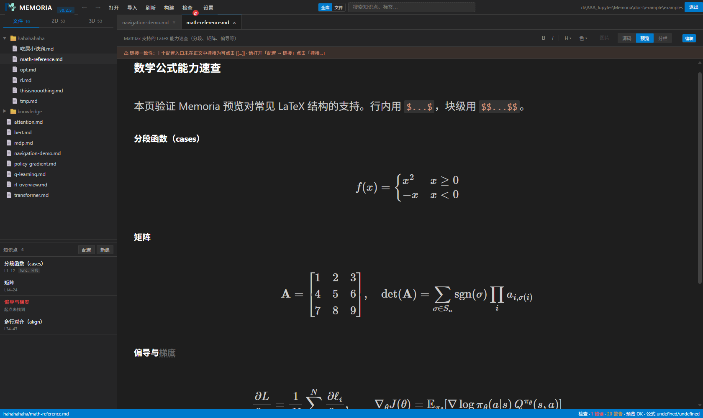
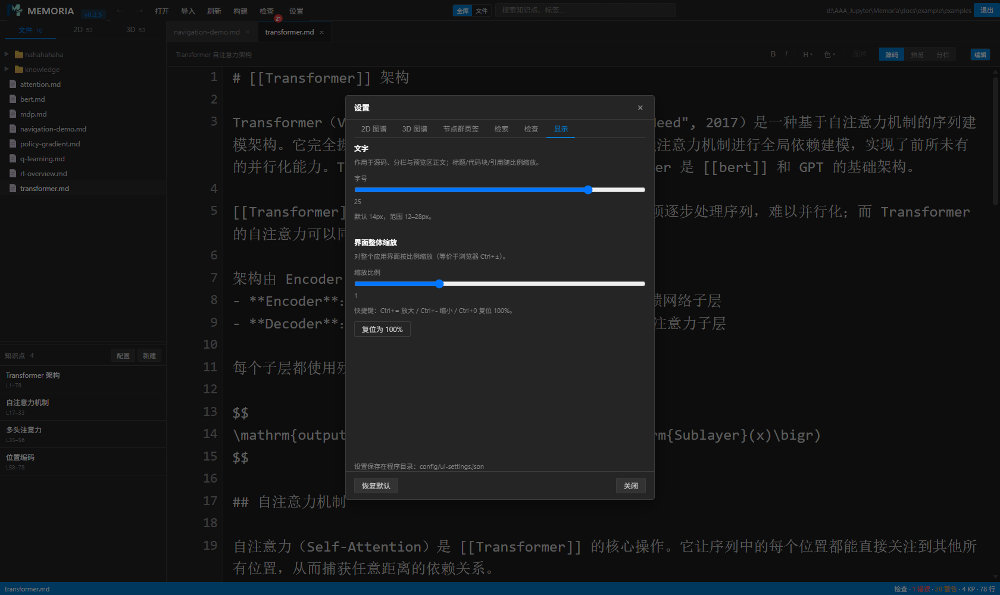
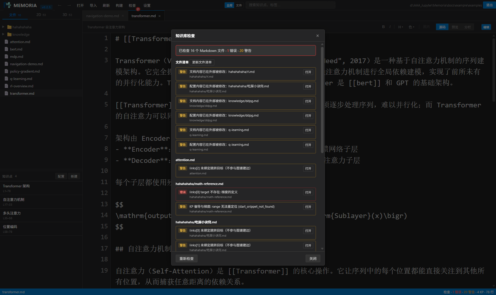
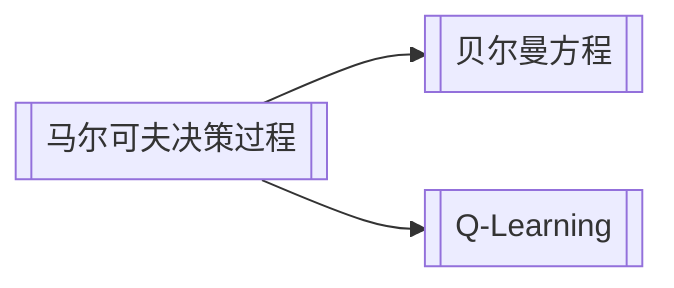

# Memoria — 本地知识图谱 IDE

> **把 Markdown 笔记变成一张可跳转、可检索、可可视化的知识网络。**

[](https://www.python.org/)
[](https://github.com/)
[](LICENSE)
[](src/memoria/__version__.py)
[](README.en.md)

**Memoria** 是一款面向个人知识库的本地知识图谱 IDE：Markdown 笔记 + 双向链接（`[[]]`）语义、荧光笔与富文本标记、LaTeX 公式、Mermaid 图表、2D/3D 知识图谱，配一个**纯离线**的检索内核。

所有数据都以普通文件保存在你的磁盘上——`.md` 正文 + YAML 元数据。没有账号、没有云同步、没有隐私泄露。打开即用，关闭即走，数据永远属于你。

> 想快速浏览英文介绍？请看 [README.en.md](README.en.md)。

---

## 为什么用 Memoria？

| 传统笔记 | Memoria |
|---------|---------|
| 一篇篇孤立文档，靠文件夹分类 | 文档 + **知识点（Knowledge Points）** + 图谱，任意片段可互相引用 |
| 链接只是跳转，跳完回不来 | **snippet-range 双向链接**：点击跳转 → 源码高亮定位 → 前进/后退导航 |
| 想复习只能重读整篇 | 知识点列表、待确认清单、完整性检查，逐条确认/整批处理 |
| 云端存储，数据不归你 | 纯本地、纯文件，`.md` + `.memoria.yaml`，随时迁移/备份/版本管理 |
| 功能要联网 | 离线分词检索 + 可选语义检索，搜索关键词即点即达 |

---

## 核心功能

### 知识图谱与双向链接

- **Wiki 式链接**：`[[知识点名称]]` 把任意位置的片段连成网络，点击即跳到目标源码片段并高亮定位，支持前进 / 后退浏览历史。
- **2D / 3D 图谱**：侧边栏一键在 2D 与 3D 空间图谱间切换，节点点击跳回原文，图谱分组与构建由「构建」按钮自动同步。
- **snippet-range 精确导航**：链接不再只是一整页，而是定位到文档中的具体行区间。

### 沉浸式书写体验

- **三种视图**：`源码` / `预览` / `分栏`，边写边看；可随时开关「编辑模式」，关闭后可只读浏览。
- **可视化编辑**：像 Word 一样用鼠标**涂抹荧光笔 / 字体颜色 / 加粗斜体**，操作自动回写源码，所见即所得。
- **格式工具条**：加粗、斜体、荧光笔（黄/绿/红/蓝/橙/自定义/双色/命名）、字体色、图片插入，一应俱全。

### 富内容渲染（Markdown+）

- **LaTeX 数学公式**：基于 MathJax，支持行内 `$...$` 与块级 `$$...$$`，覆盖 `cases`、`matrix`、`align`、`mathbb`、`\text` 等常见场景。
- **Mermaid 图表**：流程图、时序图、关系图直接内嵌渲染。
- **图片管理**：本地相对路径 / 网络 URL / 一键复制入库 `.memoria/images`，支持 Lightbox 点击放大、宽高与对齐控制。
- 荧光笔 `[[\h:颜色|文字]]`、字体色 `[[\c:颜色|文字]]`、Markdown 表格、代码块、引用等混合嵌套。

### 知识点管理（你的知识卡片）

- 文档 Front-matter 声明**知识点**（名称、权重、标签），或从正文抽取；左侧「知识点」面板集中管理当前文件的知识点与链接。
- **待确认清单**：检查出未确认 / 悬空的知识点与链接后，可**逐条配置确认**，也可一键**全部确认**。
- **完整性检查**：一键扫描全库——悬空链接、缺失知识点、结构不一致一目了然。

### 纯本地离线检索

- 内置**中文分词（jieba）词法检索**，支持全库 / 当前文件两种范围，`Ctrl+K` 快速唤起。
- 可选安装 `sentence-transformers` 语义检索 + 重排融合，构建真正懂语义的本地搜索引擎（可选依赖，不强制）。

### 数据在本地、格式在手中

- 正文为**标准 Markdown 文件**，元数据放在同名 `侧车 .memoria.yaml`，与正文并列或集中存放均可。
- 知识库是一个普通文件夹：`.md` + `.memoria/`（索引缓存、图片、manifest），可以直接放进 Git、NAS、网盘，随时搬家。

---

## 界面预览

工作区（2D 图谱视图）：侧栏顶部分页可切换 文件树 / 2D / 3D；图谱面板可拖拽加宽、按分组查看。下方为知识点列表，右侧编辑当前文档。



3D 知识图谱：滚轮缩放、左键旋转，节点点击跳回原文。



分栏模式：左侧源码、右侧实时渲染预览，光标同步。



渲染预览：荧光笔、Wiki 链接、表格、代码块混合排版。



数学公式：MathJax 渲染的 LaTeX 公式（行内 / 块级 / cases / align）。



显示设置与完整性检查：字号 / 界面缩放可调；一键扫描知识库结构问题。





---

## 快速开始

> 前置条件：Python ≥ 3.11、Windows（桌面壳基于 pywebview / Chromium）。

```powershell
# 1. 安装（开发模式，含 pytest）
pip install -e ".[dev]"

# 2. 启动桌面应用
python app.py
# 或开发态（带 DevTools + 无边框窗口）
.\scripts\run_dev.ps1
```

打开后点击「打开知识库」，选择任意 Markdown 目录即可开始；想先体验，可以直接打开仓库内示例知识库：

```
docs\example\examples\           # RL / 大模型主题示例（53 节点、链接与图谱齐全）
docs\example\rich-content-test\  # 富内容语法样例（公式 / 图片 / Mermaid / 荧光笔）
```

需要离线打包成独立 exe？运行 `.\packaging\build_release.cmd`，产物在 `Package\Memoria.exe`。

---

## 语法速览

Memoria 兼容标准 Markdown，并在其上扩展了知识链接与富标记：

````markdown
# 我的笔记

## Wiki 双向链接
[[Transformer 架构]] 是一篇值得反复阅读的文章。

## 荧光笔 / 字体色
这是[[\h:yellow|需要背下来的重点]]，那段[[\c:red|必须纠错的结论]]。
双色荧光笔：[[\h:green:blue|绿底蓝字]]

## 数学公式（MathJax）
行内公式 $E = mc^2$，块级公式：

$$
\mathrm{Attention}(Q,K,V)=\mathrm{softmax}\!\left(\frac{QK^\top}{\sqrt{d_k}}\right)V
$$

## 图片（本地 / 网络 / Lightbox）


## Mermaid 图

````

详见 [docs/reference/preview-formats.md](docs/reference/preview-formats.md)（渲染格式与样式说明）、[docs/conventions/markdown-form-std.md](docs/conventions/markdown-form-std.md)（语法规范）。

---

## 技术架构

| 层 | 技术 | 说明 |
|----|------|------|
| 语言 | **Python ≥ 3.11** | `src` layout，`pyproject.toml` 管理 |
| 桌面壳 | **pywebview**（Chromium），pyqt6 可选 | `MEMORIA_SHELL` 环境变量切换 |
| Web 服务 | **bottle** | 静态资源 + `/files/` 知识库文件路由（防目录穿越）+ `/rpc` API 桥 |
| 前端 | **原生 JS（零框架）** | `parser.js` 编译为 AST → `renderer.js` 渲染 DOM；编辑后回写源码重编译 |
| 渲染库 | marked / **MathJax** / **mermaid** / **three.js** | Markdown、公式、图表、3D 图谱 |
| 存储 | 文件系统 + YAML | 侧车 `.memoria.yaml` + `.memoria/` 元数据目录（索引 / 图片 / manifest） |
| 检索 | jieba 词法；可选 sentence-transformers / pypinyin | 全库语义检索与重排为可选依赖 |

**前端数据流**：`源码 → parser.js（AST）→ renderer.js（DOM）→ 预览`；`edit-handler.js` 把可视化编辑写回源码并触发重编译，保证源码与预览永远一致。

---

## 文档与 AI 协作

Memoria 的文档体系专为人机协作设计：每个一级目录顶部有 `README.md` 说明职责，契约性规范集中在 `docs/conventions/`。

- 接入指南（先读）：[AGENT.md](AGENT.md)
- 文档中心：[docs/README.md](docs/README.md)（含目录导航）
- 架构说明：[docs/reference/architecture.md](docs/reference/architecture.md)、[docs/design/system-design.md](docs/design/system-design.md)
- 设计里程碑：[docs/design/designV0.md](docs/design/designV0.md)
- 版本号唯一事实源：[src/memoria/\_\_version\_\_.py](src/memoria/__version__.py)（当前 **0.2.5**）

---

## 项目结构

```
├── src/            # 源码（Python 包 + 前端静态资源）   → src/README.md
├── tests/          # 单元/集成测试（pytest）            → tests/README.md
├── docs/           # 文档中心（规范/设计/指南/示例）     → docs/README.md
├── scripts/        # 开发者工具（启动/基准）             → scripts/README.md
├── packaging/      # 打包发布（build_release.cmd → Package/）→ packaging/README.md
├── resources/      # 应用资源（图标）                   → resources/README.md
├── benchmarks/     # 检索评估数据与结果                 → benchmarks/README.md
├── config/         # 程序配置（ui-settings.json）       → config/README.md
└── app.py          # 源码运行入口
```

---

## 路线图

- **已完成（0.x）**：snippet-range 双向链接与跳转高亮、知识点 / 侧车 YAML 元数据、2D/3D 图谱、富内容渲染（公式 / Mermaid / 荧光笔 / 图片）、待确认清单与完整性检查、平面文件批量导入（含冲突报告）、离线检索内核。
- **规划中**：检索评估基准完善、语义检索增强、更多桌面壳 / 平台支持。

详见 [docs/design/designV0.md](docs/design/designV0.md)。

---

## License

[MIT](LICENSE) © 2026 FreshTim
