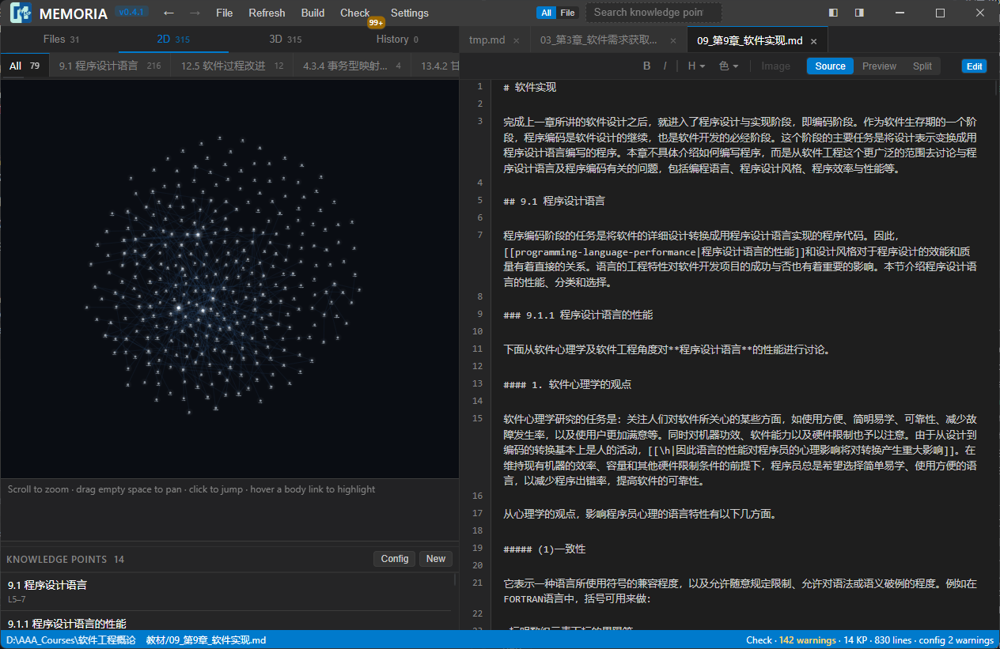
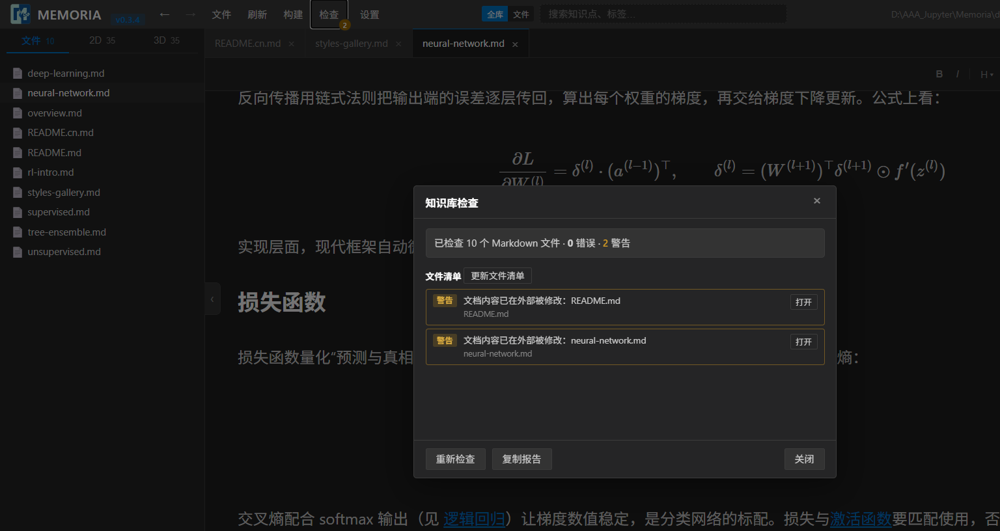
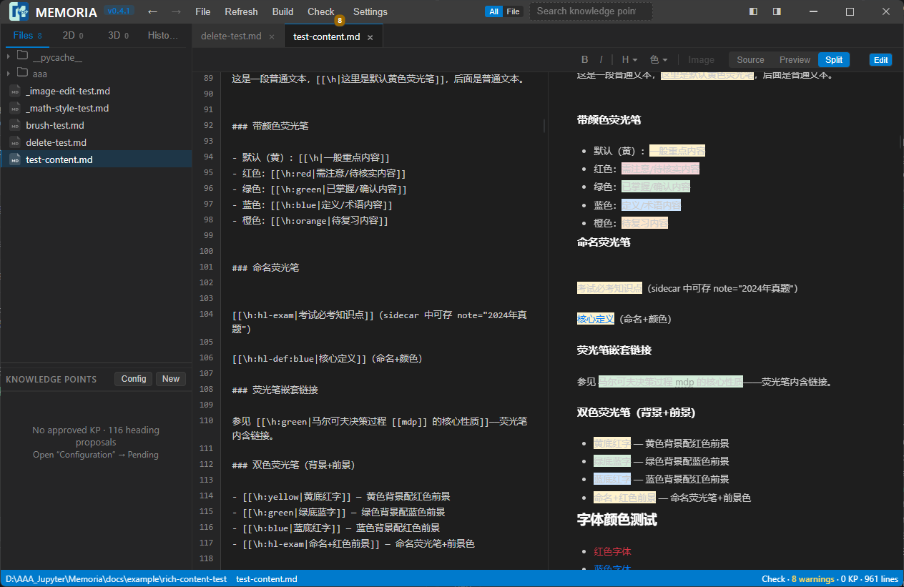
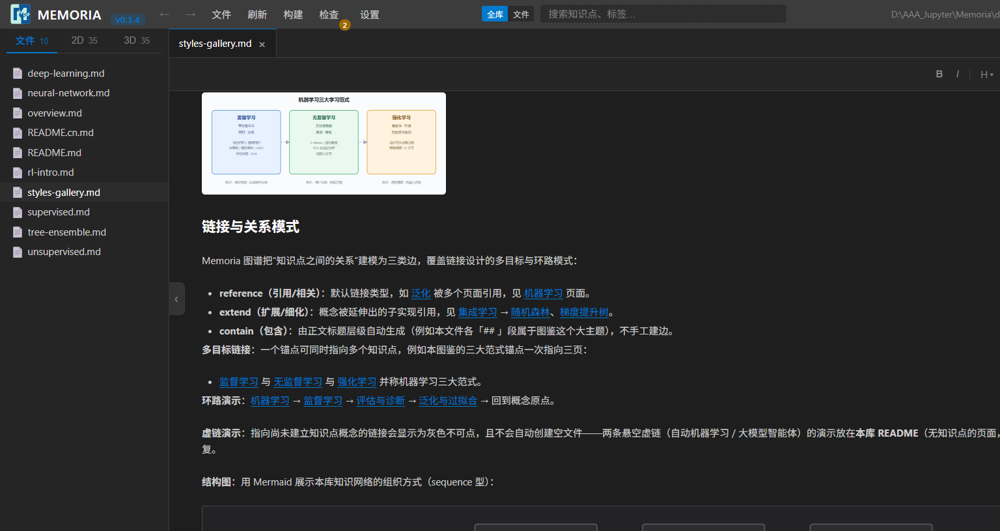
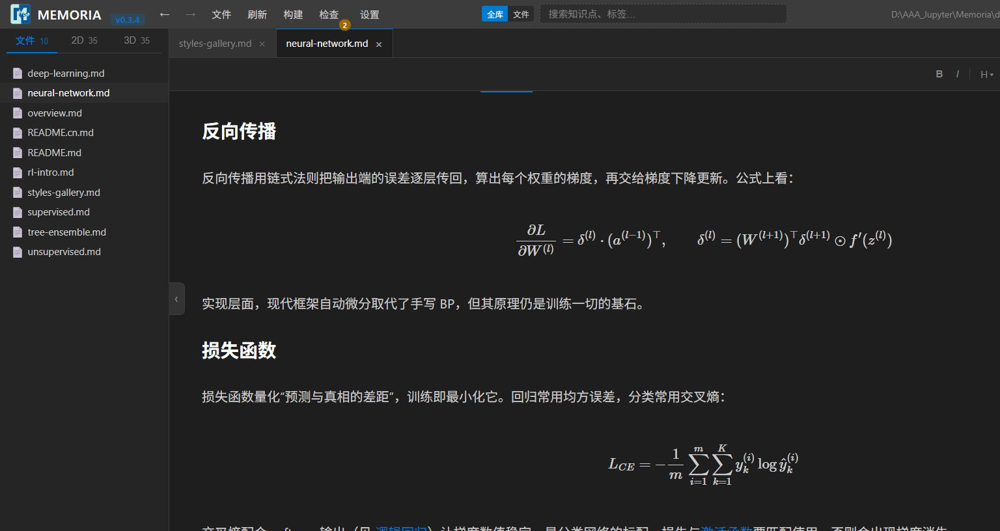
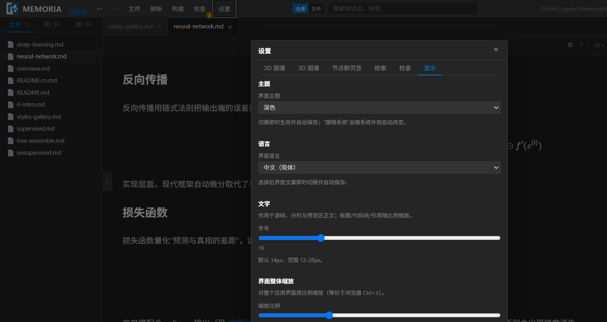
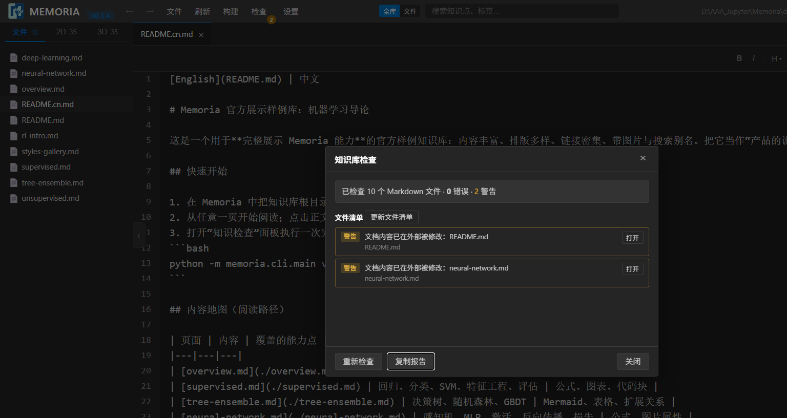
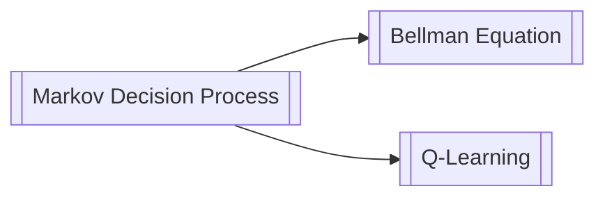

# Memoria — A Local Knowledge-Graph IDE

> **Turn Markdown notes into a navigable, searchable, visualizable knowledge network — entirely on your machine.**

> 想快速浏览中文介绍？请看 [README.cn.md](README.cn.md)。

[](https://www.python.org/)
[](https://github.com/)
[](LICENSE)
[](src/memoria/__version__.py)
[](README.cn.md)

**Memoria** is a local-first knowledge-graph IDE for personal knowledge bases: Markdown notes with bidirectional `[[]]` links, highlighter & rich inline markup, LaTeX math, Mermaid diagrams, a 2D/3D knowledge graph, and a fully **offline retrieval kernel**.

All of your data lives in plain files on your disk — `.md` bodies plus YAML metadata. No accounts, no cloud sync, no privacy leaks. Data stays yours, forever.

---

## Why Memoria?

| Conventional notes | Memoria |
|--------------------|---------|
| Isolated documents organized by folders | Documents + **Knowledge Points** + a graph where any snippet can reference any other |
| Links are one-way jumps | **snippet-range bidirectional links**: click to jump → source is highlighted at the exact range → back/forward navigation |
| Reviewing means re-reading everything | Knowledge-point list, pending-confirmation queue, integrity check with batch actions |
| Data locked in the cloud | Local-first, file-first: `.md` + `.memoria.yaml`, easy to back up / migrate / version |
| Features need internet | Offline tokenized search + optional semantic retrieval |

---

## Features

### Knowledge graph & bidirectional links

- **Wiki-style links**: `[[Knowledge Point Name]]` weaves any snippet into a network. Click to jump to the target source snippet with highlight, with back/forward navigation.
- **2D / 3D graph**: switch between force-directed 2D and spatial 3D views in the sidebar; click a node to jump back to its source; graph groups are rebuilt via the "Build" button.
- **snippet-range navigation**: links resolve to the exact line range in a document — not just the whole page.
- **Multi-target links & semantic edges**: one link text can point to several targets — clicking jumps to the queue leader while the rest stay as tag-bar alternates; every edge carries a type (reference / extend / contain) and a relevance strength, synced on graph build and individually suppressible or deletable.

### Immersive writing

- **Three views**: `Source` / `Preview` / `Split`, edit while you watch; toggle "Edit mode" on and off (read-only browsing when off).
- **Visual editing**: paint **highlighters / font colors / bold / italic** with your mouse like a word processor; changes are written back to source automatically.
- **Format toolbar**: bold, italic, highlighters (yellow/green/red/blue/orange/custom/dual-color/named), font colors, image insertion.
- **Style brush & color picker**: pick a style (bold / italic / highlight / font color), then drag with the left button to paint it across a run; right-click cancels one style at a time. The picker manages a custom palette you can add colors to or remove from.

### Rich rendering (Markdown+)

- **LaTeX math** via MathJax: inline `$...$` and block `$$...$$`, supporting `cases`, `matrix`, `align`, `mathbb`, `\text` and more.
- **Mermaid diagrams**: flowcharts, sequence diagrams, and graphs rendered inline.
- **Image management**: local relative paths, remote URLs, or copy-into-library (`.memoria/images`); Lightbox zoom, width/alignment controls.
- Mixed nesting of highlighters `[[\h:color|text]]`, font colors `[[\c:color|text]]`, tables, code blocks, and quotes.

### Knowledge-point management

- Declare **Knowledge Points** (name, weight, tags) in front-matter or extract them from text; the sidebar panel manages the points and links of the current file.
- **Pending confirmation**: after checks surface unconfirmed/dangling points and links, confirm them **one by one or all at once**.
- **Candidates & suggestions**: body mentions, aliases, and descriptions appear as candidates — adopt them as aliases / tags / descriptions in one click; "System suggestions / Sync search aux" derives suggested candidates from the body index.
- **Integrity check**: scan the whole library in one click — dangling links, missing points, inconsistent structure.

### Local offline retrieval

- Built-in **Chinese tokenized search (jieba)**, whole-library or current-file scope, `Ctrl+K` to summon.
- Optional `sentence-transformers` semantic retrieval + rerank fusion (optional dependency, not required).

### Bilingual UI (Chinese / English)

- **UI language**: Settings → Display → Interface language, switched instantly and remembered automatically; every UI string is localized, and missing English entries fall back to Chinese.

### Your data, your format

- Bodies are **standard Markdown files**; metadata lives in a sidecar `.memoria.yaml`.
- A knowledge base is an ordinary folder: `.md` + `.memoria/` (index cache, images, manifest). Put it in Git, NAS, or a sync drive — it moves anywhere.

---

## Screenshots

Workspace in the 2D graph view: the sidebar tab bar switches between file tree / 2D / 3D; the graph panel can be widened by dragging and browsed by group. Below it sits the knowledge-point list; the current document is edited on the right.



3D knowledge graph: zoom with the wheel, rotate with the left mouse button; click a node to jump back to the source.



Split view: source on the left, live rendered preview on the right.



Rendered preview: highlighters, wiki links, tables, and code blocks in mixed layout.



Math rendering: LaTeX formulas via MathJax (inline / block / cases / align).



Display settings and integrity check: adjustable font size / UI scale; one-click structural scan.





---

## Getting Started

> Prerequisites: Python ≥ 3.11, Windows (the desktop shell is built on pywebview / Chromium).

```powershell
# 1. Install (development mode, includes pytest)
pip install -e ".[dev]"

# 2. Launch the desktop app
python app.py
# or dev mode (DevTools + frameless window)
.\scripts\run_dev.ps1
```

Click **Open Knowledge Base** and pick any folder of Markdown files. To try it right away, open one of the bundled sample knowledge bases:

```
docs\example\examples\           # RL / LLM topics (53 nodes with links and graph)
docs\example\rich-content-test\  # rich-content syntax samples (math / images / Mermaid / highlighters)
```

Want a standalone exe? Run `.\packaging\build_release.cmd`; output goes to `Package\Memoria.exe`.

---

## Syntax in a Nutshell

Memoria is compatible with standard Markdown and extends it with knowledge links and rich markup:

````markdown
# My note

## Wiki links
[[Transformer]] is worth re-reading.

## Highlighters / font colors
This is [[\h:yellow|a key takeaway]], and that is [[\c:red|a must-fix conclusion]].
Dual-color highlighter: [[\h:green:blue|green background, blue text]]

## Math (MathJax)
Inline $E = mc^2$, block:

$$
\mathrm{Attention}(Q,K,V)=\mathrm{softmax}\!\left(\frac{QK^\top}{\sqrt{d_k}}\right)V
$$

## Images (local / remote / lightbox)


## Mermaid

````

See [docs/reference/preview-formats.md](docs/reference/preview-formats.md) for rendering formats and styles, and [docs/conventions/markdown-form-std.md](docs/conventions/markdown-form-std.md) for the syntax spec.

---

## Tech Stack

| Layer | Technology | Notes |
|-------|-----------|-------|
| Language | **Python ≥ 3.11** | `src` layout, managed by `pyproject.toml` |
| Desktop shell | **pywebview** (Chromium), pyqt6 optional | switch via the `MEMORIA_SHELL` env var |
| Web service | **bottle** | static assets + `/files/` KB file routing (directory-traversal safe) + `/rpc` API bridge |
| Frontend | **vanilla JS (zero framework)** | `parser.js` compiles source to an AST → `renderer.js` renders the DOM; edits are written back and recompiled |
| Rendering | marked / **MathJax** / **mermaid** / **three.js** | Markdown, math, diagrams, 3D graph |
| Storage | file system + YAML | sidecar `.memoria.yaml` + `.memoria/` metadata directory (index / images / manifest) |
| Retrieval | jieba lexical; optional sentence-transformers / pypinyin | semantic retrieval and rerank are optional dependencies |

**Frontend data flow**: `source → parser.js (AST) → renderer.js (DOM) → preview`; `edit-handler.js` writes visual edits back to source and triggers recompilation, so source and preview never drift apart.

---

## Docs & AI Collaboration

Memoria's documentation is designed for human + agent collaboration: every top-level directory carries a `README.md`, and contract-level rules live under `docs/conventions/`.

- Onboarding guide (read first): [AGENT.md](AGENT.md)
- Docs hub: [docs/README.md](docs/README.md)
- Architecture: [docs/reference/architecture.md](docs/reference/architecture.md), [docs/design/system-design.md](docs/design/system-design.md)
- Design milestone: [docs/design/designV0.md](docs/design/designV0.md)
- Single source of truth for the version: [src/memoria/\_\_version\_\_.py](src/memoria/__version__.py) (currently **0.2.5**)

---

## Project Layout

```
├── src/            # Source (Python package + frontend static assets) → src/README.md
├── tests/          # Unit/integration tests (pytest)                 → tests/README.md
├── docs/           # Docs hub (conventions / guides / reference / samples) → docs/README.md
├── scripts/        # Dev tooling (run & benchmark)                   → scripts/README.md
├── packaging/      # Release build (build_release.cmd → Package/)    → packaging/README.md
├── resources/      # App resources (icons, demo screenshots)        → resources/README.md
├── benchmarks/     # Retrieval evaluation data & results             → benchmarks/README.md
├── config/         # App configuration (ui-settings.json)            → config/README.md
└── app.py          # Source run entry point
```

---

## Roadmap

- **Done (0.x)**: snippet-range bidirectional links with jump highlighting; knowledge points & sidecar YAML metadata; 2D/3D graphs; rich rendering (math / Mermaid / highlighters / images); pending-confirmation list & integrity check; batch flat-file import with conflict reports; offline retrieval kernel.
- **Planned**: retrieval benchmark harness; stronger semantic search; more desktop shells / platforms.

See [docs/design/designV0.md](docs/design/designV0.md) for details.

---

## License

[MIT](LICENSE) © 2026 FreshTim
