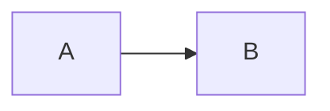

# 编辑板块语法与映射系统说明

> 本文档描述 Memoria 预览区编辑系统的完整语法规范、AST 结构、渲染管线、光标映射机制，以及当前编辑功能的实现状态。
> 用于版本维护、语法对照和后续开发参考。

---

## 1. 系统架构总览

```
┌──────────┐     ┌──────────┐     ┌──────────┐     ┌──────────────────┐
│  Source  │ ──→ │   AST    │ ──→ │  Rendered │     │   User Edit       │
│  (text)  │     │  (tree)  │     │   DOM     │     │  (keyboard/mouse) │
└──────────┘     └──────────┘     └──────────┘     └────────┬─────────┘
     ↑                ↑                                    │
     │                │              ┌──────────┐           │
     │                └──────────────│ Position  │←──────────┘
     │                               │  Mapper   │
     │                               └──────────┘
     │
     └──── Source Generator (AST → text) ──────────────┘
```

### 1.1 核心模块

| 模块 | 文件 | 职责 |
|------|------|------|
| AST | `ast.js` | 节点类型常量、工厂函数、遍历工具 |
| Lexer | `lexer.js` | 单行源码 → Token 数组 |
| Parser | `parser.js` | Token[] / 全文 → AST |
| SourceGen | `source-gen.js` | AST → 源码文本（Parser 逆操作） |
| Renderer | `renderer.js` | AST → contenteditable DOM |
| Mapper | `mapper.js` | Source ↔ AST ↔ DOM 三坐标系双向转换 |
| EditHandler | `edit-handler.js` | 预览区编辑交互（光标同步、键盘事件） |

### 1.2 数据流

```
用户打开文件
  → app.js: body = doc.body (源码字符串)
  → Parser.parse(body) → AST Document
  → Renderer.render(doc) → DOM 元素
  → stampBlockLines() → 给每个 block 标记 data-m0-src-line
  → postProcessWikilinks() → 给 wikilink 添加 memoria-link 类和链接解析
  → bindPreviewLinks() → 绑定点击/悬停/右键事件

用户点击预览区
  → EditHandler: mouseup 事件
  → Mapper.domToAst(domNode, domOffset) → { blockIndex, nodePath, offset }
  → Mapper.astToSrc(blockIndex, nodePath, offset) → { line, col }
  → setSourceCursor(line, col) → 同步源码编辑器光标
```

---

## 2. 语法规范

### 2.1 Block 类型（块级元素）

每个 block 占用一行或多行源码，对应预览中的一个 DOM 容器元素。

#### 2.1.1 Frontmatter

```
---
key: value
---
```

- **语法**：文件开头的 `---` ... `---` 包围区域
- **AST**：`{ type: "frontmatter", yaml: string }`
- **渲染**：`<pre class="m0-frontmatter">`
- **源码行数**：YAML 行数 + 2（含两个 `---`）
- **可编辑**：否（`contentEditable="false"`）

#### 2.1.2 标题 Heading

```
# 一级标题
## 二级标题
###### 六级标题
```

- **语法**：`#{1-6}` + 空格 + inline 内容
- **AST**：`{ type: "heading", level: 1-6, children: Inline[] }`
- **渲染**：`<h1>` ~ `<h6>`
- **源码前缀**：`level + 1` 字符（如 `## ` = 3 字符）
- **源码行数**：1
- **可编辑**：是，inline 内容可编辑

#### 2.1.3 段落 Paragraph

```
这是一段普通文本，可包含 **粗体**、*斜体* 等行内语法。
```

- **语法**：非空行，不匹配其他 block 类型的行
- **AST**：`{ type: "paragraph", children: Inline[] }`
- **渲染**：`<p>`
- **源码前缀**：0
- **源码行数**：1
- **可编辑**：是

#### 2.1.4 空行 Blank Line

```
（空行）
```

- **语法**：`rawLine.trim() === ""`
- **AST**：`{ type: "blank_line" }`
- **渲染**：`<div class="m0-blank-block"><br></div>`
- **源码行数**：1
- **作用**：提供 block 间距（预览中不可见但占用源码行）

#### 2.1.5 列表 List

```
- 无序列表项 1
- 无序列表项 2

1. 有序列表项 1
2. 有序列表项 2
```

- **语法**：连续的 `[-*+]` + 空格（无序）或 `\d+.` + 空格（有序）开头的行
- **AST**：`{ type: "list", ordered: boolean, items: ListItem[] }`
- **ListItem**：`{ type: "list_item", children: Inline[] }`
- **渲染**：`<ul>` 或 `<ol>`，每个 item 为 `<li>`
- **源码前缀**：每个 item `"- "` (2字符) 或 `"N. "` (数字+点+空格)
- **源码行数**：`items.length`（每个 item 占一行）
- **可编辑**：是，每个 `<li>` 内的 inline 内容可编辑
- **注意**：列表内不支持嵌套（当前版本）；缩进列表项的缩进空格被当作 TEXT 节点

#### 2.1.6 引用 Blockquote

```
> 这是一段引用
> 引用的第二行
```

- **语法**：`>` + 可选空格 开头的连续行
- **AST**：`{ type: "blockquote", children: [Paragraph] }`
- **渲染**：`<blockquote><p>...</p></blockquote>`
- **源码前缀**：`"> "` (2字符)
- **源码行数**：连续引用行数
- **可编辑**：是

#### 2.1.7 围栏代码块 Code Block

````
```python
def hello():
    print("Hello")
```
````

- **语法**：`` `{3,} `` 或 `~{3,}` 开始，同符号结束，中间为代码
- **AST**：`{ type: "code_block", lang: string, code: string }`
- **渲染**：`<pre><code class="language-{lang}">`
- **源码行数**：代码行数 + 2（含两个围栏行）
- **可编辑**：否（`contentEditable="false"`）

#### 2.1.8 数学块 Math Block

```
$$
a^2 + b^2 = c^2
$$
```

- **语法**：`$$` 开始和结束
- **AST**：`{ type: "math_block", formula: string }`
- **渲染**：`<div class="m0-math-block">` + MathJax 处理
- **源码行数**：公式行数 + 2
- **可编辑**：否

#### 2.1.9 Mermaid 图表

````

````

- **语法**：围栏代码块，lang 为 `mermaid`
- **AST**：`{ type: "mermaid", code: string }`
- **渲染**：`<pre><code class="language-mermaid">` + Mermaid 后处理
- **源码行数**：代码行数 + 2
- **可编辑**：否

#### 2.1.10 表格 Table

```
| 列1 | 列2 | 列3 |
| --- | --- | --- |
| a   | b   | c   |
```

- **语法**：首行含 `|`，次行为分隔行 `|?[\s\-:|]+\|?`
- **AST**：`{ type: "table", header: string[], rows: string[][] }`
- **渲染**：`<table><thead><tr><th>...<tbody><tr><td>...`
- **源码行数**：2 + 数据行数
- **可编辑**：否（纯文本，不支持 inline 语法）

#### 2.1.11 图片 Image（独立行）

```

```

- **语法**：整行仅为 `` 模式
- **AST**：`{ type: "image", alt: string, url: string }`
- **渲染**：`<p class="m0-image-block"></p>`
- **源码行数**：1
- **可编辑**：否
- **注意**：行内的 `` 会被解析为 inline IMAGE 节点（在段落中）

#### 2.1.12 水平线 Horizontal Rule

```
---
```

- **语法**：`^([-*_]\s*){3,}$` 或 `***`
- **AST**：`{ type: "horizontal_rule" }`
- **渲染**：`<hr>`
- **源码行数**：1
- **可编辑**：否

---

### 2.2 Inline 类型（行内元素）

Inline 节点出现在标题、段落、列表项的 `children` 数组中，可以嵌套。

#### 2.2.1 文本 Text

- **语法**：普通字符
- **AST**：`{ type: "text", content: string }`
- **渲染**：DOM TextNode
- **源码**：`content` 原样输出
- **前缀长度**：0 | **后缀长度**：0 | **渲染长度**：`content.length`

#### 2.2.2 粗体 Bold

```
**粗体文本**     或     __粗体文本__
```

- **AST**：`{ type: "bold", children: Inline[] }`
- **渲染**：`<strong>`
- **前缀**：`**` (2) | **后缀**：`**` (2) | **可嵌套**：是

#### 2.2.3 斜体 Italic

```
*斜体文本*     或     _斜体文本_
```

- **AST**：`{ type: "italic", children: Inline[] }`
- **渲染**：`<em>`
- **前缀**：`*` (1) | **后缀**：`*` (1) | **可嵌套**：是

#### 2.2.4 粗斜体 Bold Italic

```
***粗斜体文本***
```

- **AST**：`{ type: "bold_italic", children: Inline[] }`
- **渲染**：`<strong><em>`
- **前缀**：`***` (3) | **后缀**：`***` (3) | **可嵌套**：是
- **注意**：Lexer 优先匹配 `***`，再匹配 `**`，最后匹配 `*`

#### 2.2.5 删除线 Strikethrough

```
~~删除线文本~~
```

- **AST**：`{ type: "strikethrough", children: Inline[] }`
- **渲染**：`<del>`
- **前缀**：`~~` (2) | **后缀**：`~~` (2) | **可嵌套**：是

#### 2.2.6 行内代码 Code

```
`inline code`
```

- **AST**：`{ type: "code", code: string }`
- **渲染**：`<code>`
- **前缀**：`` ` `` (1) | **后缀**：`` ` `` (1) | **可嵌套**：否（叶子节点）
- **注意**：代码内容不解析 inline 语法

#### 2.2.7 行内数学 Math Inline

```
$a^2 + b^2$
```

- **AST**：`{ type: "math_inline", formula: string }`
- **渲染**：`<span class="m0-math">` + MathJax 处理
- **前缀**：`$` (1) | **后缀**：`$` (1) | **可嵌套**：否（叶子节点）

#### 2.2.8 荧光笔 Highlight

```
[[\h|默认黄色高亮]]
[[\h:blue|蓝色高亮]]
[[\h:orange|橙色高亮]]
[[\h:yellow:red|黄色底+红色字]]
```

- **AST**：`{ type: "highlight", color: string|null, fgColor: string|null, children: Inline[] }`
- **渲染**：`<span class="m0-hl" style="background-color: ...">`
- **支持颜色**：yellow, green, red, blue, orange
- **前缀**：
  - 无颜色：`[[\h|` (5字符)
  - 有颜色：`[[\h:color|` (6 + color.length 字符)
  - 有前景色：再 `:fgColor` (1 + fgColor.length 字符)
- **后缀**：`]]` (2) | **可嵌套**：是

#### 2.2.9 字体颜色 Font Color

```
[[\c:red|红色文字]]
[[\c:#ff0000|红色文字]]
```

- **AST**：`{ type: "font_color", color: string, children: Inline[] }`
- **渲染**：`<span style="color: ...">`
- **支持颜色**：red, green, blue, orange, yellow, purple, gray, 或 `#RRGGBB`
- **前缀**：`[[\c:color|` (6 + color.length) | **后缀**：`]]` (2)

#### 2.2.10 字号 Font Size

```
[[\s:20px|20px文字]]
[[\s:1.5em|1.5em文字]]
```

- **AST**：`{ type: "font_size", size: string, children: Inline[] }`
- **渲染**：`<span style="font-size: ...">`
- **前缀**：`[[\s:size|` (6 + size.length) | **后缀**：`]]` (2)

#### 2.2.11 字体样式族（[[\x|...]] 系列）

以下语法共享 `[[\x|...]]` 结构，区别仅在前缀命令字符：

| 语法 | AST 类型 | 渲染 | 前缀 |
|------|----------|------|------|
| `[[\b\|文本]]` | font_bold | `<span style="font-weight:bold">` | `[[\b\|` (5) |
| `[[\i\|文本]]` | font_italic | `<span style="font-style:italic">` | `[[\i\|` (5) |
| `[[\u\|文本]]` | font_underline | `<span style="text-decoration:underline">` | `[[\u\|` (5) |
| `[[\sup\|文本]]` | font_superscript | `<sup>` | `[[\sup\|` (7) |
| `[[\sub\|文本]]` | font_subscript | `<sub>` | `[[\sub\|` (7) |
| `[[\bg:color\|文本]]` | bg_color | `<span class="m0-hl" style="background-color:...">` | `[[\bg:color\|` (7 + color.length) |

- **后缀**：均为 `]]` (2)
- **可嵌套**：是

#### 2.2.12 Wiki 链接 Wiki Link

```
[[target_id]]
[[target_id|显示文本]]
```

- **AST**：`{ type: "wiki_link", target: string, display: string }`
- **渲染**：`<a class="m0-wikilink memoria-link">` + 后处理添加 `m0-link-resolved`/`m0-link-broken`
- **前缀**：
  - 无 display：`[[` (2)
  - 有 display：`[[target|` (2 + target.length + 1)
- **后缀**：`]]` (2)
- **渲染长度**：`(display || target).length`
- **源码长度**：`4 + target.length + (display ? 1 + display.length : 0)`
- **可嵌套**：否（叶子节点）
- **链接解析**：`postProcessWikilinks()` 用 `state.linkTargetSet` 检查 target 是否有效
  - 有效：`m0-link-resolved`（主题色，可点击跳转）
  - 无效：`m0-link-broken`（灰色，点击打开链接编辑器）

#### 2.2.13 普通链接 Link

```
[链接文字](https://example.com)
```

- **AST**：`{ type: "link", text: string, url: string }`
- **渲染**：`<a href="url">text</a>`
- **源码长度**：`4 + text.length + url.length`（`[text](url)`）
- **可嵌套**：否（叶子节点）

#### 2.2.14 转义 Escape

```
\*  \_  $$  \]  \\  \!  \~  \`  \$
```

- **AST**：`{ type: "escape", char: string }`
- **渲染**：DOM TextNode（仅输出 `char`，不输出 `\`）
- **源码长度**：2（`\` + char）
- **渲染长度**：1（仅 char）
- **作用**：阻止后续字符被解析为语法标记

---

## 3. 光标映射系统

### 3.1 三坐标系

| 坐标系 | 表示 | 说明 |
|--------|------|------|
| Source | `(line, col)` | 源码文本的行号（0-based）和列号（0-based） |
| AST | `(blockIndex, nodePath, offset)` | block 索引、inline 节点路径、叶节点内偏移 |
| DOM | `(domNode, domOffset)` | 浏览器 Selection 的锚点和偏移 |

### 3.2 映射函数

```
DOM → AST → Source:  domToAst() → astToSrc()
Source → AST → DOM:  srcToAst() → astToDom()
```

#### 3.2.1 domToAst(domNode, domOffset) → { blockIndex, nodePath, offset, listItemIndex }

1. 向上查找 `.m0-src-block` 元素，获取 `blockIndex`
2. **LIST block**：向上查找 `<li>` 元素，确定 `itemIndex`
   - 收集 `<li>` 内所有 TextNode，计算渲染偏移
   - `renderedToSrcCol({ children: item.children }, renderedOffset)` 定位到 AST 节点
3. **普通 block**：收集 blockEl 内所有 TextNode，计算渲染偏移
   - `renderedToSrcCol({ children: block.children }, renderedOffset)` 定位
4. `findNodePathInList(children, targetNode)` 查找节点路径

#### 3.2.2 astToSrc(blockIndex, nodePath, offset) → { line, col }

1. 计算行号：累加前面所有 block 的 `blockLineCount`
2. **LIST block**：
   - `line += itemIdx`（每个 item 独占一行）
   - `liCol = 2`（`"- "` 前缀）
   - 加上 item 内前面兄弟节点的 `inlineSourceLen`
   - 加上目标节点的 `inlinePrefixLen`
   - 递归处理更深层 nodePath
   - `liCol += offset`
3. **普通 block**：
   - `col = blockPrefixLen(block)`（如 heading 的 `# ` 前缀）
   - 加上前面兄弟节点的 `inlineSourceLen`
   - 加上目标节点的 `inlinePrefixLen`
   - 递归处理更深层 nodePath
   - `col += offset`

#### 3.2.3 renderedToSrcCol(node, renderedOffset) → { srcCol, leafOffset, targetNode }

将渲染偏移映射到源码列。核心逻辑：

1. **叶子节点**（TEXT, CODE, MATH_INLINE, WIKI_LINK, LINK）：
   - `renderedOffset` 直接映射为 `srcCol` 和 `leafOffset`
2. **容器节点**（有 children）：
   - 遍历 children，用 `renderedLen(child)` 累加渲染位置
   - 当 `renderedOffset <= renderedPos + childRenderedLen` 时匹配（**含边界**）
   - 递归进入子节点
   - `srcCol` 累加 `inlineSourceLen(child)`（源码长度）和 `inlinePrefixLen(node)`（前缀）

**边界处理**：使用 `<=` 而非 `<`，确保光标在 TEXT/HIGHLIGHT 边界时优先映射到 TEXT 末尾，而非下一个节点的前缀。

#### 3.2.4 srcColToRendered(node, srcCol) → { renderedOffset, targetNode }

源码列映射到渲染偏移（`renderedToSrcCol` 的逆操作）。同样使用 `<=` 处理边界。

### 3.3 前缀/后缀长度表

| AST 类型 | 前缀 | 后缀 | 源码长度公式 |
|----------|------|------|-------------|
| TEXT | 0 | 0 | `content.length` |
| BOLD | 2 (`**`) | 2 (`**`) | `4 + Σ children` |
| ITALIC | 1 (`*`) | 1 (`*`) | `2 + Σ children` |
| BOLD_ITALIC | 3 (`***`) | 3 (`***`) | `6 + Σ children` |
| STRIKETHROUGH | 2 (`~~`) | 2 (`~~`) | `4 + Σ children` |
| CODE | 1 (`` ` ``) | 1 (`` ` ``) | `2 + code.length` |
| MATH_INLINE | 1 (`$`) | 1 (`$`) | `2 + formula.length` |
| HIGHLIGHT (无色) | 5 (`[[\h\|`) | 2 (`]]`) | `7 + Σ children` |
| HIGHLIGHT (有色) | `6 + color.length` | 2 | `8 + color.length + Σ children` |
| HIGHLIGHT (有色+前景) | `7 + color.length + fgColor.length` | 2 | `9 + color.length + fgColor.length + Σ children` |
| FONT_COLOR | `6 + color.length` | 2 | `8 + color.length + Σ children` |
| FONT_SIZE | `6 + size.length` | 2 | `8 + size.length + Σ children` |
| FONT_BOLD | 5 | 2 | `7 + Σ children` |
| FONT_ITALIC | 5 | 2 | `7 + Σ children` |
| FONT_UNDERLINE | 5 | 2 | `7 + Σ children` |
| FONT_SUPERSCRIPT | 7 | 2 | `9 + Σ children` |
| FONT_SUBSCRIPT | 7 | 2 | `9 + Σ children` |
| BG_COLOR | `7 + color.length` | 2 | `9 + color.length + Σ children` |
| WIKI_LINK (无display) | 2 (`[[`) | 2 (`]]`) | `4 + target.length` |
| WIKI_LINK (有display) | `2 + target.length + 1` | 2 | `5 + target.length + display.length` |
| LINK | 1 (`[`) | 0 | `4 + text.length + url.length` |
| ESCAPE | 1 (`\`) | 0 | `2` |
| HEADING (block前缀) | `level + 1` (`## `) | - | - |
| LIST_ITEM (block前缀) | 2 (`- `) | - | - |
| BLOCKQUOTE (block前缀) | 2 (`> `) | - | - |

### 3.4 blockLineCount

| Block 类型 | 行数 |
|------------|------|
| BLANK_LINE | 1 |
| HEADING | 1 |
| PARAGRAPH | 1 |
| IMAGE | 1 |
| HORIZONTAL_RULE | 1 |
| LIST | `items.length` |
| BLOCKQUOTE | 连续 `>` 行数 |
| CODE_BLOCK | `code.split("\n").length + 2` |
| MATH_BLOCK | `formula.split("\n").length + 2` |
| MERMAID | `code.split("\n").length + 2` |
| FRONTMATTER | `yaml.split("\n").length + 2` |
| TABLE | `2 + rows.length` |

---

## 4. 渲染管线

### 4.1 全量渲染 renderPreview(doc)

```
1. body = doc.preview_body || doc.body
2. body = MarkdownPreview.normalizeBody(body)  // 数学标准化
3. body = rewriteMdImagePaths(body)             // 图片路径重写
4. _doc = Parser.parse(body)                    // AST 解析
5. Mapper.setDoc(_doc)                          // 共享 AST
6. content = Renderer.render(_doc)              // AST → DOM
7. preview.innerHTML = ""; preview.appendChild(content)
8. stampBlockLines(preview, _doc)              // 标记 data-m0-src-line
9. 禁止特殊元素编辑 (pre, code, table, svg, mjx-container)
10. postProcessWikilinks()                      // wikilink 链接解析
11. bindPreviewLinks()                          // 绑定链接事件
12. MathJax / Mermaid / Lightbox 后处理
```

### 4.2 DOM 结构

每个 block 渲染为一个 `.m0-src-block` 元素：

```html
<div class="m0-preview">
  <h2 class="m0-src-block" data-m0-block-index="0" data-m0-src-line="1">标题</h2>
  <p class="m0-src-block" data-m0-block-index="1" data-m0-src-line="2">段落</p>
  <div class="m0-src-block m0-blank-block" data-m0-block-index="2" data-m0-src-line="3"><br></div>
  <ul class="m0-src-block" data-m0-block-index="3" data-m0-src-line="4">
    <li>列表项</li>
  </ul>
</div>
```

- `data-m0-block-index`：AST block 索引（0-based）
- `data-m0-src-line`：源码起始行号（1-based），由 `stampBlockLines` 设置
- `data-m0-src-line-end`：源码结束行号（1-based）

### 4.3 链接后处理 postProcessWikilinks()

渲染后对 `.m0-wikilink` 元素进行后处理：

1. 添加 `memoria-link` 类（使 `bindPreviewLinks` 能识别）
2. 从 `data-m0-target` 获取目标 ID
3. 用 `state.linkTargetSet`（Set）检查目标是否已解析
4. 添加状态类：
   - `m0-link-resolved`：目标有效，主题色，`tabindex=0`，可点击跳转
   - `m0-link-broken` + `memoria-broken-link`：目标无效，灰色，`tabindex=-1`，点击打开编辑器
   - `m0-link-pending`：`linkTargetSet` 未加载，等待状态
5. 设置 `data-link-target`、`data-link-type`、`data-link-line` 属性

---

## 5. 编辑模式

### 5.1 编辑模式切换

- **编辑模式**（默认开启）：`preview.contentEditable = "true"`，鼠标点击定位光标，不触发链接跳转
- **浏览模式**：`preview.contentEditable = "false"`，链接可点击跳转，右键显示链接菜单

### 5.2 当前已实现

| 功能 | 状态 | 说明 |
|------|------|------|
| 鼠标点击 → 光标同步 | ✅ 已实现 | `mouseup` → `domToAst` → `astToSrc` → `setSourceCursor` |
| 方向键 → 光标同步 | ✅ 已实现 | `keydown` (ArrowLeft/Right/Up/Down) → 浏览器移动光标 → `setTimeout(0)` → `syncFromSelection` |
| 源码区假光标显示 | ✅ 已实现 | `showFakeCursor` 在源码区显示光标位置标记 |
| 光标上下文日志 | ✅ 已实现 | `logCursorContext` 输出 SRC/PV 双侧上下文用于验证 |
| 链接右键菜单 | ✅ 已修复 | `postProcessWikilinks` + `bindLinkContextMenu` |
| 链接灰色状态 | ✅ 已修复 | `m0-link-broken` 类 |
| 浏览模式链接跳转 | ✅ 已实现 | `onMemoriaLinkClick` → `resolve_links` → `jumpToTarget` |

### 5.3 待实现

| 功能 | 优先级 | 说明 |
|------|--------|------|
| Backspace | 高 | 删除字符，跨节点合并 |
| Input（字符输入） | 高 | 在光标位置插入字符 |
| Enter | 中 | 换行，可能触发 block 类型转换 |
| 增量渲染 | 中 | 只重渲染变化的 block，避免全量重渲染 |

---

## 6. 光标映射验证方法

### 6.1 上下文日志

`logCursorContext(srcLine, srcCol, blockIndex, listItemIndex)` 输出双侧上下文：

```
[CTX] SRC L71 C14 [[\h:oran|g|e|待复习内容]
[CTX] PV  blk43 C3 [橙色：|待|复习内容]
```

- `SRC` 行：源码行号、列号、`[前8字|当前字符|后8字]`
- `PV` 行：block 索引、预览渲染偏移、`[前8字|当前字符|后8字]`
- 验证标准：`|` 标记的位置在源码和预览中应对应同一个语义位置

### 6.2 边界测试要点

1. **TEXT → HIGHLIGHT 边界**：如 `橙色：  [[\h:orange|待复习内容]]`
   - 光标在"："后、空格前 → 应映射到 TEXT 内偏移
   - 光标在空格后、`[[`前 → 应映射到 TEXT 末尾，而非 HIGHLIGHT 前缀内
2. **HIGHLIGHT → TEXT 边界**：如 `[[\h:blue|定义]]/术语`
   - 光标在 `]]` 后 → 应映射到下一个 TEXT 的开头
3. **LIST item 边界**：每个 item 独占源码行，`line += itemIdx`

---

## 7. 已知限制

1. **列表不支持嵌套**：缩进的列表项的缩进被当作 TEXT 节点
2. **表格不支持 inline 语法**：单元格内容为纯文本
3. **引用内部简化处理**：连续引用行合并为一个 paragraph
4. **`astToDom` 函数存在 bug**：使用 `inlineSourceLen` 计算渲染偏移（应为 `renderedLen`），目前未使用该函数
5. **HTML 空格折叠**：多个空格在视觉上被折叠，但 `textContent` 保留原始空格，映射不受影响
6. **`[[\h:color:fgColor|...]]` 语法**：荧光笔支持双色（背景色+前景色），但 Lexer 对 `:` 分割较简单

---

## 8. 文件索引

| 文件 | 路径 | 说明 |
|------|------|------|
| AST | `src/memoria/ui/static/m0/js/ast.js` | 节点类型定义、工厂函数 |
| Lexer | `src/memoria/ui/static/m0/js/lexer.js` | 词法分析器 |
| Parser | `src/memoria/ui/static/m0/js/parser.js` | 语法分析器 |
| SourceGen | `src/memoria/ui/static/m0/js/source-gen.js` | 源码生成器 |
| Renderer | `src/memoria/ui/static/m0/js/renderer.js` | DOM 渲染器 |
| Mapper | `src/memoria/ui/static/m0/js/mapper.js` | 位置映射器 |
| EditHandler | `src/memoria/ui/static/m0/js/edit-handler.js` | 编辑交互处理 |
| App | `src/memoria/ui/static/m0/js/app.js` | 主应用（渲染管线、链接处理） |
| LinkMenu | `src/memoria/ui/static/m0/js/link-context-menu.js` | 链接右键菜单 |
| MarkdownPreview | `src/memoria/ui/static/m0/js/markdown-preview.js` | 旧版预览（图片路径重写、Mermaid等） |
| CSS | `src/memoria/ui/static/m0/css/m0.css` | 预览区样式 |
| 重构方案 | `docs/preview-sync-refactor-plan.md` | 编译器基础设施重构方案 |
