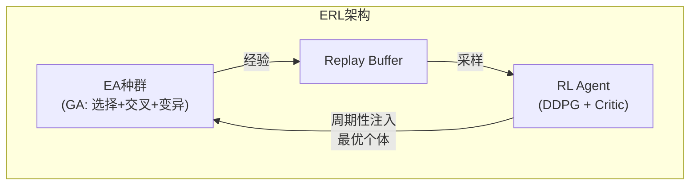
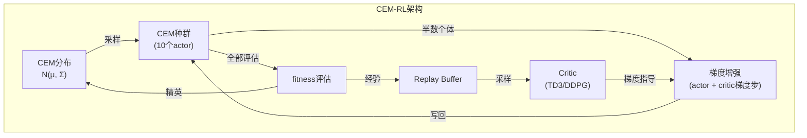
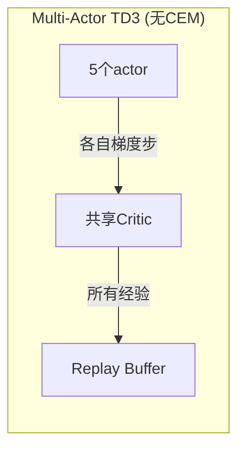

# CEM-RL：结合进化方法与梯度方法的策略搜索

## 0. 论文来源

| 项目 | 内容 |
|------|------|
| **标题** | CEM-RL: Combining Evolutionary and Gradient-Based Methods for Policy Search |
| **作者** | Alois Pourchot, Olivier Sigaud |
| **机构** | Gleamer, Sorbonne Université, CNRS UMR 7222, ISIR |
| **发表** | ICLR 2019 |
| **核心贡献** | 提出CEM-RL算法，将交叉熵方法（CEM）与TD3/DDPG结合，在连续控制任务上实现了优于ERL的性能 |


## 1. 算法概述

### 1.1 一句话定位

**CEM-RL** 是一种将**交叉熵方法（CEM）**（一种进化策略/分布估计算法）与**异策略深度强化学习算法（TD3或DDPG）** 相结合的混合策略搜索算法。CEM维护一个由神经网络策略构成的种群，其中一半个体直接通过CEM进化，另一半个体**额外接受RL critic的梯度指导**，CEM的分布更新基于全部个体的表现。

### 1.2 设计动机（Why）

- **进化方法（CEM/ES）**：稳定性好、适用性广、易于并行化，但样本效率低
- **深度RL方法（DDPG/TD3）**：样本效率高，但训练不稳定、超参数敏感
- **核心目标**：结合两者优势——用RL的梯度提升CEM的样本效率，用CEM的种群稳定性抑制RL的不稳定性

### 1.3 与ERL的核心区别

| 维度 | ERL | CEM-RL |
|------|-----|--------|
| **进化算法** | 自定义GA（选择+交叉+变异） | **CEM（分布估计算法）** |
| **RL个体** | 1个独立的DDPG agent | **无独立RL agent**——梯度直接作用于CEM种群个体 |
| **梯度作用方式** | RL agent独立训练，周期性注入种群 | **每个世代对半数种群个体施加梯度步** |
| **信息流** | RL agent ↔ 种群（双向，周期性的） | CEM分布 ↔ 种群个体 + 梯度（双向，密集的） |
| **探索机制** | 参数空间（EA变异）+ 动作空间（OU噪声） | **CEM采样（参数空间）+ 梯度步** |
| **关键特征** | RL agent作为"精英注入者" | **每个个体都可能既被进化又被梯度更新** |

**一句话概括区别**：

> ERL的RL和EA是**松耦合的并行双轨**（各自独立运行，定期交换个体）；CEM-RL的RL和EA是**紧耦合的融合**（梯度直接注入种群个体，CEM基于所有个体更新分布）。


## 2. 背景知识

### 2.1 交叉熵方法（CEM）

CEM是一种**分布估计算法（EDA）**，通过维护一个参数分布 \(\mathcal{N}(\mu, \Sigma)\) 来隐式地表示一个种群：

1. 从分布 \(\mathcal{N}(\mu, \Sigma)\) 中采样 \(\lambda\) 个个体
2. 评估所有个体的适应度（fitness）
3. 选择前 \(K_e\) 个精英个体
4. 用精英个体更新分布参数 \(\mu\) 和 \(\Sigma\)

**CEM的分布更新公式**（论文公式1-3）：

精英个体：\(\{z_i\}_{i=1}^{K_e}\)，权重 \(\lambda_i\)（通常为 \(1/K_e\) 或按排名加权）

均值更新：

\[
\mu_{\text{new}} = \sum_{i=1}^{K_e} \lambda_i z_i
\]

协方差更新（使用当前均值 \(\mu_{\text{old}}\)，而非新均值，以保持多样性）：

\[
\Sigma_{\text{new}} = \sum_{i=1}^{K_e} \lambda_i (z_i - \mu_{\text{old}})(z_i - \mu_{\text{old}})^\top + \epsilon \mathcal{I}
\]

在实际实现中，为处理高维参数空间，使用**对角协方差**：

\[
\Sigma_{\text{new}} = \sum_{i=1}^{K_e} \lambda_i (z_i - \mu_{\text{old}})^2 + \epsilon \mathcal{I}
\]

其中 \(\epsilon\) 随世代指数衰减：

\[
\epsilon \leftarrow \tau_{\text{cem}} \epsilon + (1 - \tau_{\text{cem}}) \sigma_{\text{end}}
\]

### 2.2 TD3

TD3（Twin Delayed DDPG）是对DDPG的改进，主要解决**Q值过估计**问题：

1. **双Q学习**：使用两个critic网络，取较小的Q值计算TD目标
2. **延迟策略更新**：critic更新多次后，actor才更新一次
3. **目标策略平滑**：在目标动作中加入裁剪噪声


## 3. CEM-RL算法

### 3.1 核心思想

CEM-RL的核心机制可以概括为：

> **将CEM种群的一半个体"租借"给RL critic，让它们沿着梯度方向走几步；另一半保持纯进化。CEM基于全部个体的表现更新分布。**

这样设计的好处是：
- 如果梯度方向是正确的 → 被梯度更新的个体表现更好 → CEM分布向该方向移动
- 如果梯度方向是错误的 → 被梯度更新的个体表现变差 → CEM分布忽略它们
- 无论如何，**所有个体产生的经验都存入replay buffer**，供critic学习

### 3.2 算法流程图（Mermaid）

```mermaid
graph TD
    A[开始] --> B[初始化 CEM 均值 μ 和协方差 Σ<br>初始化 Critic Q 和 Replay Buffer R]
    B --> C{total_steps < max_steps?}
    C -->|是| D[从 N(μ, Σ) 采样 pop_size 个 actor]
    D --> E[前 pop_size/2 个 actor:<br>纯 CEM 个体]
    D --> F[后 pop_size/2 个 actor:<br>RL 梯度增强个体]
    
    F --> G[对每个梯度增强个体:]
    G --> H[从 R 中采样 mini-batch]
    H --> I[用 TD3/DDPG 更新 Critic]
    I --> J[用 Critic 的梯度更新 Actor]
    J --> K[重复 actor_steps 次]
    K --> L[将梯度更新后的 actor 写回种群]
    
    E --> M[评估所有 pop_size 个 actor<br>计算 fitness = 累积奖励]
    L --> M
    
    M --> N[将所有经验存入 R]
    N --> O[用 top K_e 个精英个体<br>更新 μ 和 Σ]
    O --> P[total_steps += 本次步数]
    P --> C
    
    C -->|否| Q[输出最优策略]
```

### 3.3 算法伪代码

**Algorithm 1: CEM-RL**

| 行号 | 伪代码 |
|------|--------|
| 1 | **初始化**：随机 actor \(\pi_\mu\)（CEM的均值），协方差 \(\Sigma = \sigma_{init}\mathcal{I}\) |
| 2 | **初始化**：critic \(\mathcal{Q}^\pi\) 和目标 critic \(\mathcal{Q}_t^\pi\) |
| 3 | **初始化**：空循环replay buffer \(\mathcal{R}\) |
| 4 | `total_steps, actor_steps = 0, 0` |
| 5 | **while** `total_steps < max_steps` **do** |
| 6 |  `pop` ← 从 \(\mathcal{N}(\pi_\mu, \Sigma)\) 采样（使用importance mixing） |
| 7 |  **for** \(i \gets 1\) **to** `pop_size/2` **do** ▷ 对半数个体施加梯度步 |
| 8 |   \(\pi\) ← `pop[i]` |
| 9 |   初始化目标actor \(\pi_t\) 为 \(\pi\) 的副本 |
| 10 |   用 \(2 \times \text{actor_steps} / \text{pop_size}\) 个mini-batch训练 \(\mathcal{Q}^\pi\) |
| 11 |   用 `actor_steps` 个mini-batch训练 \(\pi\)（最大化Q值） |
| 12 |   将更新后的 \(\pi\) 写回 `pop` |
| 13 |  **end for** |
| 14 |  **for** \(i \gets 1\) **to** `pop_size` **do** ▷ 评估所有个体 |
| 15 |   \(\pi\) ← `pop[i]` |
| 16 |   \((\text{fitness}, \text{steps})\) ← evaluate(\(\pi\)) |
| 17 |   将经验存入 \(\mathcal{R}\) |
| 18 |   `actor_steps += steps`，`total_steps += actor_steps` |
| 19 |  **end for** |
| 20 |  用前 \(K_e\) 个精英更新 \(\pi_\mu\) 和 \(\Sigma\)（公式1-3） |
| 21 | **end while** |

**关于 `actor_steps` 的说明**：

`actor_steps` 是上一代所有个体在环境中执行的总步数。第10-11行使用该值控制critic和actor的训练量，使得梯度更新的次数与采样量成正比，保持学习率的稳定性。

### 3.4 Critic训练细节

**DDPG版本**的critic损失（标准TD误差）：

\[
\mathcal{L}(\psi) = \mathbb{E}_{(s,a,r,s') \sim \mathcal{R}} \left[ \left( r + \gamma Q_{\psi'}(s', \pi_{\omega'}(s')) - Q_\psi(s,a) \right)^2 \right]
\]

**TD3版本**使用双critic + 延迟策略更新 + 目标策略平滑。

**CEM-RL中critic训练的关键点**：
- critic从**所有个体**（包括纯CEM个体和梯度增强个体）产生的经验中学习
- 梯度增强个体使用critic的梯度更新自己：
  \[
  \nabla_\omega J \approx \mathbb{E}_{s \sim \mathcal{R}} \left[ \nabla_a Q_\psi(s,a) \big|_{a=\pi_\omega(s)} \cdot \nabla_\omega \pi_\omega(s) \right]
  \]
- 这本质上是**DDPG/TD3的actor更新公式**

### 3.5 Importance Mixing（附录B）

Importance mixing是一种样本重用机制：如果某个旧个体在当前分布下仍有较大概率被采样，则可以跳过环境评估，直接复用其fitness。

CEM-RL中，**只有不接收梯度步的那一半个体**可以使用importance mixing（因为梯度步改变了个体的"采样属性"）。

实验结果表明：在CEM-RL中，importance mixing的效果有限，因为：
- CEM-RL的协方差矩阵移动较快，旧样本不易重用
- MuJoCo任务难度较高，环境评估成本已是主要瓶颈


## 4. 实验与结果

### 4.1 实验设置

| 参数 | 值 |
|------|-----|
| 环境 | HalfCheetah-v2, Hopper-v2, Walker2d-v2, Swimmer-v2, Ant-v2 |
| 种群大小 | 10 |
| 精英比例 | 50%（\(K_e = 5\)） |
| \(\sigma_{init}\) | \(10^{-3}\) |
| \(\sigma_{end}\) | \(10^{-5}\) |
| \(\tau_{cem}\) | 0.95 |
| 折扣因子 \(\gamma\) | 0.99 |
| 目标更新系数 \(\tau\) | \(5 \times 10^{-3}\) |
| Replay buffer大小 | \(10^6\) |
| Batch size | 100 |
| 优化器 | Adam |
| 学习率 | \(10^{-3}\)（actor和critic） |
| 运行次数 | 10次独立运行 |

### 4.2 主要结果

**1. CEM-TD3 vs 基线（表1）**

| 环境 | CEM | TD3 | Multi-Actor TD3 | **CEM-TD3** |
|------|-----|-----|-----------------|-------------|
| HalfCheetah | 2940 | 9630 | 9662 | **10725** |
| Hopper | 1055 | 3555 | 2056 | **3613** |
| Walker2d | 928 | 8088 | 3934 | **4711** |
| Swimmer | 35 | 314 | 76 | **75** |
| Ant | 487 | 2710 | 3567 | **425** |

**结论**：CEM-TD3在4/5环境中优于所有基线；在Swimmer上，纯CEM最优（梯度信息具有欺骗性）。

**2. CEM-RL vs ERL（表2）**

| 环境 | ERL | CEM-DDPG | **CEM-TD3** |
|------|-----|----------|-------------|
| HalfCheetah | 8684 | 11035 | **10725** |
| Hopper | 2288 | 3444 | **3613** |
| Walker2d | 2188 | 2865 | **4711** |
| Ant | 3716 | 2170 | **425** |
| Swimmer | 350 | 68 | **75** |

**结论**：CEM-RL在4/5环境中优于ERL；在Ant上，ERL更优；在Swimmer上，纯CEM/ERL优于任何RL增强方法。

### 4.3 关键发现

1. **梯度增强的有效性**：CEM-TD3在大多数任务上优于纯CEM和纯TD3，说明梯度信息有效提升了进化搜索
2. **欺骗性梯度的存在**：Swimmer任务中，梯度信息具有欺骗性，用梯度反而降低性能
3. **CEM vs GA的差异**：CEM（分布估计算法）天然保持种群多样性，不易像GA那样收敛到单一个体
4. **激活函数的影响**：tanh作为actor激活函数在多个任务上显著优于ReLU
5. **Action noise不是必需的**：CEM的参数空间探索已足够，额外动作噪声无益


## 5. 与ERL的深度对比

### 5.1 架构对比（Mermaid）

**ERL架构**（论文Figure 1b）：



**CEM-RL架构**（论文Figure 1a）：



### 5.2 核心差异总结

| 维度 | ERL | CEM-RL |
|------|-----|--------|
| **进化算法类型** | 遗传算法（GA） | 交叉熵方法（CEM） |
| **RL组件** | 独立DDPG agent + critic | 只有critic，无独立RL agent |
| **梯度作用对象** | RL agent自身（独立训练） | **种群中的半数个体** |
| **RL→EA信息流** | 周期性注入（每ω代） | **每个世代**通过梯度增强个体传递 |
| **EA→RL信息流** | 所有种群经验入buffer | 所有种群经验入buffer |
| **种群多样性** | 易收敛到单一个体 | CEM采样天然保持多样性 |
| **探索方式** | 变异 + OU噪声 | CEM采样 + 梯度步 |
| **样本效率** | 较低 | 较高（梯度增强更密集） |

### 5.3 为什么CEM-RL优于ERL？

1. **梯度利用更充分**：ERL中RL agent每10代才注入一次；CEM-RL中每代都有半数个体沿梯度方向探索
2. **种群多样性更好**：GA易收敛到单一个体；CEM通过分布采样天然维持多样性
3. **更稳健的探索-利用平衡**：梯度好时利用梯度，梯度差时忽略梯度


## 6. 消融与分析

### 6.1 梯度步的必要性（Multi-Actor TD3实验）

去掉CEM机制，仅保留多个actor共享critic的"Multi-Actor TD3"：



**结论**：Multi-Actor TD3的性能低于CEM-TD3，证明**CEM的分布更新机制**是性能提升的关键。

### 6.2 Swimmer的欺骗性梯度

在Swimmer任务中：
- 纯CEM > ERL > CEM-DDPG > CEM-TD3
- 梯度信息越强（TD3 > DDPG），性能越差
- 这说明**梯度方向在Swimmer中是错误的**（欺骗性梯度）

### 6.3 种群多样性对比（论文Figure 6）

- **ERL**：种群参数快速收敛到RL agent附近，多样性丧失
- **CEM-RL**：每个世代都有全新的采样点，多样性保持良好


## 7. 总结

| 维度 | 结论 |
|------|------|
| **核心贡献** | CEM-RL提供了一种更紧密的EA-RL融合方式：梯度直接作用于种群个体，而非独立RL agent |
| **性能** | 在4/5 MuJoCo任务上优于ERL，在多数任务上优于纯CEM和纯TD3 |
| **关键优势** | 1) 密集梯度注入 2) CEM天然多样性 3) 欺骗性梯度自动被忽略 |
| **局限** | 在梯度具有欺骗性的任务（如Swimmer）中，CEM部分反而被RL"污染" |
| **与ERL关系** | CEM-RL是ERL的"更激进"版本——更密集的信息流，但牺牲了一些鲁棒性 |