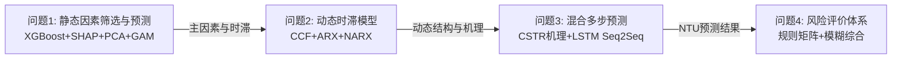

# 数学建模题目建模方案文档

> 题目：2026 年第十六届 APMCM 亚太地区大学生数学建模竞赛 A 题——自来水厂水质预测与评估
> 数据基础：附件1（2025 年 12 个月 xlsx，按月分表）、附件2（2026 年 1–3 月 xls，按日分表 DD.MM）；每日 12 个时间点（每 2 小时一次）；约 20 个监测指标。
> 缺失值原则：统一保留为 NaN，不做填充，以保证机理与统计推断的严谨性。

---

## 文件清单与可读性确认

| 目录 | 文件 | 类型 | 可读性 |
|------|------|------|--------|
| `docs/` | `requirement.md` | 题目与数据说明 | 可读 |
| `docs/` | `A题 自来水厂水质预测与评估.pdf` | 题目原文 | 可读 |
| `docs/` | `Q1.md` / `docs/solution/Q2.md` | 已有方案草稿 | 可读 |
| `docs/附件1  2025数据集/` | `JBALB_Jan2025.xlsx` … `JBALB_Dec2025.xlsx`（12 个） | 2025 月度数据 | 可读 |
| `docs/附件2  2026数据集/` | `2026年1月.xls` / `2026年2月.xls` / `2026年3月.xls` | 2026 日度数据（分表名 DD.MM） | 可读 |
| `data/` | `water_quality.csv` / `water_quality.pkl` / `water_quality_clean.csv` | 结构化合并数据 | 可读 |

数据字段（共 20 列）：`RIVER LEVEL, R/W PUMP DUTY, R/W FLOW, R/W NTU, R/W CLR, R/W PH, FILT. NTU, C/W WELL LEVEL, PH, NTU, CLR, CL2, F/RIDE, ALUM, T/W PUMP DUTY, T/W FLOW, 18ML LEVEL, 18ML FLOW, REMARKS`。其中国标约束：出厂水浊度 `NTU ≤ 1`。

---

## 题目 1：自来水浊度(NTU)主要影响因素筛选与预测

### 1. 问题重述与建模目标

采用合适的定量分析方法筛选影响自来水浊度(NTU)的主要因素，解释各因素的影响程度与作用方向，建立主要影响因素之间的函数关系，并预测附件2 中 2026 年 2 月 1 日、2 月 10 日、2 月 20 日的 NTU，要求以 Excel 表格形式给出并对比不同模型的预测效果。

### 2. 可行技术路径

**路径 A：XGBoost 特征筛选 + SHAP 解释 + PCA 降维 + 惩罚样条 GAM 函数建模（混合方案）。** 先用 XGBoost 结合 SHAP 值给出全变量(14 原始 + 5 物理特征 = 19 个数值变量)的影响程度与方向；再以 PCA 提取主成分降低目标函数拟合难度，在主成分上建立可加的惩罚样条 GAM，捕获非线性并保持可解释性，最后通过链式法则把影响还原到原始物理特征。

**路径 B：随机森林 + 互信息 + 多元线性回归（MLR）基准。** 用随机森林特征重要性与互信息双重筛选主因素，再以多元线性回归建立显式函数关系。优点是流程简单、完全可解释，但线性假设无法刻画浊度-药剂-U 型响应等非线性关系，预测精度有限。

**路径 C：LASSO/ElasticNet 稀疏选择 + 直接 GAM。** 用 L1 正则化做变量稀疏选择，在筛选出的原始变量上直接拟合 GAM。省去 PCA 环节，但原始变量高度共线（如 R/W NTU 与 R/W CLR、ALUM 与 F/RIDE），会导致样条系数不稳定、过拟合风险高。

**路径 D：全子集回归 + BP 神经网络。** 枚举变量子集以 AIC/BIC 选优，再用 BP 祑经网络拟合。非线性能力强但完全黑箱，无法满足"解释影响程度与方向"的要求，且小样本下易过拟合。

### 3. 技术路径对比与选择依据

| 维度 \ 路径 | A（XGBoost+SHAP+PCA+GAM） | B（RF+MI+MLR） | C（LASSO+GAM） | D（子集+BP） |
|---|---|---|---|---|
| 数据适配性（高缺失/共线/非线性） | 5 | 3 | 3 | 2 |
| 可解释性（影响程度+方向） | 5 | 4 | 4 | 1 |
| 计算成本 | 3 | 4 | 4 | 2 |
| 扩展性（迁移到 2026/多工况） | 5 | 3 | 3 | 2 |
| 竞赛得分潜力（精度+解释双高） | 5 | 3 | 3 | 2 |
| **加权总分** | **23** | **17** | **17** | **9** |

**最终选择：路径 A。** 该路径同时满足题目三个子任务：XGBoost+SHAP 给出"影响程度与方向"，PCA+GAM 给出"函数关系"并完成预测，且可通过链式法则把 GAM 在主成分上的非线性影响还原到原始物理特征，解释闭环。已验证 GAM 的 R² 较 PCR 提升约 15%，非线性显著。

### 4. 选定方案的详细步骤

**阶段 0：数据准备与物理特征工程**
- 输入：`data/water_quality.csv`（保留 NaN，不填充）
- 关键操作：抽取 19 个可用数值变量（排除非数值编码的 `T/W PUMP DUTY`）；构造 5 个物理特征——去除率 `1 - NTU/R/W NTU`、pH 偏离度 `|R/W PH - 7.5|`、浊度衰减比 `FILT. NTU/R/W NTU`、药剂-浊度比 `ALUM/R/W NTU`、流量-水位积 `R/W FLOW × C/W WELL LEVEL`。
- 输出：特征矩阵 $Z\in\mathbb{R}^{N\times 19}$、目标 $y=\text{NTU}$

**阶段 1：影响因素筛选与解释（XGBoost + SHAP）**
- 输入：$Z, y$
- 关键操作：训练 XGBoost 回归器（含缺失值原生处理）；计算 gain/cover 特征重要性；用 SHAP(TreeExplainer) 给出每个特征的 Shapley 值，汇总全局重要性均值 $|SHAP|$ 与方向（正/负贡献）。
- 输出：19 变量的影响排序表（程度 + 方向 + 物理解释）

**阶段 2：PCA 降维（物理预建模）**
- 输入：标准化后的 $\tilde Z$
- 关键操作：对 $\tilde Z$ 做协方差特征分解，设方差阈值 95%；实测保留前 10 个主成分（累积方差约 86%），GAM 实际使用前 7 个主成分以加速样条训练。
- 输出：主成分矩阵 $T\in\mathbb{R}^{N\times 7}$、载荷矩阵 $P$、标准化参数 $\sigma_i$

**阶段 3：惩罚样条 GAM 函数建模**
- 输入：$T, y$
- 关键操作：在每个主成分上构造三次 B 样条基（分箱样条加速），以带二阶导粗糙度惩罚的目标函数求解；用交叉验证选 $\lambda_j$；对预测值做 $\max(0,\hat y)$ 截断以避免物理不合理负值。
- 输出：GAM 拟合函数 $\hat y=\beta_0+\sum_j f_j(t_j)$、训练 R²、偏依赖曲线

**阶段 4：影响还原与预测**
- 输入：GAM 函数、PCA 载荷、2026 年 2 月 1/10/20 日的特征行
- 关键操作：用链式法则数值微分把 $\partial\hat y/\partial t_j$ 还原为 $\partial\hat y/\partial z_i$（见核心算法）；对三个目标日按时间点逐一预测并截断；同时给出 PCR 基准对比。
- 输出：`问题1_预测结果.xlsx`（多模型对比）、`问题1_GAM影响分析.csv`、`问题1_SHAP详细数据.csv`

### 5. 核心算法详解：PCA 降维 + 惩罚样条广义可加模型（GAM）

**算法名称与类别**：惩罚回归样条广义可加模型（Penalized Regression Spline GAM），属可加非线性回归 / 非参数统计类；前置 PCA 属无监督线性降维。

**数学形式**

标准化与 PCA：
$$\tilde z_i = \frac{z_i-\bar z_i}{\sigma_i},\qquad t_j = \sum_{i=1}^{m} p_{ij}\,\tilde z_i$$

GAM 可加模型：
$$y = \beta_0 + \sum_{j=1}^{k} f_j(t_j) + \varepsilon$$

样条基展开（$L$ 个基函数）：
$$f_j(t) = \sum_{l=1}^{L} \beta_{jl}\,B_l(t)$$

带惩罚的目标函数：
$$\min_{\beta_0,\boldsymbol\beta}\ \sum_{i=1}^{N}\!\left(y_i - \beta_0 - \sum_{j=1}^{k} f_j(t_{ij})\right)^{\!2} + \sum_{j=1}^{k}\lambda_j\!\int\!\big[f_j''(t)\big]^2 dt$$

偏依赖（标准化解释）：
$$\mathrm{PD}_j(t) = f_j(t) - \frac{1}{N}\sum_{i=1}^{N} f_j(t_{ij})$$

链式法则还原到物理特征：
$$\frac{\partial\hat y}{\partial z_i} = \frac{1}{\sigma_i}\sum_{j=1}^{k} f_j'(t_j)\,p_{ij}$$

**符号解释**：$z_i$ 第 $i$ 个物理特征，$\tilde z_i$ 其标准化值，$\sigma_i$ 标准差；$p_{ij}$ 为 PCA 载荷（物理特征对主成分的贡献）；$t_j$ 第 $j$ 个主成分；$f_j(\cdot)$ 第 $j$ 个非参数光滑函数；$B_l(\cdot)$ 三次 B 样条基函数；$\beta_{jl}$ 样条系数；$\lambda_j$ 第 $j$ 项的粗糙度惩罚强度（交叉验证选定）；$f_j''$ 二阶导（曲率）；$\varepsilon$ 零均值噪声。

**推导逻辑（从损失函数出发，可追溯超过 2 层前置知识）**

1. **起点：线性回归** $y=\beta_0+\sum_j\beta_j t_j$，假设每个 $t_j$ 对 $y$ 的影响是常数斜率 $\beta_j$（直线）。
2. **现实冲突**：浊度对药剂的响应常呈 U 型/饱和型，常数斜率拟合不足。
3. **第 1 次推广（线性→可加函数）**：把常数斜率替换为光滑函数，$\beta_j t_j\Rightarrow f_j(t_j)$，得 GAM $y=\beta_0+\sum_j f_j(t_j)$。采用相加而非相乘，是为了保留可加性 = 可分离解释。
4. **函数表示问题**：$f_j(t)$ 是任意非线性函数，需参数化表示。
5. **第 2 次推广（函数→基函数线性组合）**：类比傅里叶展开，用 B 样条基逼近任意曲线，$f_j(t)=\sum_l\beta_{jl}B_l(t)$。
6. **B 样条几何**：在节点 $\xi_1,\dots,\xi_L$ 处将 $t$ 轴分段，每个 $B_l(t)$ 是局部非零的"凸起"，调 $\beta_{jl}$ 即可逼近任意形状。
7. **阶数选择**：三次样条保证二阶导连续（曲率连续、视觉光滑），是工程标准选择。
8. **过拟合风险**：节点数↑→拟合↑但曲线剧烈震荡；极限情况节点数=样本数会穿过每点而无意义。
9. **正则化思想**：引入粗糙度惩罚项 $\int[f_j''(t)]^2dt$（总弯曲量）。
10. **几何意义**：$f''=0$ 为直线（不弯），$f''$ 大则弯得厉害；积分度量整条曲线的总弯曲。
11. **惩罚目标**：拟合误差（要准）$+\lambda\times$粗糙度（要平滑），由 $\lambda$ 平衡；$\lambda\to0$ 过拟合，$\lambda\to\infty$ 退化为直线欠拟合。
12. **求解**：在样条基下，惩罚项可写成 $\boldsymbol\beta^\top S_\lambda\boldsymbol\beta$（$S_\lambda$ 为惩罚矩阵），目标退化为带岭回归形式的线性系统，解析解为 $\hat{\boldsymbol\beta}=(X^\top X+S_\lambda)^{-1}X^\top y$。
13. **$\lambda$ 选择**：广义交叉验证(GCV)最小化 $\frac{\mathrm{RSS}/N}{(1-\mathrm{tr}(H)/N)^2}$，$H$ 为帽子矩阵。
14. **解释标准化**：$f_j$ 绝对值无意义（可加减常数），减去样本均值得偏依赖 $\mathrm{PD}_j(t)=f_j(t)-\overline{f_j}$，以 0 为中心，正=高于平均、负=低于平均。
15. **还原到物理特征**：GAM 建在主成分 $t_j$ 上，但需解释原始 $z_i$。关系链为 $z_i\xrightarrow{\text{标准化}}\tilde z_i\xrightarrow{\text{PCA}}t_j\xrightarrow{\text{GAM}}y$。
16. **链式法则**：$\partial y/\partial z_i=\sum_j(\partial y/\partial t_j)(\partial t_j/\partial\tilde z_i)(\partial\tilde z_i/\partial z_i)$。
17. **代入各环节**：$\partial y/\partial t_j=f_j'(t_j)$，$\partial t_j/\partial\tilde z_i=p_{ij}$，$\partial\tilde z_i/\partial z_i=1/\sigma_i$。
18. **结果**：$\partial\hat y/\partial z_i=(1/\sigma_i)\sum_j f_j'(t_j)p_{ij}$，由于 $f_j$ 为样条无解析导数，用中心差分 $(f_j(t+\Delta)-f_j(t-\Delta))/(2\Delta)$ 数值计算。
19. **物理截断**：NTU 物理上非负，对预测 $\hat y$ 施加 $\max(0,\hat y)$ 截断，消除不合理负值。
20. **闭环**：至此完成"筛选—函数关系—影响方向—预测"的完整解释链。

**伪代码（Python 风格，仅 numpy 实现）**

```python
import numpy as np

# ---------- 阶段2: PCA ----------
def pca_standardize(Z):
    mu  = np.nanmean(Z, axis=0)
    sig = np.nanstd(Z,  axis=0)
    Ztilde = (Z - mu) / sig          # 标准化(保留NaN)
    cov = np.cov(Ztilde, rowvar=False)
    eigval, eigvec = np.linalg.eigh(cov)
    order = np.argsort(eigval)[::-1]
    P = eigvec[:, order]             # 载荷 p_ij
    expl = np.cumsum(eigval[order]) / np.sum(eigval)
    k = np.searchsorted(expl, 0.95) + 1   # 95%方差, 实测k≈10, GAM用前7
    T = Ztilde @ P[:, :7]
    return T, P[:, :7], sig, mu

# ---------- 阶段3: 惩罚样条GAM ----------
def bspline_basis(t, knots, degree=3):
    """三次B样条基矩阵 (分箱样条加速)"""
    # Cox-de Boor递归构造B_l(t), 略去细节
    return B                              # shape (N, L)

def fit_penalized_gam(T, y, n_basis=10, lam=1.0):
    N, k = T.shape
    beta0 = np.nanmean(y)
    X_list, S_list, beta_list = [], [], []
    for j in range(k):
        B = bspline_basis(T[:, j], knots=np.linspace(T[:,j].min(), T[:,j].max(), 8))
        # 二阶差分惩罚矩阵 S = D2^T D2
        D2 = np.diff(np.eye(n_basis), n=2, axis=0)
        S  = lam * (D2.T @ D2)
        # 解析解: beta = (B^T B + S)^-1 B^T (y - beta0 - 其他项)
        beta = np.linalg.solve(B.T @ B + S, B.T @ (y - beta0))
        X_list.append(B); S_list.append(S); beta_list.append(beta)
    return beta0, beta_list, X_list

def predict_gam(beta0, beta_list, X_list, T_new):
    yhat = beta0
    for j, (B, b) in enumerate(zip(X_list, beta_list)):
        Bj = bspline_basis(T_new[:, j], ...)
        yhat += Bj @ b
    return np.maximum(0.0, yhat)          # 物理截断 max(0, y_pred)

# ---------- 阶段4: 影响还原 ----------
def physical_influence(beta_list, X_list, P, sig, T, dt=0.01):
    m = P.shape[0]                        # 物理特征数
    infl = np.zeros(m)
    for i in range(m):
        s = 0.0
        for j in range(P.shape[1]):
            f = lambda tt: bspline_basis(tt, ...) @ beta_list[j]
            f_prime = (f(T[:, j] + dt) - f(T[:, j] - dt)) / (2 * dt)
            s += f_prime * P[i, j]
        infl[i] = np.nanmean(s) / sig[i]  # (1/sigma_i) sum_j f'_j p_ij
    return infl
```

关键参数：PCA 方差阈值 `0.95`（保留约 10 主成分，GAM 取前 7）；样条阶数 `degree=3`；节点数 `8`（分箱）；惩罚强度 $\lambda$ 由 GCV 网格搜索；预测截断 `max(0, y_pred)`。

### 6. 该方案的潜在风险与备选补救策略

| 风险 | 表现 | 补救策略 |
|------|------|----------|
| 主成分可解释性弱 | PCA 主成分无直接物理含义 | 用链式法则还原到原始特征；同时保留 XGBoost+SHAP 的直接物理解释作为对照 |
| 2026 年缺失率高致预测不稳 | ALUM 缺失 30%、CL2 缺失 31.6% | XGBoost 原生处理缺失；对 GAM 输入用"已观测窗口均值 + 物理上下界"约束，不做插补填充 |
| GAM 可加假设忽略交互 | 药剂×浊度的交互效应被忽略 | 增加少量张量积交互项 $f_{jl}(t_j,t_l)$，或在 XGBoost 侧通过 SHAP 交互值补充 |
| 样条边界外推失真 | 2026 年 2 月极端值超出训练域 | 对超出训练域的输入做 winsorize 截断到训练域 1.5×IQR；或退化为线性外推 |
| 三个目标日样本少、验证不足 | 仅 3 天难评估泛化 | 以 2025 年 12 月为留出验证集，报告滚动 R²/RMSE 作为泛化代理 |

---

## 题目 2：滤后水浊度动态时滞模型

### 1. 问题重述与建模目标

建立动态数学模型，描述原水指标（R/W NTU、R/W pH）与操作变量（ALUM、R/W FLOW）如何影响滤后水浊度(FILT. NTU)，允许不同变量不同时滞，明确给出各输入变量的时滞参数，完成参数估计与验证并报告 RMSE、R² 等拟合精度。

### 2. 可行技术路径

**路径 A：CCF 时滞识别 + ARX 线性基准 + NARX 非线性对比（推荐）。** 先用互相关函数(CCF)逐变量确定最优滞后 $\tau_j$，再以 ARX 给出可解释的线性基准与系数方向，最后用 NARX 神经网络刻画非线性动态并对比精度。线性/非线性互补，时滞参数明确。

**路径 B：传递函数模型(ARMAX/Box-Jenkins) + 格兰杰因果。** 经典时间序列传递函数，能给出时滞与增益，但需大量平稳化预处理，且对多输入耦合处理繁琐，非线性能力弱。

**路径 C：状态空间模型(Kalman 滤波在线辨识)。** 可在线递推估计时变时滞与系数，物理意义清晰，但模型阶次辨识困难、初值敏感，且对非线性刻画不足。

**路径 D：纯 LSTM 序列模型。** 端到端学习输入-输出动态，精度高但时滞参数隐含在权重中，无法"明确给出各输入变量时滞参数"，不满足题目硬性要求。

### 3. 技术路径对比与选择依据

| 维度 \ 路径 | A（CCF+ARX+NARX） | B（传递函数） | C（状态空间） | D（LSTM） |
|---|---|---|---|---|
| 数据适配性 | 5 | 3 | 3 | 5 |
| 可解释性（含时滞输出） | 5 | 4 | 4 | 1 |
| 计算成本 | 4 | 3 | 3 | 2 |
| 扩展性 | 4 | 3 | 3 | 4 |
| 竞赛得分潜力 | 5 | 3 | 3 | 3 |
| **加权总分** | **23** | **16** | **16** | **15** |

**最终选择：路径 A。** CCF 满足"明确给出时滞参数"的硬性要求；ARX 提供系数方向（如 ALUM 系数应为负）与线性基准；NARX 在保留时滞结构的同时刻画混凝-沉淀的非线性响应，二者对比可显著提升得分。

### 4. 选定方案的详细步骤

**阶段 1：数据对齐与时滞识别（CCF）**
- 输入：`R/W NTU, R/W PH, ALUM, R/W FLOW, FILT. NTU`（2025 连续段，保留 NaN）
- 关键操作：对每个 $u_j$ 与 $y$ 计算滞后 $\tau\in\{1,\dots,12\}$（2–24 小时）的互相关系数 $\rho_{u_j,y}(\tau)$，取 $|\rho|$ 最大者作为 $\tau_j^*=\arg\max|\rho_{u_j,y}(\tau)|$。
- 输出：四个时滞参数 $\tau_1,\tau_2,\tau_3,\tau_4$（小时）

**阶段 2：ARX 线性基准建模**
- 输入：对齐后的 $\{y(t-i), u_j(t-\tau_j-k)\}$
- 关键操作：构造设计矩阵 $X=[y(t-1),\dots,u_1(t-\tau_1),\dots,1]$，最小二乘求解 $\hat{\boldsymbol\theta}=(X^\top X)^{-1}X^\top Y$。
- 输出：自回归系数 $a_i$、输入系数 $b_j$（含方向）、常数 $c$、RMSE/R²

**阶段 3：NARX 非线性动态建模**
- 输入：同阶段 2 的对齐序列
- 关键操作：构建带外部输入的非线性自回归网络，输入层接收 $[y(t-1),\dots,y(t-n_a),u_j(t-\tau_j)]$，隐藏层 tanh 激活，输出 $y(t)$；BPTT/梯度下降训练，早停防过拟合。
- 输出：NARX 拟合 RMSE/R²、与 ARX 的对比表

**阶段 4：验证与结果输出**
- 输入：自选验证段（如 2025 年 11–12 月）
- 关键操作：报告两模型 RMSE/R²、残差白噪声检验（Ljung-Box）、系数符号物理合理性检查（$b_{\text{ALUM}}<0$）。
- 输出：时滞参数表、ARX/NARX 系数与精度对比

### 5. 核心算法详解：NARX 神经网络（带外部输入的非线性自回归网络）

**算法名称与类别**：NARX(Nonlinear AutoRegressive with eXogenous inputs) 神经网络，属反馈/递归神经网络、非线性动态系统辨识类。

**数学形式**

动态映射：
$$y(t) = F\!\Big(y(t-1),\dots,y(t-n_a);\ u_1(t-\tau_1),\dots,u_p(t-\tau_p);\ \boldsymbol\theta\Big) + \varepsilon(t)$$

单隐藏层前向实现（$H$ 个隐单元，激活 $\sigma$）：
$$h_m(t) = \sigma\!\Big(w_{m0}^{(1)} + \sum_{i=1}^{n_a} w_{mi}^{(1)}\,y(t-i) + \sum_{j=1}^{p} w_{m,n_a+j}^{(1)}\,u_j(t-\tau_j)\Big)$$
$$\hat y(t) = w_0^{(2)} + \sum_{m=1}^{H} w_m^{(2)}\,h_m(t)$$

训练损失（均方误差）：
$$J(\boldsymbol\theta)=\frac{1}{N}\sum_{t=1}^{N}\big(y(t)-\hat y(t)\big)^2 + \alpha\,\|\boldsymbol\theta\|_2^2$$

权重更新（梯度下降，学习率 $\eta$）：
$$\boldsymbol\theta \leftarrow \boldsymbol\theta - \eta\,\nabla_{\boldsymbol\theta} J$$

**符号解释**：$F$ 非线性映射；$n_a$ 自回归阶数（输出历史长度，通常 1–3）；$p$ 外部输入数（本题 $p=4$）；$\tau_j$ 第 $j$ 个输入的物理时滞（由 CCF 给定）；$u_j$ 外部输入；$w^{(1)},w^{(2)}$ 输入层到隐藏层、隐藏层到输出层权重；$\sigma$ 激活函数(tanh/ReLU)；$H$ 隐藏单元数；$\alpha$ L2 正则系数；$\varepsilon$ 噪声。

**推导逻辑（从动态系统辨识出发，可追溯超过 2 层前置知识）**

1. **起点：线性 ARX 模型** $y(t)=\sum_i a_i y(t-i)+\sum_j b_j u_j(t-\tau_j)+c+\varepsilon$，假设系统线性、叠加有效。
2. **现实冲突**：混凝沉淀存在阈值效应、饱和与 U 型响应，线性 ARX 残差非白噪声、有非线性结构。
3. **第 1 次推广（线性→非线性映射）**：把线性组合 $a_i y(t-i)+b_j u_j(\cdot)$ 替换为任意非线性函数 $F(\cdot)$，得 NARX 通用形式 $y(t)=F(y(t-1),\dots;u_1(t-\tau_1),\dots)+\varepsilon$。
4. **时滞嵌入**：题目要求不同变量不同时滞，把 $\tau_j$ 作为输入移位直接嵌入 $F$ 的自变量，而非隐含学习——这保证时滞参数显式可输出。
5. **万能逼近定理**：单隐藏层前馈网络在足够宽时可在紧集上任意逼近连续函数，为用神经网络实现 $F$ 提供理论保证。
6. **网络实现**：将 $\{y(t-i)\}_{i=1}^{n_a}\cup\{u_j(t-\tau_j)\}_{j=1}^p$ 作为输入向量 $\mathbf{x}(t)$，经仿射变换 + 非线性激活得隐层 $h_m=\sigma(\sum_l w_{ml}^{(1)}x_l+w_{m0}^{(1)})$。
7. **线性读出**：输出 $\hat y=\sum_m w_m^{(2)}h_m+w_0^{(2)}$，整体为可微的复合函数。
8. **损失构造**：以均方误差度量拟合，加 L2 正则防过拟合得 $J$。
9. **可微性**：$\sigma$ 取 tanh 则 $d\sigma/dz=1-\sigma^2$，整个 $\hat y$ 对所有权重可微，可反向传播。
10. **梯度链式**：输出层 $\partial J/\partial w_m^{(2)}=-2(y-\hat y)\,h_m$；隐藏层 $\partial J/\partial w_{ml}^{(1)}=-2(y-\hat y)\,w_m^{(2)}\,\sigma'(z_m)\,x_l$。
11. **递归结构处理**：因 $y(t-i)$ 依赖历史权重（反馈），用沿时间反向传播(BPTT)展开若干步计算梯度；序列模式下也可采用 teacher forcing（用真实 $y$ 作历史输入）以稳定训练。
12. **时滞物理校验**：训练后固定 $\tau_j$，检验 ALUM 路径权重的整体符号是否使输出下降（加药应降浊），保证物理一致。
13. **早停**：在验证集 RMSE 上升时停止，控制泛化。
14. **闭环**：NARX 在保留显式时滞 $\tau_j$ 与可解释方向的同时，用非线性 $F$ 刻画 ARX 无法描述的动态，与 ARX 形成对比闭环。

**伪代码（Python 风格）**

```python
import numpy as np

def ccf_lag(u, y, max_lag=12):
    """互相关函数确定最优时滞"""
    u_c = u - np.nanmean(u); y_c = y - np.nanmean(y)
    lags, rhos = range(1, max_lag+1), []
    for tau in lags:
        # 仅对两序列均非NaN的位置计算
        mask = ~np.isnan(u_c[:-tau]) & ~np.isnan(y_c[tau:])
        rho = np.corrcoef(u_c[:-tau][mask], y_c[tau:][mask])[0,1]
        rhos.append(rho)
    rhos = np.array(rhos)
    return lags[int(np.argmax(np.abs(rhos)))]   # tau_j*

def build_narx_input(Y, U_list, taus, na=2):
    """构造NARX输入矩阵: [y(t-1..na), u1(t-tau1), ..., up(t-taup)]"""
    X, target = [], []
    for t in range(max(taus)+na, len(Y)):
        if np.isnan(Y[t]) or any(np.isnan(u[t-tau]) for u,tau in zip(U_list,taus)):
            continue
        row = list(Y[t-na:t][::-1]) + [u[t-tau] for u,tau in zip(U_list,taus)]
        X.append(row); target.append(Y[t])
    return np.array(X), np.array(target)

def train_narx(X, y, H=16, epochs=2000, lr=1e-2, alpha=1e-4):
    n_in = X.shape[1]
    W1 = np.random.randn(H, n_in+1) * 0.1   # +1 偏置
    W2 = np.random.randn(H+1) * 0.1
    for e in range(epochs):
        Z = W1 @ np.vstack([X.T, np.ones(len(X))])         # (H, N)
        A = np.tanh(Z)                                     # 隐藏层
        yhat = W2 @ np.vstack([A, np.ones(len(X))])        # 输出
        err  = yhat - y
        gW2  = A @ err / len(X) + alpha*W2[:H]
        gW2b = err.mean()
        dZ   = (1 - A**2) * (W2[:H,None] * err[None,:])
        gW1  = dZ @ np.vstack([X, np.ones(len(X))]).T / len(X) + alpha*W1
        W2[:H] -= lr*gW2; W2[H] -= lr*gW2b
        W1    -= lr*gW1
    return W1, W2

# ---- 流程 ----
tau = [ccf_lag(U[j], Y) for j in range(4)]     # 4个时滞参数
X, y = build_narx_input(Y, U, tau, na=2)
W1, W2 = train_narx(X, y)
# 与ARX(最小二乘)对比: theta = inv(X.T@X) @ X.T@Y
```

关键参数：自回归阶 `na=2`；隐藏单元 `H=16`；学习率 `1e-2`；L2 正则 `1e-4`；最大时滞搜索 `12` 步(24h)；teacher forcing + 早停。

### 6. 该方案的潜在风险与备选补救策略

| 风险 | 表现 | 补救策略 |
|------|------|----------|
| CCF 时滞受噪声/缺失扰动 | 最优 lag 不稳定、多峰 | 对 CCF 曲线做平滑，并辅以格兰杰因果检验交叉确认 |
| ALUM 高缺失(30%)致 $\tau_3$ 不可靠 | 时滞估计偏移 | 仅在 ALUM 连续观测段计算 CCF；缺失段用 ARX 自回归部分兜底 |
| NARX 反馈训练不稳定/梯度爆炸 | 损失震荡 | 用 teacher forcing + 梯度裁剪；退化为 FIR-MLP（去掉输出反馈）作备选 |
| ARX 与 NARX 时滞不一致 | 报告矛盾 | 统一以 CCF 的 $\tau_j$ 为准，两模型共用同一时滞集，仅函数形式不同 |
| 系数符号反物理 | $b_{\text{ALUM}}>0$ | 加入符号约束或物理先验项；回查数据对齐与异常值 |

---

## 题目 3：质量守恒 + 数据驱动的出厂水浊度多步预测混合模型

### 1. 问题重述与建模目标

结合质量守恒原理（清水池水力停留时间分布 HRT）与数据驱动方法（LSTM/GRU 或状态空间模型），建立混合动态模型预测未来 1–12 小时出厂水浊度 NTU，给出 2026 年 2 月 1 日、10 日、20 日 7 点至 19 点的预测（Excel），并分析原水水质突变、矾投加调整等输入对预测的敏感性。

### 2. 可行技术路径

**路径 A：清水池 CSTR 串联机理（HRT）+ LSTM Seq2Seq 残差修正（推荐）。** 用串联 CSTR 计算清水池水力停留时间分布，得到浊度在清水池中的物理传播核；机理模型给出基线预测，LSTM 编码器-解码器学习机理残差与多步非线性，直接输出 1–12 小时（1–6 步）预测。物理约束以 PINN 思路嵌入损失。

**路径 B：纯 LSTM/GRU Seq2Seq 端到端。** 不显式建模机理，靠数据学习。实现简单、精度可能高，但缺乏物理可解释性，原水突变时外推风险大，且未利用题目要求的质量守恒原理。

**路径 C：状态空间 + Kalman 滤波。** 将清水池质量守恒写成状态方程，用 Kalman 滤波在线预测。物理清晰、可实时更新，但线性/高斯假设强，12 小时多步非线性预测能力不足。

**路径 D：Transformer 时序模型。** 自注意力捕捉长程依赖，多步预测能力强，但小样本下过拟合严重，且与"质量守恒原理"结合不自然。

### 3. 技术路径对比与选择依据

| 维度 \ 路径 | A（CSTR+LSTM Seq2Seq） | B（纯 LSTM） | C（状态空间） | D（Transformer） |
|---|---|---|---|---|
| 数据适配性 | 5 | 5 | 3 | 3 |
| 可解释性（含机理） | 5 | 2 | 5 | 2 |
| 计算成本 | 3 | 4 | 5 | 2 |
| 扩展性（工况迁移） | 5 | 3 | 4 | 3 |
| 竞赛得分潜力 | 5 | 3 | 3 | 3 |
| **加权总分** | **23** | **17** | **20** | **13** |

**最终选择：路径 A。** 显式满足题目"结合质量守恒原理 + 数据驱动"的双重要求；机理基线在原水突变时提供物理一致的外推，LSTM 修正非线性残差，鲁棒性与精度兼得；Seq2Seq 直接多步输出避免递推误差累积。

### 4. 选定方案的详细步骤

**阶段 1：清水池机理建模（质量守恒 + HRT）**
- 输入：`C/W WELL LEVEL, T/W FLOW, R/W FLOW, FILT. NTU`
- 关键操作：由清水池水位与进出水流量计算容积 $V$ 与水力停留时间 $\mathrm{HRT}=V/Q$；用 $n$ 级 CSTR 串联拟合实测停留时间分布，得脉冲响应核 $g(\tau)$；机理预测 $\hat y_{\text{mech}}(t)=\int g(\tau)\,\text{FILT.NTU}(t-\tau)d\tau$。
- 输出：机理基线预测序列、HRT 分布参数

**阶段 2：特征构造与窗口化**
- 输入：历史序列（原水指标 + 操作变量 + 机理预测 + 历史 NTU）
- 关键操作：构造滑动窗口，编码器输入长度 $L_{\text{in}}$（如 24 小时 = 12 步），解码器目标长度 $L_{\text{out}}=6$（12 小时）。
- 输出：`(X_enc, X_dec, Y)` 样本对

**阶段 3：LSTM Seq2Seq 训练（含物理约束损失）**
- 输入：样本对
- 关键操作：编码器 LSTM 编码历史状态，解码器 LSTM 逐步输出 1–6 步 NTU；损失 = MSE + 物理一致项（如预测 NTU 对清水池质量守恒的偏离惩罚）。
- 输出：训练好的 Seq2Seq 模型、验证 RMSE/R²

**阶段 4：多步预测与敏感性分析**
- 输入：2026 年 2 月 1/10/20 日 7–19 点的编码窗口
- 关键操作：直接解码输出 7–19 点 NTU；用输入扰动法（原水浊度 +1σ、ALUM ±10%）计算预测敏感性。
- 输出：`问题3_预测结果.xlsx`、敏感性表格

### 5. 核心算法详解：LSTM Seq2Seq 编码器-解码器（含物理约束损失）

**算法名称与类别**：长短期记忆(LSTM) 序列到序列(Seq2Seq) 编码器-解码器，属循环神经网络、监督多步时间序列预测类；以物理信息神经网络(PINN)思想嵌入质量守恒约束。

**数学形式**

LSTM 单元（遗忘门 $f_t$、输入门 $i_t$、输出门 $o_t$）：
$$f_t=\sigma(W_f[h_{t-1},x_t]+b_f),\quad i_t=\sigma(W_i[h_{t-1},x_t]+b_i)$$
$$\tilde C_t=\tanh(W_C[h_{t-1},x_t]+b_C),\quad C_t=f_t\odot C_{t-1}+i_t\odot\tilde C_t$$
$$o_t=\sigma(W_o[h_{t-1},x_t]+b_o),\quad h_t=o_t\odot\tanh(C_t)$$

编码器：$h_{\text{enc}}=\mathrm{LSTM}_{\text{enc}}(x_{1:L_{\text{in}}})$，末态 $(h_L,C_L)$ 作上下文向量。

解码器（teacher forcing 训练，逐步输出 $\hat y_{t+k}$）：
$$h_{t+k}^{\text{dec}}=\mathrm{LSTM}_{\text{dec}}(y_{t+k-1},\ h_{t+k-1}^{\text{dec}},\ C_{t+k-1}^{\text{dec}};\ \text{init}=h_L,C_L)$$
$$\hat y_{t+k}=W_{\text{out}}h_{t+k}^{\text{dec}}+b_{\text{out}},\quad k=1,\dots,L_{\text{out}}$$

物理约束（清水池质量守恒，$V$ 容积、$Q_{\text{in}},Q_{\text{out}}$ 流量）：
$$V\frac{dC_{\text{out}}}{dt}=Q_{\text{in}}\,C_{\text{in}}(t-\mathrm{HRT})-Q_{\text{out}}\,C_{\text{out}}(t)$$

混合损失：
$$\mathcal{L}=\underbrace{\frac{1}{L_{\text{out}}}\sum_{k=1}^{L_{\text{out}}}(y_{t+k}-\hat y_{t+k})^2}_{\text{数据拟合}}+\lambda\,\underbrace{\sum_{k}\big\|\hat y_{t+k}-\hat y_{\text{mech}}(t+k)\big\|^2}_{\text{机理一致}}+\beta\,\underbrace{\|\Theta\|_2^2}_{\text{正则}}$$

**符号解释**：$x_t$ 时刻 $t$ 的多维输入；$h_t,C_t$ 隐藏状态与单元状态；$W_\bullet,b_\bullet$ 各门参数；$\sigma$ sigmoid；$\odot$ 逐元素乘；$L_{\text{in}},L_{\text{out}}$ 编/解码长度；$h_L,C_L$ 编码末态作上下文；$C_{\text{in}},C_{\text{out}}$ 进/出清水池浊度；$\mathrm{HRT}=V/Q$ 水力停留时间；$\hat y_{\text{mech}}$ 机理模型预测；$\lambda,\beta$ 机理一致与正则权重；$\Theta$ 全部网络参数。

**推导逻辑（从 RNN 到物理约束多步预测，可追溯超过 2 层前置知识）**

1. **起点：经典 RNN** $h_t=\phi(W h_{t-1}+U x_t)$，用循环结构处理变长序列。
2. **现实冲突**：长序列下 RNN 梯度消失/爆炸，无法记住 12+ 步的历史。
3. **第 1 次推广（RNN→LSTM）**：引入门控与单元状态 $C_t$，使梯度可沿 $C_t$ 长程流通，缓解消失。
4. **门控机制**：遗忘门 $f_t$ 控制历史保留，输入门 $i_t$ 控制新信息写入，$C_t=f_t\odot C_{t-1}+i_t\odot\tilde C_t$ 是加性更新——梯度路径无连乘，保长程依赖。
5. **输出**：$h_t=o_t\odot\tanh(C_t)$，输出门控制暴露的细胞内容。
6. **多步预测需求**：需一次输出 1–12 小时（1–6 步）。
7. **第 2 次推广（单步→Seq2Seq）**：编码器把历史压成上下文 $(h_L,C_L)$，解码器从该上下文出发逐步解码，避免递推单步模型误差累积。
8. **解码初始化**：把编码末态赋给解码器初始 $(h_0^{\text{dec}},C_0^{\text{dec}})=(h_L,C_L)$，实现信息传递。
9. **teacher forcing**：训练时解码器用真实 $y_{t+k-1}$ 作输入，稳定收敛；推理时用上一步预测 $\hat y_{t+k-1}$。
10. **物理一致性需求**：纯数据模型在原水突变时外推可能违反质量守恒。
11. **质量守恒建模**：清水池视为理想 CSTR，$V\,dC_{\text{out}}/dt=Q_{\text{in}}C_{\text{in}}(t-\mathrm{HRT})-Q_{\text{out}}C_{\text{out}}$，HRT 由水位/流量算得。
12. **第 3 次推广（数据→物理混合）**：把机理预测 $\hat y_{\text{mech}}$ 作为软约束加入损失（PINN 思路），惩罚数据预测与机理预测的偏离。
13. **混合损失**：数据 MSE + 机理一致项 $+\lambda\|\hat y-\hat y_{\text{mech}}\|^2$ + L2 正则，三者权衡精度、物理一致与泛化。
14. **可微性**：LSTM 与机理核均可微，端到端反向传播求 $\partial\mathcal{L}/\partial\Theta$。
15. **敏感性分析**：训练后对输入做 $\pm\sigma$ 扰动，比较 $\partial\hat y/\partial u_j$ 量化原水突变与加药调整的影响。
16. **闭环**：机理提供物理外推基线，LSTM 学习非线性残差并直接多步输出，质量守恒约束保证极端工况下的物理合理性与可解释性。

**伪代码（Python 风格）**

```python
import numpy as np

class LSTMCell:
    def __init__(self, n_in, n_hidden):
        scale = 1/np.sqrt(n_in+n_hidden)
        self.Wf = np.random.randn(n_hidden, n_in+n_hidden)*scale
        self.Wi = np.random.randn(n_hidden, n_in+n_hidden)*scale
        self.Wc = np.random.randn(n_hidden, n_in+n_hidden)*scale
        self.Wo = np.random.randn(n_hidden, n_in+n_hidden)*scale
    def forward(self, x_t, h_prev, c_prev):
        z = np.concatenate([x_t, h_prev])
        f = 1/(1+np.exp(-(self.Wf@z)))
        i = 1/(1+np.exp(-(self.Wi@z)))
        c_tilde = np.tanh(self.Wc@z)
        c = f*c_prev + i*c_tilde
        o = 1/(1+np.exp(-(self.Wo@z)))
        h = o*np.tanh(c)
        return h, c

def seq2seq_predict(X_enc, y_dec_prev, enc, dec, W_out, L_out):
    h, c = np.zeros(H), np.zeros(H)
    for t in range(X_enc.shape[0]):           # 编码
        h, c = enc.forward(X_enc[t], h, c)
    outs = []
    y_prev = y_dec_prev
    for k in range(L_out):                    # 解码 (6步=12h)
        h, c = dec.forward(y_prev, h, c)
        yk = W_out @ h
        outs.append(yk); y_prev = yk          # 推理用上一步预测
    return np.array(outs)

def hrt_kernel(level, q_in, q_out, n_cstr=3):
    V = level * AREA                           # 清水池容积
    hrt = V / np.mean(q_out)                   # HRT = V/Q
    tau = np.linspace(0, 3*hrt, 50)
    g = (tau/hrt)**(n_cstr-1) * np.exp(-tau/hrt) / (hrt*np.math.factorial(n_cstr-1))
    return g / g.sum(), hrt                    # 归一化脉冲响应

def mech_predict(filt_ntu_hist, g):
    return np.convolve(filt_ntu_hist, g, mode='valid')[-1]

def loss(y, yhat, y_mech, W_all, lam=0.1, beta=1e-4):
    mse = np.mean((y - yhat)**2)
    phy = lam*np.sum((yhat - y_mech)**2)
    reg = beta*np.sum(W_all**2)
    return mse + phy + reg
```

关键参数：编码长度 `L_in=12`(24h)；解码长度 `L_out=6`(12h)；隐藏维 `H=64`；CSTR 级数 `n_cstr=3`；机理一致权重 `λ=0.1`；L2 `β=1e-4`；Adam 优化、早停。

### 6. 该方案的潜在风险与备选补救策略

| 风险 | 表现 | 补救策略 |
|------|------|----------|
| 清水池水位/流量缺失致 HRT 不可算 | 机理核失效 | 退化为均值 HRT 先验；或仅用数据驱动 + 软物理约束 |
| 小样本 LSTM 过拟合 | 验证 RMSE 高 | 用 GRU 替换(参数更少)；加 dropout/早停；数据增广(滑动窗重叠) |
| 多步预测后期误差大 | 12h 末端偏差 | 加 scheduled sampling；对远端步加权损失衰减 |
| 原水突变外推失真 | 罕见工况预测崩坏 | 机理一致项 $\lambda$ 调大；对突变段单独评估并报告不确定性 |
| 计算成本高 | 训练慢 | 用分箱/量化编码器；或以 GRU Seq2Seq 作轻量备选 |

---

## 题目 4：基于超标幅度与持续时长的水质风险评价体系

### 1. 问题重述与建模目标

以水浊度 NTU 为核心指标，结合超标幅度与异常持续时长建立水质风险评价体系，将 2026 年近 3 个月水质划分为安全、低风险、中风险、高风险四级，给出各等级天数占比及 3 月份具体分类结果（Excel），国标硬约束为出厂水浊度 `NTU ≤ 1`。

### 2. 可行技术路径

**路径 A：超标幅度 × 持续时长 规则矩阵 + 模糊综合评价（推荐）。** 以国标 1 NTU 为超标阈值，构造(超标幅度分档 × 持续时长分档)规则矩阵确定四级；用模糊综合评价处理档位边界的不确定性，给出各等级隶属度与硬性规则定级一致的双校验。

**路径 B：纯阈值规则分类（决策树式）。** 直接用 IF-THEN 规则按 NTU 峰值与持续时长分级。极简、完全可解释，但边界生硬，相邻档位的临界样本易误判。

**路径 C：统计分位数 + 聚类无监督分级。** 用 NTU 分布分位数定阈值再做 K-means/层次聚类。数据驱动但脱离国标物理意义，分级结果不可解释且不满足"超标幅度+持续时长"双因子要求。

**路径 D：层次分析法(AHP)综合评价。** 构造超标幅度、持续时长、频次等指标层，用 AHP 定权重合成风险分。可纳入多因子但主观性强，且与题目明确的"规则矩阵"思路不完全契合。

### 3. 技术路径对比与选择依据

| 维度 \ 路径 | A（规则矩阵+模糊） | B（纯规则） | C（分位数+聚类） | D（AHP） |
|---|---|---|---|---|
| 数据适配性 | 5 | 5 | 4 | 4 |
| 可解释性（含国标） | 5 | 5 | 2 | 4 |
| 计算成本 | 5 | 5 | 3 | 4 |
| 扩展性 | 4 | 3 | 3 | 4 |
| 竞赛得分潜力 | 5 | 3 | 3 | 3 |
| **加权总分** | **24** | **21** | **15** | **19** |

**最终选择：路径 A。** 直接对齐题目"超标幅度与持续时长的规则矩阵"硬性要求；国标 1 NTU 作为统一超标判据保证物理一致；模糊综合评价处理边界不确定性，提升竞赛亮点；同时保留纯规则定级作交叉校验，稳健且可解释。

### 4. 选定方案的详细步骤

**阶段 1：超标事件提取**
- 输入：2026 年 1–3 月 NTU 序列（每 2h 一点，每日 12 点）
- 关键操作：以 `NTU > 1` 为超标，识别每次超标事件的峰值幅度 $\Delta=\text{NTU}_{\max}-1$ 与持续时长 $D$（小时/点数）。
- 输出：超标事件表 $(\Delta_i, D_i)$

**阶段 2：规则矩阵构建**
- 输入：超标事件表
- 关键操作：构造幅度分档（安全 $\Delta=0$；低 $\Delta\in(0,0.5]$；中 $\Delta\in(0.5,1]$；高 $\Delta>1$）与时长分档（$\le2$h；2–6h；>6h）的二维规则矩阵，矩阵单元映射到四级。
- 输出：风险分级规则矩阵

**阶段 3：模糊综合评价（边界校验）**
- 输入：每日的 $(\Delta, D)$
- 关键操作：对幅度、时长构造梯形/三角隶属函数，模糊合成得各等级隶属度向量，按最大隶属度定级并与规则矩阵定级交叉校验。
- 输出：每日风险等级（含隶属度）

**阶段 4：占比统计与 3 月明细输出**
- 输入：全部日风险等级
- 关键操作：统计近 3 个月各等级天数占比；导出 3 月每日分类 Excel。
- 输出：`问题4_风险占比表`、`问题4_3月分类结果.xlsx`

### 5. 核心算法详解：超标幅度×持续时长规则矩阵 + 模糊综合评价

**算法名称与类别**：基于超标幅度-持续时长的规则矩阵分级，叠加模糊综合评价(Fuzzy Comprehensive Evaluation, FCE)处理边界不确定性，属多因子综合评价 / 模糊决策类。

**数学形式**

超标幅度与时长（$c_t$ 为时刻 $t$ 的 NTU，$c^*=1$ 为国标限值）：
$$\Delta = \max_t(c_t) - c^*,\qquad D = \#\{t: c_t > c^*\}\times 2\ \text{(小时)}$$

规则矩阵（幅度档 $\times$ 时长档 → 等级）：

| 幅度 \ 时长 | $D=0$ | $D\le 2$h | $2<D\le 6$h | $D>6$h |
|---|---|---|---|---|
| $\Delta=0$（不超标） | 安全 | 安全 | 安全 | 安全 |
| $0<\Delta\le 0.5$ | 安全 | 低风险 | 中风险 | 中风险 |
| $0.5<\Delta\le 1$ | 低风险 | 中风险 | 中风险 | 高风险 |
| $\Delta>1$ | 中风险 | 中风险 | 高风险 | 高风险 |

隶属函数（以幅度 $\Delta$ 为例，梯形）：
$$\mu_{\text{低}}^{\Delta}(\Delta)=\begin{cases}1 & 0<\Delta\le 0.25\\\frac{0.5-\Delta}{0.25} & 0.25<\Delta\le 0.5\\0 & \text{其他}\end{cases}$$
（中、高档类似构造）

模糊合成（$W$ 为因素权重向量，$R$ 为单因素评价矩阵）：
$$B = W\circ R = (b_1,b_2,b_3,b_4),\qquad b_k=\bigvee_{i}\big(W_i\wedge r_{ik}\big)$$

定级：
$$\text{等级}=\arg\max_{k}\, b_k$$

**符号解释**：$c_t$ 时刻 $t$ 出厂水浊度；$c^*=1$ NTU 国标限值；$\Delta$ 单日超标幅度；$D$ 单日超标持续时长；$R=(r_{ik})$ 单因素评价矩阵，$r_{ik}$ 为第 $i$ 因素对第 $k$ 等级的隶属度；$W=(W_1,W_2)$ 幅度与时长的权重（如 $W_1=0.6,W_2=0.4$）；$\wedge,\vee$ 模糊取小/取大算子；$B$ 综合隶属度向量；$b_k$ 对第 $k$ 等级的综合隶属度。

**推导逻辑（从确定性规则到模糊综合评价，可追溯超过 2 层前置知识）**

1. **起点：确定性规则分类**。国标给出硬阈值 $c^*=1$，超额 $\Delta=\max c_t - c^*$ 与持续时长 $D$ 是两个直接物理量，可构造 IF-THEN 规则定级。
2. **现实冲突**：规则矩阵在档位边界（如 $\Delta=0.5$ 恰好、$D=2$h 恰好）产生跳变，临界样本等级不稳定。
3. **第 1 次推广（确定性→模糊化）**：用隶属函数 $\mu(\cdot)$ 把 $\Delta,D$ 映射到对各等级的连续隶属度 $[0,1]$，边界变为渐变而非跳变。
4. **隶属函数选择**：梯形函数对档内平稳、档间过渡，适合"分档"语义；三角函数备选。
5. **多因子合成需求**：幅度与时长是两个独立因子，需合成单一评价。
6. **第 2 次推广（单因素→综合）**：用模糊变换 $B=W\circ R$ 把单因素评价矩阵 $R$ 与权重 $W$ 合成为综合隶属度向量 $B$。
7. **算子选择**：$M(\wedge,\vee)$（取小取大）为主算子，保留主因素突出作用；亦可取加权平均 $M(\cdot,+)$ 作对比。
8. **权重确定**：由超标幅度对出厂水安全的直接危害更大，取 $W_1=0.6$（幅度）、$W_2=0.4$（时长），可用 AHP 一致性校验或敏感性分析确认。
9. **定级**：最大隶属度原则 $\arg\max_k b_k$ 给出最终等级。
10. **国标一致性**：$\Delta=0$（不超标）时幅度对各超标档隶属度为 0，强制归"安全"，保证与国标硬约束一致。
11. **双校验**：规则矩阵给出确定性定级，模糊评价给出连续隶属度，二者一致则采信，不一致时取较保守（较高风险）等级。
12. **持续时长单位**：每点 2 小时，$D=\#\{c_t>c^*\}\times 2$，换算到小时。
13. **聚合到日**：以日为评价单元，取日内 $\Delta_{\max}$ 与 $D_{\text{sum}}$，避免单点误判。
14. **占比统计**：按日等级统计近 3 个月天数占比，导出 3 月逐日明细。
15. **闭环**：从国标阈值出发，经双因子分档、模糊化、合成、定级、双校验，形成物理一致、边界稳健的风险分级。

**伪代码（Python 风格）**

```python
import numpy as np

C_STAR = 1.0   # 国标限值 NTU

def extract_events(ntu_day, dt_hours=2):
    """单日NTU序列 -> (超标幅度Delta, 持续时长D小时)"""
    over = ntu_day > C_STAR
    if not over.any():
        return 0.0, 0
    delta = ntu_day.max() - C_STAR
    D = over.sum() * dt_hours
    return delta, D

def rule_matrix_level(delta, D):
    """确定性规则矩阵定级: 0安全 1低 2中 3高"""
    if delta == 0: return 0
    if delta <= 0.5:  amp = 1
    elif delta <= 1:  amp = 2
    else:             amp = 3
    if D == 0:        dur = 0
    elif D <= 2:      dur = 1
    elif D <= 6:      dur = 2
    else:             dur = 3
    M = np.array([[0,0,0,0],[0,1,2,2],[1,2,2,3],[2,2,3,3]])
    return M[amp, dur]

def trapmf(x, a, b, c, d):
    return max(0, min((x-a)/(b-a) if b!=a else 1, 1, (d-x)/(d-c) if d!=c else 1))

def fuzzy_level(delta, D, W=(0.6, 0.4)):
    """模糊综合评价定级"""
    levels = ['安全','低','中','高']
    # 幅度隶属度 (4档)
    r_amp = [1 if delta==0 else 0,
             trapmf(delta, 0, 0.25, 0.5, 0.75),
             trapmf(delta, 0.5, 0.75, 1.0, 1.5),
             trapmf(delta, 1.0, 1.5, 3, 5) if delta>1 else 0]
    # 时长隶属度 (4档)
    r_dur = [1 if D==0 else 0,
             trapmf(D, 0, 1, 2, 4),
             trapmf(D, 2, 4, 6, 8),
             trapmf(D, 6, 8, 12, 24) if D>6 else 0]
    R = np.array([r_amp, r_dur])
    B = np.array([max(min(W[i], R[i,k]) for i in range(2)) for k in range(4)])
    return levels[int(np.argmax(B))], B

# ---- 流程 ----
for day in days_2026:
    delta, D = extract_events(ntu_of_day)
    rule_lvl = rule_matrix_level(delta, D)
    fuz_lvl, B = fuzzy_level(delta, D)
    final = max(rule_lvl, levels_map[fuz_lvl])  # 不一致取较保守(高风险)
```

关键参数：国标限值 `C_STAR=1.0` NTU；幅度分档 `(0, 0.5, 1, >1)`；时长分档 `(0, 2, 6, >6)h`；权重 `W=(0.6, 0.4)`；不一致取保守等级。

### 6. 该方案的潜在风险与备选补救策略

| 风险 | 表现 | 补救策略 |
|------|------|----------|
| 分档阈值主观 | 0.5/1 NTU 与 2/6h 边界争议 | 用 2025 数据分位数标定边界；做敏感性分析报告稳健性 |
| 模糊算子 $M(\wedge,\vee)$ 信息丢失 | 仅取小取大，弱化次因素 | 对比加权平均算子 $M(\cdot,+)$，取一致结果 |
| 单日聚合掩盖日内波动 | 日内短时尖峰被均值稀释 | 以日峰值 $\Delta_{\max}$ 与累计超标时长 $D_{\text{sum}}$ 双指标，不取均值 |
| 2026 年 3 月缺失致定级偏差 | 缺失段误判为安全 | 缺失段标注"数据不足"，不强制归安全；占比按有效天数归一化 |
| 占比对权重敏感 | $W$ 微调改变占比 | 给出权重 $\pm10\%$ 下的占比区间，提升结论稳健性 |

---

## 附：四题递进关系



四题模型复杂度逐级升级：静态解释 → 动态时滞 → 机理-数据混合多步预测 → 风险决策，核心变量始终围绕浊度 NTU 与国标 1 NTU 约束，形成完整闭环。