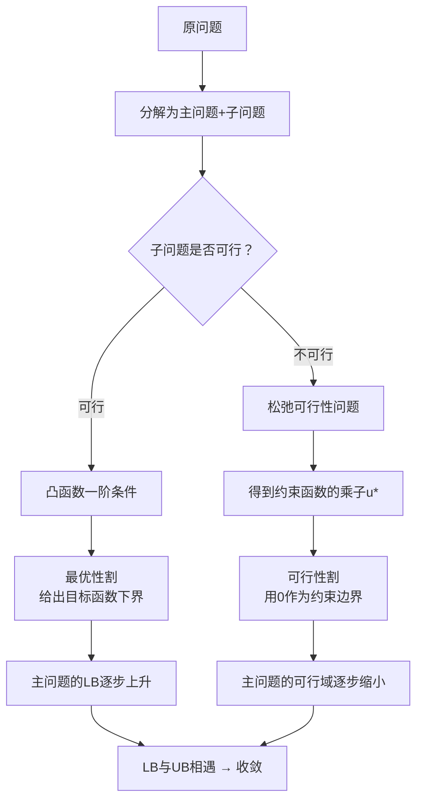

好的，我们从头开始，把对偶函数的数学理论彻底讲清楚。

---

## 第一步：我们想要什么？

考虑一个**带约束的优化问题**（称为**原问题 Primal Problem**）：

$$
\begin{aligned}
\min_{x} \quad & f(x) \\
\text{s.t.} \quad & g_i(x) \leq 0, \quad i = 1, \dots, m \\
& h_j(x) = 0, \quad j = 1, \dots, p
\end{aligned}
$$

**核心困难**：约束条件让优化变得复杂。如果能把约束"吸收"到目标函数里，问题就会简单很多。

---

## 第二步：拉格朗日函数 —— 把约束"惩罚"进目标

引入**拉格朗日乘子** $\lambda_i \geq 0$（对应不等式约束）和 $\mu_j$（对应等式约束），定义**拉格朗日函数**：

$$
L(x, \lambda, \mu) = f(x) + \sum_{i=1}^m \lambda_i g_i(x) + \sum_{j=1}^p \mu_j h_j(x)
$$

**直观理解**：

| 约束状态 | 惩罚效果 |
|----------|----------|
| $g_i(x) \leq 0$（满足约束） | $\lambda_i g_i(x) \leq 0$，不会增加目标值 |
| $g_i(x) > 0$（违反约束） | $\lambda_i g_i(x) > 0$，目标值增加（**惩罚**） |
| $h_j(x) = 0$（满足约束） | $\mu_j h_j(x) = 0$，无影响 |
| $h_j(x) \neq 0$（违反约束） | 目标值增加或减少（取决于符号和 $\mu_j$） |

**关键点**：如果 $x$ 满足所有约束（$g_i(x) \leq 0$，$h_j(x) = 0$），且 $\lambda_i \geq 0$，那么：

$$
L(x, \lambda, \mu) = f(x) + \underbrace{\sum_i \lambda_i g_i(x)}_{\leq 0} + \underbrace{\sum_j \mu_j h_j(x)}_{=0} \leq f(x)
$$

所以对任意可行 $x$，$L(x, \lambda, \mu) \leq f(x)$。

---

## 第三步：对偶函数 —— 给出一个"下界"

**对偶函数**（也叫拉格朗日对偶函数）定义为：

$$
d(\lambda, \mu) = \inf_{x \in \mathcal{D}} L(x, \lambda, \mu)
$$

其中 $\mathcal{D}$ 是 $x$ 的定义域。$\inf$ 表示取下确界（最小值）。

**"对偶函数给出下界"——为什么？**

对于任意 $\lambda \geq 0$ 和任意可行解 $x$（满足所有约束）：

$$
L(x, \lambda, \mu) \leq f(x)
$$

（这是上一步的结论）

因为 $d(\lambda, \mu) = \inf_x L(x, \lambda, \mu)$ 是 $L$ 在所有 $x$ 上的最小值（下界），而 $L(x, \lambda, \mu) \leq f(x)$ 对所有可行 $x$ 成立，所以：

$$
d(\lambda, \mu) = \inf_x L(x, \lambda, \mu) \leq L(x, \lambda, \mu) \leq f(x)
$$

对任意可行 $x$ 成立。

因此，$d(\lambda, \mu)$ **小于等于原问题的最优值**：

$$
d(\lambda, \mu) \leq p^*
$$

其中 $p^*$ 是原问题的最优值（最小值）。

**这就是对偶函数给出下界的根本原因**。

---

## 第四步：一个具体例子

**原问题**：
$$
\begin{aligned}
\min_{x} \quad & x^2 \\
\text{s.t.} \quad & x - 2 \leq 0
\end{aligned}
$$

很明显，最优解 $x^* = 0$，最优值 $p^* = 0$。

**拉格朗日函数**：
$$
L(x, \lambda) = x^2 + \lambda (x - 2), \quad \lambda \geq 0
$$

**对偶函数** $d(\lambda) = \inf_x [x^2 + \lambda x - 2\lambda]$

固定 $\lambda$，这是一个关于 $x$ 的二次函数，求最小值：

$d/dx: 2x + \lambda = 0 \Rightarrow x = -\lambda/2$

代入：
$$
d(\lambda) = (-\lambda/2)^2 + \lambda(-\lambda/2) - 2\lambda = \lambda^2/4 - \lambda^2/2 - 2\lambda = -\lambda^2/4 - 2\lambda
$$

**验证下界**：
- 取 $\lambda = 0$：$d(0) = 0$，等于最优值 $p^* = 0$ ✓
- 取 $\lambda = 1$：$d(1) = -0.25 - 2 = -2.25 \leq 0$ ✓

---

## 第五步：对偶问题

既然 $d(\lambda, \mu)$ 给出了原问题的下界，那最紧的下界是什么？就是最大化 $d(\lambda, \mu)$。

**对偶问题**：
$$
\begin{aligned}
\max_{\lambda, \mu} \quad & d(\lambda, \mu) \\
\text{s.t.} \quad & \lambda \geq 0
\end{aligned}
$$

对偶问题的最优值记为 $d^*$，称为对偶最优值。

---

## 第六步：弱对偶与强对偶

**弱对偶 (Weak Duality)**：
$$
d^* \leq p^*
$$

总是成立，对任何问题都成立。

**强对偶 (Strong Duality)**：
$$
d^* = p^*
$$

只在**凸优化问题**（且满足一定约束品性条件，如 Slater 条件）下成立。

---
## 总结：对偶函数的最简逻辑链

| 步骤 | 内容 |
|------|------|
| 1 | 我们有原问题：$\min f(x)$，s.t. $g(x) \leq 0$ |
| 2 | 构造拉格朗日函数：$L(x, \lambda) = f(x) + \lambda g(x)$，$\lambda \geq 0$ |
| 3 | 对任意可行 $x$（满足 $g(x) \leq 0$），$L(x, \lambda) \leq f(x)$ |
| 4 | 对偶函数 $d(\lambda) = \inf_x L(x, \lambda)$ |
| 5 | 因为 $d(\lambda) \leq L(x, \lambda) \leq f(x)$，所以 $d(\lambda) \leq p^*$ |
| 6 | $d(\lambda)$ 是原问题最优值的一个**下界** |
| 7 | 对偶问题最大化 $d(\lambda)$，找到最紧的下界 |
| 8 | 对凸问题，强对偶成立，下界 = 最优值 |

---

## 下一阶段：从对偶函数到 GBD

现在你理解了对偶函数为什么能给出下界。**GBD 的核心机制**就是：
1. 子问题求解时，**同时得到拉格朗日乘子 $u^*$**
2. 用这些乘子构造一个**对偶下界**（就是 Cut）
3. 这个下界被添加到主问题中，**不断收紧主问题的可行域**
4. 最终主问题的下界（LB）和子问题的上界（UB）相等，收敛到最优解

如果这个逻辑链清楚了，我们可以继续深入 **GBD 如何利用对偶函数构造 Cut**，以及**可行性割的推导**。


好的，我们接续上一节。现在你已经理解了**对偶函数为什么能给出下界**，以及**强对偶为什么能让下界等于最优值**。接下来我要回答的是：**GBD 如何利用这个理论来构造 Cut**。

---

## 第七步：从对偶函数到 GBD 的最优性割

### 7.1 GBD 的子问题是什么？

回顾 GBD 的设定。我们把原问题分解成：

- **主问题**：处理复杂变量 $ y $（整数变量，如 `a`）
- **子问题**：固定 $ y $ 后，求解连续变量 $ x $（如功率 `P`）

子问题的一般形式：

$$
\begin{aligned}
\min_{x} \quad & f(x, \bar{y}) \\
\text{s.t.} \quad & g(x, \bar{y}) \leq 0
\end{aligned}
$$

其中 $ \bar{y} $ 是主问题给定的一个具体值，在这一步中是**固定的常数**。

### 7.2 构造子问题的拉格朗日函数

$$
L(x, \bar{y}, u) = f(x, \bar{y}) + u^T g(x, \bar{y}), \quad u \geq 0
$$

其中 $ u $ 是拉格朗日乘子向量。

### 7.3 子问题的对偶函数

$$
d_{\bar{y}}(u) = \inf_x L(x, \bar{y}, u)
$$

根据对偶理论，对于任意 $ u \geq 0 $：
$$
d_{\bar{y}}(u) \leq \text{子问题的最优值}
$$

如果子问题是凸的，且强对偶成立，那么存在 $ u^* $ 使得：
$$
d_{\bar{y}}(u^*) = \text{子问题的最优值}
$$

### 7.4 最关键的一步：推广到任意 $ y $

我们现在固定的是 $ \bar{y} $，求得了最优解 $ x^* $ 和最优乘子 $ u^* $。

现在的问题是：**对于其他任意的 $ y $，我们能不能用这些信息来估计子问题的最优值？**

答案是**能**。因为拉格朗日函数对 $ y $ 也是凸的（假设原问题是凸的），所以有：

$$
f(x^*, y) + u^{*T} g(x^*, y) \geq f(x^*, \bar{y}) + u^{*T} g(x^*, \bar{y}) + \nabla_y \left[ f(x^*, \bar{y}) + u^{*T} g(x^*, \bar{y}) \right]^T (y - \bar{y})
$$

这是**凸函数的一阶条件**：凸函数在其定义域上任意一点处的切线（一阶近似）是全局下界。

**简化记法**：令 $ L_{\bar{y}}(y) = f(x^*, y) + u^{*T} g(x^*, y) $，则：

$$
L_{\bar{y}}(y) \geq L_{\bar{y}}(\bar{y}) + \nabla_y L_{\bar{y}}(\bar{y})^T (y - \bar{y})
$$

### 7.5 这就是最优性割！

$$
\boxed{\eta \geq L(x^*, \bar{y}, u^*) + \nabla_y L(x^*, \bar{y}, u^*)^T (y - \bar{y})}
$$

**这个不等式的含义是**：
- 左边 $ \eta $ 是主问题中目标函数的代理变量
- 右边是一个线性函数（关于 $ y $ 的线性函数）
- 这条不等式告诉主问题：**无论你选什么 $ y $，子问题的最优值都不可能低于这个值**
- 所以它给出了**一个下界**

**几何意义**：在点 $ \bar{y} $ 处，用一条**直线（超平面）**从下方"托住"真实的目标函数。

---

## 第八步：可行性割

### 8.1 什么时候需要可行性割？

当子问题**无解**（不可行）时，无法得到 $ u^* $ 和 $ x^* $，也就无法构造最优性割。

**什么情况下子问题会无解？**
- 主问题给出的 $ \bar{y} $ 导致子问题的约束 $ g(x, \bar{y}) \leq 0 $ 没有可行解
- 例如：主问题选择的充电站容量不够，无法满足所有EV的充电需求

### 8.2 如何处理不可行？

求解一个**松弛的可行性问题**（论文算法1中的 `Solve the new primal problem`）：

$$
\begin{aligned}
\min_{x, s} \quad & s \\
\text{s.t.} \quad & g(x, \bar{y}) \leq s \\
& s \geq 0
\end{aligned}
$$

其中 $ s $ 是松弛变量，表示约束违反的程度。如果最小 $ s = 0 $，说明原问题可行；如果 $ s > 0 $，说明原问题不可行。

这个松弛问题的拉格朗日函数为：

$$
L_s(x, s, u) = s + u^T (g(x, \bar{y}) - s)
$$

求解后得到最优乘子 $ u^* $。

### 8.3 构造可行性割

$$
\boxed{0 \geq u^{*T} g(x^*, \bar{y}) + \nabla_y \left[ u^{*T} g(x^*, \bar{y}) \right]^T (y - \bar{y})}
$$

**这个不等式的含义是**：
- 它强制主问题的未来解 $ y $ 必须满足一个线性约束
- 这个约束是从当前不可行的 $ \bar{y} $ 推导出来的
- **"切掉"** 所有会导致类似不可行性的 $ y $ 值

**为什么没有 $ f(x, y) $ 项？**
因为目标函数只关心最小化，而可行性割只关心**哪些 $ y $ 是可行的**，与目标值无关。

---

## 第九步：GBD 的完整迭代过程

现在所有拼图都齐了：

```
初始化：
    LB = -∞ (下界)
    UB = +∞ (上界)
    给定初始 y^0

循环：
    步骤1：固定 y^q，求解子问题
        
        如果子问题可行：
            → 得到 x^q, u^q
            → 计算子问题最优值 f(x^q, y^q)
            → UB = min(UB, f(x^q, y^q))
            → 添加最优性割
        
        如果子问题不可行：
            → 求解松弛可行性问题，得到 u^q
            → 添加可行性割
    
    步骤2：求解主问题（包含所有已添加的割）
        主问题求解得到新的 y^{q+1}
        更新 LB = 主问题最优值
    
    检查收敛：
        如果 LB ≥ UB，停止
        否则 q = q+1，继续循环
```

---

## 第十步：GBD 的收敛性

**为什么能保证收敛？**

1. **每次迭代添加一个割**，主问题的可行域逐次缩小
2. **最优性割**保证主问题的解 $ y $ 不会导致子问题的最优值低于真实最优值
3. **可行性割**保证主问题的解 $ y $ 不会导致子问题无解
4. 主问题的可行域是**紧集**（有界闭集），且割的数目有限（或可数无限）
5. 当 $ LB $ 和 $ UB $ 收敛到同一值时，找到了**全局最优解**

**收敛速度**：GBD 在实践中有超线性收敛速度，但最坏情况可能需要多次迭代。

---

## 完整逻辑链总结

| 层级 | 概念 | 作用 |
|------|------|------|
| 1 | 原问题 | 要解决的优化问题 |
| 2 | 子问题 | 固定复杂变量后求解连续变量 |
| 3 | 拉格朗日函数 | 把约束"惩罚"进目标 |
| 4 | 对偶函数 | 给出原问题的下界 |
| 5 | 强对偶 | 下界可以等于最优值 |
| 6 | KKT 条件 | 子问题的最优性条件 |
| 7 | 最优性割 | 把子问题的下界信息传递给主问题 |
| 8 | 可行性割 | 把子问题的不可行信息传递给主问题 |
| 9 | GBD 迭代 | 不断添加割，逐步逼近最优解 |
| 10 | 收敛性 | LB 和 UB 相等时找到全局最优 |

如果你愿意，可以继续进入 **CORS 论文的第四节 CASE STUDY（案例研究）**，看这个算法在实际算例中的表现。


要理解 GBD 中的“最优性割”，关键在于深刻理解**凸函数的一阶条件**。这个数学性质保证了我们能用一条简单的切线，来“托住”一个复杂的凸函数。

---

## 1. 凸函数的定义回顾

在凸分析中，一个函数 $ f(x) $ 被称为凸函数，如果对于定义域内任意两点 $ x_1 $ 和 $ x_2 $，以及任意 $ \lambda \in [0,1] $，都有：

$$
f(\lambda x_1 + (1-\lambda) x_2) \le \lambda f(x_1) + (1-\lambda) f(x_2)
$$

**几何意义**：函数图像上任意两点之间的连线（弦），始终位于函数图像的上方。换句话说，函数图像是“向下凸”的，像一个碗。

---

## 2. 可微凸函数的一阶条件（核心）

如果一个凸函数 $ f(x) $ 是可微的（存在梯度），那么它满足一个非常重要的性质：

$$
f(y) \ge f(x) + \nabla f(x)^T (y - x), \quad \forall x, y
$$

**这个不等式的意思是**：
- 在任意点 $ x $ 处，用一阶泰勒展开（切线/切平面）构造一个线性函数
- 这个线性函数在任意点 $ y $ 的值，**都小于等于**原函数 $ f(y) $ 的真实值
- 也就是说，**一阶近似是原函数的一个全局下界**

**这个性质的名称**：在凸优化中，这被称为**凸函数的一阶条件**或**梯度不等式**。

---

## 3. 为什么这个条件是成立的？

为了建立直觉，我们从**凸函数的定义**出发，来推导这个不等式。

设 $ x $ 是定义域内任意一点，$ y $ 也是定义域内任意一点。考虑从 $ x $ 向 $ y $ 方向移动一个小步长 $ \lambda \in (0,1) $，则 $ z = x + \lambda (y - x) $ 也在定义域内（凸集性质）。

根据凸函数定义：

$$
f(z) = f(x + \lambda (y - x)) \le (1-\lambda) f(x) + \lambda f(y)
$$

移项：

$$
f(y) \ge f(x) + \frac{f(x + \lambda (y - x)) - f(x)}{\lambda}
$$

令 $ \lambda \to 0^+ $，右边第二项趋向于**方向导数**：

$$
\frac{f(x + \lambda (y - x)) - f(x)}{\lambda} \to \nabla f(x)^T (y - x)
$$

因此得到：

$$
f(y) \ge f(x) + \nabla f(x)^T (y - x)
$$

**这就是凸函数一阶条件的来源**。

---

## 4. 一个直观的例子

考虑最简单的一维凸函数 $ f(x) = x^2 $。

- 取 $ x = 1 $，切线为 $ f(1) + f'(1)(y - 1) = 1 + 2(y - 1) = 2y - 1 $
- 对于任意 $ y $，验证：$ y^2 \ge 2y - 1 \Rightarrow (y - 1)^2 \ge 0 $，永远成立

**这说明**：在 $ x = 1 $ 处画一条切线，这条切线永远在 $ y^2 $ 曲线下方，是它的一个全局下界。

**几何意义**：对于凸函数，在任意点作切线，切线永远不高于函数本身。

---

## 5. 为什么这个性质对 GBD 至关重要？

回顾 GBD 的最优性割：

$$
\eta \ge L(x^*, \bar{y}, u^*) + \nabla_y L(x^*, \bar{y}, u^*)^T (y - \bar{y})
$$

这个割之所以成立，是因为 **拉格朗日函数对 $ y $ 是凸的**。

根据一阶条件，对于任意 $ y $：

$$
L(x^*, y, u^*) \ge L(x^*, \bar{y}, u^*) + \nabla_y L(x^*, \bar{y}, u^*)^T (y - \bar{y})
$$

右边给出了左边的一个**下界**。因此，将这个下界传递给主问题，可以保证主问题不会低估子问题的最优值。

---

## 总结

| 概念 | 内容 |
|------|------|
| **凸函数定义** | 任意两点连线在函数图像上方 |
| **一阶条件** | $ f(y) \ge f(x) + \nabla f(x)^T (y - x) $，切线是全局下界 |
| **推导来源** | 由凸函数定义令步长趋于零得到 |
| **在 GBD 中的作用** | 保证最优性割是有效的下界，不低估真实最优值 |

这个问题问得非常精准，它把两个看似分离的概念连接起来了。

先明确你说的“这个”和“那个”：

- **“这个”**：凸函数的一阶条件 → $ f(y) \ge f(x) + \nabla f(x)^T (y - x) $ → 用来构造**最优性割**的数学依据
- **“那个 0”**：可行性割中的 $ 0 $ → 约束 $ g(x,y) \le 0 $ 的边界 → 用来构造**可行性割**的“准星”

它们的关系是：**两者都是 GBD 中“用一阶近似构造线性约束”这一核心思想的体现，但应用的对象不同。**

---

## 1. 最优性割中的一阶条件

最优性割的推导对象是**目标函数**（或更准确地说，拉格朗日函数）：

$$
\eta \ge L(x^*, \bar{y}, u^*) + \nabla_y L(x^*, \bar{y}, u^*)^T (y - \bar{y})
$$

**这里用到了凸函数的一阶条件吗？**

严格来说，这里的一阶条件不是直接用 $ f(y) \ge f(x) + \nabla f(x)^T (y-x) $，而是用了其**等价形式**：

$$
L(x^*, y, u^*) \ge L(x^*, \bar{y}, u^*) + \nabla_y L(x^*, \bar{y}, u^*)^T (y - \bar{y})
$$

即**拉格朗日函数（作为 y 的函数，且固定 $ x^* $ 时）是凸的，因此其一阶泰勒展开是全局下界**。这保证了最优性割的右边不会高估真实的子问题目标值。

---

## 2. 可行性割中的 0

可行性割的推导对象是**约束函数**：

$$
0 \ge u^{*T} \left[ g(P^q, a^q) + \nabla_a g(P^q, a^q)^T (a - a^q) \right]
$$

**这里的“0”就是原约束 $ g(x,y) \le 0 $ 的右侧边界。**

可行性割的本质是：用约束函数的一阶近似（在不可行点处线性化），把这个近似约束强行压低到 0 以下，从而“切掉”主问题中那些会导致子问题不可行的 $ y $ 值。

---

## 3. 它们的逻辑关系



| 维度 | 最优性割 | 可行性割 |
|------|----------|----------|
| **处理对象** | 目标函数 $ f(x,y) $ | 约束函数 $ g(x,y) $ |
| **数学依据** | 凸函数的一阶条件 | 约束边界 $ g \le 0 $ |
| **核心数值** | 目标值的下界（无固定数值） | **0**（约束的生死线） |
| **作用** | 提升主问题的下界 LB | 缩小主问题的可行域 |
| **推导方式** | 用一阶近似线性化目标函数 | 用一阶近似线性化约束函数 |

---

## 4. 一句话总结

**最优性割用凸函数的一阶条件（切线是下界）来“托底”目标函数，可行性割用 0 来“划线”约束边界。两者都是用线性近似来处理非线性问题，但一个针对目标，一个针对约束。**