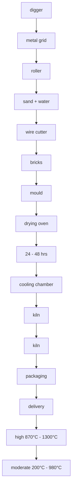

# IELTS Academic Writing Sample Tasks

The IELTS Academic Writing test includes a variety of tasks.

In Task 1, test takers are asked to describe some visual information (graph/table/chart/diagram) in their own words. They need to write 150 words in about 20 minutes.

In Task 2, they respond to a point of view or argument or problem. They need to write 250 words in about 40 minutes.

Read the details of each task type on our Test format page.

# Contents

Academic Writing Sample Task – 1A.... 3  
Academic Writing Sample Task – 1B.... 4  
Academic Writing Sample Task – 1C.... 5  
Academic Writing Sample Task – 2A.... 6  
Academic Writing Sample Task - 2B....7

Sample Candidate Writing Scripts and Examiner Comments....8

Academic Writing Sample Task – 1A – Sample Script A 9

Academic Writing Sample Task – 1A – Sample Script B 10

Academic Writing Sample Task – 1B – Sample Script A.... 11

Academic Writing Sample Task – 1B – Sample Script B 12

Academic Writing Sample Task – 1C – Sample Script A 13

Academic Writing Sample Task – 1C – Sample Script B 14

Academic Writing Sample Task – 1C – Sample Script C 16

Academic Writing Sample Task – 2A – Sample Script A 18

Academic Writing Sample Task – 2A – Sample Script B 19

Academic Writing Sample Task – 2A – Sample Script C 21

Academic Writing Sample Task – 2B – Sample Script A 23

Academic Writing Sample Task – 2B – Sample Script B 25

# WRITING TASK 1

You should spend about 20 minutes on this task.

The chart below shows the number of men and women in further education in Britain in three periods and whether they were studying full-time or part-time.

Summarise the information by selecting and reporting the main features, and make comparisons where relevant.

Write at least 150 words.

bar

| Category | Full-time education (thousands) | Part-time education (thousands) |
| --- | --- | --- |
| Male::1970/71 | ~120 | 1000 |
| Male::1980/81 | ~160 | ~870 |
| Male::1990/91 | ~250 | ~910 |
| Female::1970/71 | ~70 | ~750 |
| Female::1980/81 | ~230 | ~830 |
| Female::1990/91 | ~260 | ~1100 |

# WRITING TASK 1

You should spend about 20 minutes on this task.

The graph below shows radio and television audiences throughout the day in 1992.

Summarise the information by selecting and reporting the main features, and make comparisons where relevant.

Write at least 150 words.

Radio and television audiences in UK, October – December 1992  

line

| Time | Television (%) | Radio (%) |
| --- | --- | --- |
| Noon 6:00 | ~2 | ~6 |
| Noon 8:00 | ~6 | ~27 |
| Noon 10:00 | ~4 | ~21 |
| Noon 12:00 | ~4 | ~18 |
| Noon 2:00 | ~15 | ~15 |
| Noon 4:00 | ~14 | ~12 |
| Noon 6:00 | ~25 | ~14 |
| Noon 8:00 | ~42 | ~9 |
| Noon 10:00 | ~45 | ~7 |
| Midnight 2:00 | ~15 | ~2 |
| Midnight 4:00 | ~2 | ~2 |
| Midnight 6:00 | ~3 | ~3 |

Time of day or night

# WRITING TASK 1

You should spend about 20 minutes on this task.

The diagram below shows the process by which bricks are manufactured for the building industry.

Summarise the information by selecting and reporting the main features, and make comparisons where relevant.

Write at least 150 words.

flowchart

\*Clay: type of sticky earth that is used for making bricks, pots, etc.

# Academic Writing Sample Task – 2A

# WRITING TASK 2

You should spend about 40 minutes on this task.

Write about the following topic:

Children who are brought up in families that do not have large amounts of money are better prepared to deal with the problems of adult life than children brought up by wealthy parents.

To what extent do you agree or disagree with this opinion?

Give reasons for your answer and include any relevant examples from your own knowledge or experience.

Write at least 250 words.

# Academic Writing Sample Task – 2B

# WRITING TASK 2

You should spend about 40 minutes on this task.

Write about the following topic:

International tourism has brought enormous benefit to many places. At the same time, there is concern about its impact on local inhabitants and the environment.

Do the disadvantages of international tourism outweigh the advantages?

Give reasons for your answer and include any relevant examples from your own knowledge or experience.

Write at least 250 words.

# Sample Candidate Writing Scripts and Examiner Comments

Both the Academic and General Training Writing Modules consist of two tasks, Task 1 and Task 2. Each task is assessed independently. The assessment of Task 2 carries more weight in marking than Task 1.

Detailed performance descriptors have been developed which describe written performance at the 9 IELTS bands. These descriptors apply to both the Academic and General Training Modules.

Task 1 responses are assessed on the following criteria:

- Task Achievement  
• Coherence and Cohesion  
- Lexical Resource  
• Grammatical Range and Accuracy

Task 2 responses are assessed on the following criteria:

- Task Response  
• Coherence and Cohesion  
- Lexical Resource  
• Grammatical Range and Accuracy

Candidates should note that responses will be penalised if they are a) partly or wholly plagiarised, b) not written as full, connected text (e.g. using bullet points in any part of the response, or note form, is not appropriate).

# Task 1

# Task Achievement

This criterion assesses how fully, appropriately, accurately and relevantly the response fulfils the requirements set out in the task, using the minimum of 150 words.

Task 1 Academic is a writing task which has a defined input and a largely predictable output. It is basically an information-transfer task, which relates narrowly to the factual content of a diagram, graph, table, chart, map or other visual input, not to speculative explanations that lie outside the given data.

# Coherence and Cohesion

This criterion is concerned with the overall organisation and logical development of the message: how the response organises and links information, ideas and language.

Coherence refers to the linking of ideas through logical sequencing, while cohesion refers to the varied and appropriate use of cohesive devices (e.g. logical connectors, conjunctions and pronouns) to assist in making clear the relationships between and within sentences.

# Lexical Resource

This criterion refers to the range of vocabulary the candidate has used and the accuracy and appropriacy of that use in terms of the specific task.

# Grammatical Range and Accuracy

This criterion refers to the range and accurate use of the candidate's grammatical resource within the candidate's writing at sentence level.

# Task 2

# Task Response

Both the Academic and General Training Writing Task 2 require the candidates to formulate and develop a position in relation to a given prompt in the form of a question or statement, using a minimum of 250 words. Ideas should be supported by evidence, and examples may be drawn from a candidate's own experience.

The other criteria for Task 2 are the same as for Task 1 (Coherence and Cohesion, Lexical Resource, Grammatical Range and Accuracy).

Writing responses are marked by trained and certificated IELTS examiners. Scores may be reported as whole bands or half-bands.

On the next 17 pages you will find candidates' answers to five sample Writing tasks. There are answers for each Writing task. Each answer has been awarded a band score and is accompanied by an examiner comment on the candidate's performance for that task.

The examiners' guidelines for marking the Writing scripts are very detailed. There are many different ways a candidate may achieve a particular band score. The candidates' answers that follow should not be regarded as definitive examples of any particular band score.

Please refer to the publicly available IELTS Writing Key Criteria on our website.

# Academic Writing Sample Task – 1A – Sample Script A

This is a bar chart of the number of men and women in further education in Britain in three periods. In 1970, most of men were studying part-time but from 1980, studying part-time was decreased and studying full-time was increased and in 1990, it was twice as many students as in 1970. On the other hand, women studying full-time were increased and not only full-time, part-time also were increased, in 1990, studying full-time was three times as many students as in 1970. If compare Men and Women, as you see, in 1970, Men were studying more than women full-time or part-time but it changed from 1980 and then, in 1990, women were studying part-time more than men and studying full-time was same number. It shows you women has a high education now.

# Examiner comment

# Band 5

There is a good attempt to describe the overall trends but the content would have been greatly improved if the candidate had included some reference to the figures given on the graph. Without these, the reader is lacking some important information. The answer is quite difficult to follow and there are some punctuation errors that cause confusion. The structures are fairly simple and efforts to produce more complex sentences are not successful.

# Academic Writing Sample Task – 1A – Sample Script B

line

| Year | Number of people with full-time education |
| --- | --- |
| 1980/81 | ~1000 |
| 1980/81 | ~1000 |
| 1980/81 | ~1000 |
| 1980/81 | ~1000 |
| 1980/81 | ~1000 |
| 1980/81 | ~1000 |
| 1980/81 | ~1000 |
| 2000/81 | ~1000 |
| 2000/81 | ~1000 |
| 2000/81 | ~1000 |
| 2000/81 | ~1000 |
| 2000/81 | ~1000 |
| 2000/81 | ~1000 |
| 2000/82 | ~1000 |
| 2000/82 | ~1000 |
| 2000/82 | ~1000 |
| 2000/82 | ~1000 |
| 2000/82 | ~1000 |
| 2000/82 | ~1000 |
| 2000/83 | ~1000 |
| 2000/83 | ~1000 |
| 2000/83 | ~1000 |
| 2000/83 | ~1000 |
| 2000/83 | ~1000 |
| 2000/83 | ~1000 |
| 2000/84 | ~1000 |
| 2000/84 | ~1000 |
| 2000/84 | ~1000 |
| 2000/84 | ~1000 |
| 2000/84 | ~1000 |
| 2000/84 | ~1000 |
| 2000/85 | ~1000 |
| 2000/85 | ~1000 |
| 2000/85 | ~1000 |
| 2000/85 | ~1000 |
| 2000/85 | ~1000 |
| 2000/85 | ~1000 |
| 2000/86 | ~1000 |
| 2000/86 | ~1000 |
| 2000/86 | ~1000 |
| 2000/86 | ~1000 |
| 2000/86 | ~1000 |
| 2000/86 | ~1000 |
| 2000/87 | ~1000 |
| 2000/87 | ~1000 |
| 2000/87 | ~1000 |
| 2000/87 | ~1000 |
| 2000/87 | ~1000 |
| 2000/87 | ~1000 |
| 2000/88 | ~1000 |
| 2000/88 | ~1000 |
| 2000/88 | ~1000 |
| 2000/88 | ~1000 |
| 2000/88 | ~1000 |
| 2000/88 | ~1000 |
| 2000/89 | ~1000 |
| 2000/89 | ~1000 |
| 2000/89 | ~1000 |
| 2000/89 | ~1000 |
| 2000/89 | ~1000 |
| 2000/89 | ~1000 |
| 2000/90 | ~1000 |
| 2000/90 | ~1000 |
| 2000/90 | ~1000 |
| 2000/90 | ~1000 |
| 2000/90 | ~1000 |
| 2000/90 | ~1000 |
| 2000/91 | ~1000 |
| 2000/91 | ~1000 |
| 2000/91 | ~1000 |
| 2000/91 | ~1000 |
| 2000/91 | ~1000 |
| 2000/91 | ~1000 |

# Examiner comment

# Band 6

The candidate has made a good attempt to describe the graphs looking at global trends and more detailed figures. There is, however, some information missing and the information is inaccurate in minor areas. The answer flows quite smoothly although connectives are overused or inappropriate, and some of the points do not link up well. The grammatical accuracy is quite good and the language used to describe the trends is well-handled. However, there are problems with expression and the appropriate choice of words and whilst there is good structural control, the complexity and variation in the sentences are limited.

# Academic Writing Sample Task – 1B – Sample Script A

text_image

The graph shows the percentage of audiences over 4 years old of UK follows the radio and television throughout the day during the period October-December 1992. It has been observed from the graph that lost than 10% unifiances follows the radio at 6:00 am and the percentage raised to a pick around 30% at 8:00 AM and decline gradually and to around 10%. during the period 2:00 to 4:00 PM and again raised a bit to around 12% between 4:00 to 6:00 PM, then again dropped to below 10% at 8:00 PM around 10:00 PM. The rate again raised to a bit between 10:00 PM to 12:00 PM and then dropped slowly by 4:00 AM. On the other hand, the rate of television unifiances raises 0-10%. During the period 6:00 to 8:00 AM and remain steady up to 10:00 AM and then gradually goes down by 12:00 AM, the percentage raised dramatically to over around 15%. by 2:00 PM which again raised to a pick above 40% between 6:00-8:00 PM and then gradually dropped between the period 12:00 PM to 4:00 AM.

# Examiner comment

# Band 6

The answer has an appropriate introduction which the candidate has attempted to express in their own words. There is good coverage of the data and a brief reference to contrasting trends. The answer can be followed although it is rather repetitive and cohesive devices are overused. In order to gain a higher mark for content, the candidate would be expected to summarise the most important features of the graph in an overview, for example, ‘audiences for radio peak in the morning, and for TV, in the evening’. There is some flexibility and precision in the range of vocabulary used. Sentences are long but do lack complexity. To score more highly there would be fewer errors in tense, verb form and spelling which interfere slightly with the flow of the answer.

# Academic Writing Sample Task – 1B – Sample Script B

text_image

The bold graph shows the television audiences throughout the day. It shows that the percentage of audiences is zero percent in early morning but it gradually rises up to ten percent at 8:00 am and maintains the same for the next two hours. There is a gradual fall in percentage in next two hours however after that it rises champ up to twenty percent within the next two hours. The After this the graph rises very fast and attains it's peak at 10 pm which is about forty-five percent. The the graph gradually falls down and at 2:00 am it is at five percent. The thinner graph shows the percentage of radio audiences. Unlike the television one the peak percentage of the radio audience is at 8:00 am which is about 30 percent. Then it gradually falls and it corresponds with the television one at two pm. After that it gradually falls but with a small increase in percentage at 4:30 to 6:00 pm. The percentage of audience then declines goes down and at four am it is the lowest which is near 2 percentage. These graphs prove the progressive popularity of television.

# Examiner comment

# Band 7

The answer deals well with both the individual media trends and the overall comparison of these trends. The opening could be more fully developed with the inclusion of information relating to the groups studied and the period of time during which the study took place. There is a good variety of cohesive devices and the message can be followed quite easily although the expression is sometimes a little clumsy. Structures are complex and vocabulary is varied but there are errors in word forms, tense and voice though these do not impede communication.

# Academic Writing Sample Task – 1C – Sample Script A

Bricks are small shaped figures which are used for building.  
First of all digger dig the ground until the clay level. Next the type of sticky earth that is used for making bricks are on the metal grid which selected special parts of clay and threw them on the roller. Then in the manufacturing process sand + water are filled in. The sand gives the texture for bricks. After that the solid is put ready to go through wire culfter or moulding. This process makes shapes of the bricks.  
When the figures have got their shape, there items can be put in the drying oven, where they stayed for 24-48 hours. The temperature is moderate between 200°C and 980°C in the kiln and high between 870°C and 1300°C. Finally these hot items go to the cooling chamber and get cold from 48-47 hours. The last part of the manufacturing process is packaging and delivery to the consumption.

# Examiner comment

# Band 5

Although the basic process is accurately described, this script fails to present an overview and some of the key features are not adequately covered. The first sentence may have been an attempt at an overview but it simply causes confusion and detracts from the answer. Despite this, the overall progression is clear and there is effective, though mechanical, use of linkers and sequencers. There are also examples of substitution and referencing, although sentences are not always well linked. The vocabulary is minimally adequate for the task. Spelling is generally accurate but there are inappropriate word choices, omissions and errors in word form. Some attempts at subordination and complex nominalisations are made, but generally the structures are limited and there are frequent errors. Overall this is a good example of a Band 5 performance.

# Academic Writing Sample Task – 1C – Sample Script B

Dear Sir, I am writing a report about brick manufacturing. The following are on follows. Brick manufacturing starts with choosing good quality clay. A large digger similar to a crane digs the clay. The process takes about half a day after which it is put on metal grid to separate unwanted silt and impurities. The strained clay is then put in a large machine roller where it is mixed with sand and water to be moulded late to form the base of the brick. While it is still soft, wire cutters are used to perfectly cut the bricks, removing the rough edges. The soft bricks are then put in a drying oven where it stays from 24-48 hours. After the pre-set drying time, the bricks are then put in large kilns where it is baked at moderate heat of about 200-980°C. The bricks are first put in moderate heat to avoid cracking. After about few minutes, the bricks are then fired to a high 870-1,300°C heat. This is the final heating or 'cooking' stage so to speak for the bricks. Just beside the kiln is the cooling chamber which is made up of large steel where the bricks will stay far about 48-72 hours. The bricks are then ready for packaging where the brick warcers carefully pack the bricks. In large container vans for deluway. The whole process is fairly an easy one because there are no sophisticated machines used. The only thing that bothered me was during the heating process because as the manager told me, I have to stay and observe while the clay is being 'cooked' because some of the clays do tend to crack easily because of the wrong sand and water mixture from the start if this happen, the process has to be repeated again which can be quite lengthy.

# Examiner comment

# Band 7

This test taker uses an inappropriate format at times (e.g. the letter-style opening and personal comments) and this limits the band for Task Achievement. The process itself is adequately described, although some irrelevant information is included and there is no clear overview. Information is logically organised and there is a clear progression throughout the response. A range of cohesive devices is used appropriately, although there are occasional errors in referencing and linking, and paragraphing would have helped convey a clearer description of the stages. A wide range of sophisticated lexis is used to convey meaning with precision, but there are also occasional flaws in word choice that lead to some slightly awkward expressions. A wide range of structures is also used fluently with only occasional slight error and the majority of sentences are error-free. In spite of the high level of language proficiency, the flaws in format and organisation limit the rating for this response to Band 7.

# Academic Writing Sample Task – 1C – Sample Script C

# Brick Manufacturing

The process by which bricks are manufactured for the building industry can be outlined as in seven consecutive steps.

First the raw material, clay, which lies just below the surface of soil in certain clay-rich areas has to be dug up by a digges.

Then the lumps of clay are placed on a metal grid, in order to break up the big price chunks of clay into much smaller ones, which fall through the metal grid onto a roller, whose motion further segregates the bits of clay. Sand and water are added to make a homogenous mixture, which is then either formed in moulds or cut into brick-shaped pieces by means of a wore cutter.

Those fresh bricks are then kept in a drying oven for at least 24 and a maximum of 48 hours, several dozen if not hundreds of bricks at a time. The dried bricks are then transferred to a so-called kiln, another type of high temperature oven. First they are kept at a moderate temperature of 200°C - 980°C, then at a high temperature of 870°C - 1300°C. This process is followed by cooling down the finished bricks for 48 to 72 hours in a cooling chamber.

Once the bricks have been cooked down and have become hard, they get packaged and quickly delivered to their final destination, by means for example by means of tractors be it a building site or storage.

# Examiner comment

# Band 8.5

This response fully satisfies the requirements of the task. All key features of each stage of the process are appropriately and accurately presented. There is an overview in the first paragraph indicating that there are ‘seven consecutive steps’ however for the highest score, a fuller overview would be needed, to summarise those key stages, for example; extracting the clay, then shaping, drying and delivering the bricks. The message is very easy to read with seamless cohesion. Paragraphing, linking and referencing are all skilfully managed. The language used is very fluent and sophisticated. A wide range of vocabulary and structures are used with full flexibility and accuracy within the scope of this task. Only rare minor errors can be found and these do not detract from communication or the high rating. This item is a good example of a very high-level response.

# Academic Writing Sample Task – 2A – Sample Script A

I disagree that point about children brought up in families.
because, I show that situation arounds me at our country parents.
They want they had everything give to their children.
but, their behavior is not good effect to them.
On the other hands, children brought up by wealthy parents.
they are strong, that means they can do prepare to deal with
the problems of adult life.
In my case, I start work from 20 ages I had social experience
and I got a money for myself. however, My age is late to work
by children ages and I heard about child doing work by another
countries that countries had a culture about childrens.
That is they doing work for their pocketmoney.
they could their money buy something or entrance to the bank
also, our country childrens do this, but many childrens accept the
money by their parents which persons got a pocketmoney over the 20 ages
I think, if childrens had a work and they study at money,
they perfectly prepared their adult life after they must be parents

# Examiner comment

# Band 4

While it is obviously related to the topic, the introduction is confusing and the test taker's position is difficult to identify. Ideas are limited and although the test taker attempts to support them with examples from experience, they remain unclear. There is no overall progression in the response and the ideas are not coherently linked. Although cohesive devices are used, they assist only minimally in achieving coherence. The range of vocabulary is basic and control is inadequate for the task. Language from the input material is used inappropriately and frequent errors in word choice and collocation cause severe problems for the reader. Similarly, the range of structures is very limited, the density of grammatical and punctuation error is high and these features cause some difficulty for the reader. Attempts to use complex structures, such as subordination, are rare and tend to be very inaccurate.

# Academic Writing Sample Task – 2A – Sample Script B

I greatly support the idea about children who are brought up in families that do not have large amounts of money are better prepared to deal with the problems of adult life than children brought up by wealthy parents. I support it, because of the following reason.

Children who are brought up in families that do not have large amounts of money are twice in a certain psychological values. Such as the value of homework, discipline, they are used to be in the condition where money doesn't come easily. They have to earn it, work for it. Oppose to it, a child who comes from a wealthy family is used to have money all the time. Whenever they want something, the money is easily gave to them as a if everyday are their birthday.

Children who are brought up in families that do not have large amounts of money are well-trained to face adulthood. They are well-prepared to see the fact that the world is a very tough place. They watched their parent everyday work/very hard just to put food on the table. They have the advantage to see the reality and embrace it, set their mind that they too have work hard for their future, their own dreams, their authentic self. A child that came from a wealthy family doesn't always have this advantage. This is because their eyes are blinded by the power of money, that their parent has. They also have a disadvantage of a family love life. Commonly

wealthy parents express love by money. They love their children, so they bought them cars, expensive clothes, toys, but they are never home when their children needs them. The basic necessity of compassion isn't fulfilled in this kind of family. The impact to a child is that they will grow up and think that money is everything, that the source of happiness is money. They don't care about other people, they only care about money. The problem is they don't know how to get it, they've been spoiled all the time, so doesn't have the time to discover the art of money making, only money spending. On the contrary children from families that do not have large amounts of money will grow up with the sense of respect for money, they know how to get it and use it well. They know how to face adult life problems because they've been watching since they were a child. But a wealthy child is always to busy with himself to know that.

# Examiner comment

# Band 6.5

The arguments in this response are generally well developed, ideas are appropriate and there is a clear position. (It is a shame that the first paragraph, and beginning of the second are mainly copied from the rubric.) Better use of paragraphing would have allowed a clearer focus to some of the supporting points and prevented the lapse into generalisation towards the end. Nevertheless, there is a generally clear progression with a good arrangement of opposing arguments. Referencing is usually accurate and effective, but better use of linkers would have improved the cohesion. Vocabulary is varied and used with some flexibility. The choice is not always precise but the test taker can evidently incorporate less common/idiomatic phrases into the argument and there is a good range that is generally accurate. The repetition of language from the rubric, while integrated, reveals a lack of ability to paraphrase. Regular errors detract from the use of a range of structures, although they do not detract from overall clarity. This is a generally good response to the task, but the weaknesses in organisation and grammatical control limit the rating to Band 6.5.

# Academic Writing Sample Task – 2A – Sample Script C

I do agree to the statement that children brought up in poor families are better prepared to deal with the problems of adult life than children brought up or by wealthy parents.

Children of poor parents are prematurely exposed to the problems of adult life eg. earning a living learning to survive on a low family income and sacrificing luxuries for essential items. These children begin to see the 'realities' of life in their home or social environment. Their parents own struggles serve as an example to them.

These children are taught necessary skills for survival as an adult from a very early age. Many children eg work in the weekends or holidays to either collect some pocket money or even contribute to their families' income. A good example is the many children who accompany their parents to sell produce at the market. They are making a direct contribution to their families in terms of labor or income.

Children of poor families also are highly motivated. They tend to set high goals to improve their situation. A relevant example would be Mr Bill Gates (founder of Microsoft Corporation) He had an impoverished background but he used his talent and motivation to set up the world's largest computer organisation. However, there are some problems that children from poor backgrounds do encounter. Many of these children who are 'robbed' of their childhood are while working, may feel cheated. They often turn to crime. This however, is a small group. In summing up, children with impoverished backgrounds are able to deal with problems of adult life because of early exposure, family role models and sheer motivation.

# Examiner comment

# Band 8.5

The topic is very well addressed and explored in depth. The position is clear throughout and directly answers the question. The ideas presented are relevant and very well supported, apart from some over-generalisation in the penultimate paragraph. However, there is no mention of how well children from ‘wealthy parents’ deal with problems. Although this is not a requirement, it could be added to further improve the response. The ideas and information are very well organised and paragraphing is used appropriately throughout. The answer can be read with ease due to the sophisticated handling of cohesive devices, with only minimal lapses (for example, the use of ‘e.g.’). The writer uses a wide and very natural range of vocabulary with full flexibility. There are many examples of appropriate modification, collocation and precise vocabulary choice. Syntax is equally varied and sophisticated. There are only occasional errors in an otherwise very accurate answer. Overall this is a very strong performance and a good example of Band 8.5.

# Academic Writing Sample Task – 2B – Sample Script A

International tourism has brought enormous benefit to many places. At the same time there is concern about it's impaction on local inhabitants and the environment.

Do the disadvantages of international tourism outweigh the advantages?

In my opinion advantages outweigh the disadvantages. Firstly, many countries like Egypt or Tauloud live from tourism dots of people work there as a seilomens or tourist quinds. These countries without support of tourists wouldn't be able to fu-motion properly.

Secondally, in countries visited by tourists are plenty of places where people just can't pass because of more animals or pleuts.

another thing is that people like traveling and seeing
exotic
near places. They like lie on the beach or swim in ocean.

But on the Furthermore, tourism is now more praying industry highering thousands of people. There are making new places to work and to have fun.

But' on the other hand, people often forget that they weren't the only beings on the planet.

Many tourists are lining parbape just anywhere. Some of them won't an exotic suvenir so they pay for illegal things like deaddrammols or some sculpouts.

To sum up I think international traveling is a good thing but people must realise that there is something else besides them. They need to know that flora and falluna needs to be protected. People have to enjoy their holidays but also want to protect environment.

# Examiner comment

# Band 5.5

The first five lines of this response are directly copied rubric; no credit is given for copied rubric. The topic is addressed and a relevant position is expressed, although there are patches (as in the fourth paragraph) where the development is unclear. Other ideas are more evidently relevant, but are sometimes insufficiently developed. In spite of this, ideas are clearly organised and there is an overall progression within the response. There is some effective use of a range of cohesive devices, including referencing, but there is also some mechanical use of linkers in places. Paragraphs are sometimes rather too short and inappropriate. A range of vocabulary is attempted and this is adequate for a good response to the task. However, control is weak and there are frequent spelling errors that can cause some difficulties for the reader, thus keeping the rating down for the lexical criterion. The test taker uses a mix of simple and complex structures with frequent subordinate clauses. Control of complex structures is variable, and although errors are noticeable they only rarely impede communication. Although there are some features of a higher band in this response, flaws in the paragraphing and the errors in vocabulary limit this rating to Band 5.5.

# Academic Writing Sample Task – 2B – Sample Script B

'Tourism' - friend or foe?

Tourism is a very big industry in the modern time and is growing quite rapidly. Thousands of people travel everywhere to various destinations every year. Arguments have come up regarding the benefits and negative impacts of tourism in places and on its local inhabitants and environment; however, I believe there are more advantages than disadvantages of international tourism.

People travel for various reasons; they we travel for business purpose, holidays, visit friends and relatives etc. Travelling is mostly seen as recreational activity. Tourism has many advantages. Tourism can play a tremendous part in a country's economy, the more tourists visit a country and spend money there the better it is for the country; in that way more money is circulated within the country and even the stability of their currency rate of exchange persists if not improve. Vendors and shops get to sell more goods and make an income. Tourism also has its non-monetary advantages; it brings cultures and people closer. People from all around the world get to share their culture with each other and even learn more. This is a good opportunity in education.

Tourism seems to have some disadvantages too; However, I believe the problems caused by tourism are not something that cannot be solved or prevented. A lot of people believe that tourism can destroy or deviate culture and causes quite an impact on visited locations, such as pollution and littering. People can adhere to their own beliefs and way of life if they want to; no one can really forcefully influence someone to change from their morals and ethics. Pollution can be avoided by increasing usage of environmental friendly vehicles used for tours and rents, warnings and visual education on littering and smoking, Specific times can be allocated for tours to certain areas, such as peak times where

Local inhabitants feel uncomfortable due to too many foreigners.

Where there are problems there can always be solutions. Tourism brings great amount of advantages for any place in many ways and is a 'win-win' exchange process. The very problems caused can always be avoided or taken care of. I believe tourism should be highly promoted, specially in more traditional and poor countries with natural beauty such as Bangladesh.

# Examiner comment

# Band 7.5

The test taker addresses both aspects of the task and presents a clear position throughout the response. Ideas are relevant, well extended and supported, although there are occasional lapses in content (as in the opening of paragraph 2 and the tendency to ‘present solutions to the disadvantages’ in paragraph 3). However, ideas are logically organised and there is a clear progression. A range of cohesive devices is used effectively, but some under-use of connectives and substitution and some lapses in the use of referencing are noticeable. A wide range of vocabulary is used flexibly. The test taker can convey precise meanings, and although awkward expressions or inappropriacies in word choice occur, these are only occasional and do not limit the rating for this criterion. Likewise, a good range of sentence structures is used with a high level of accuracy resulting in frequent error-free sentences. Minor systematic errors persist, however, and punctuation is unhelpful at times. The strength of the appropriate response to the task, and the lexical resource in particular, mean overall this response is a good example of Band 7.5.