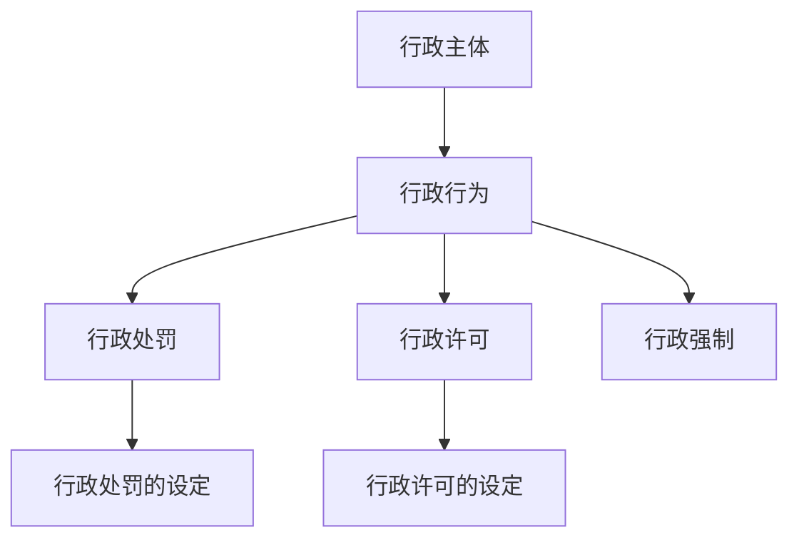
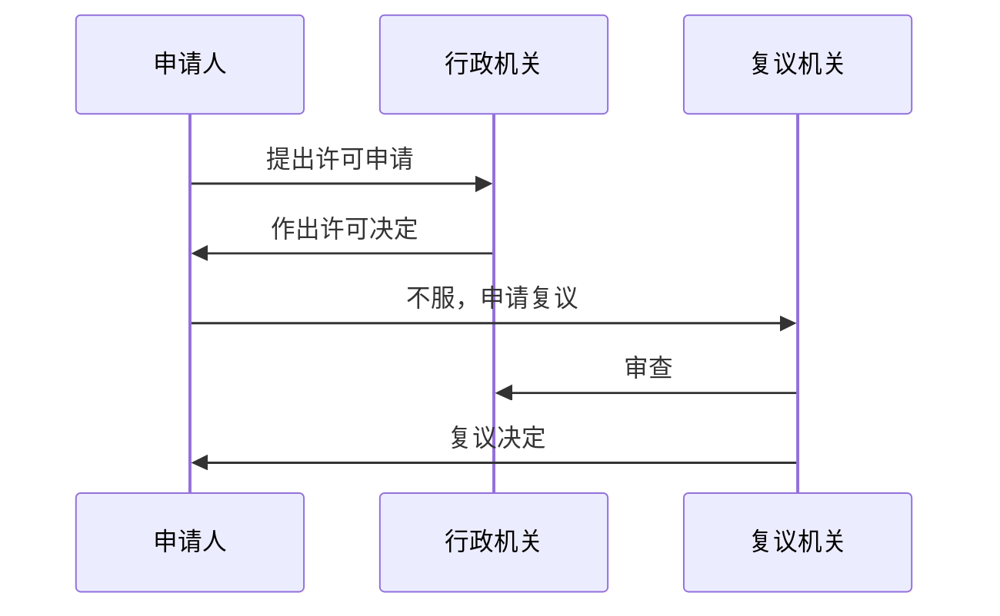
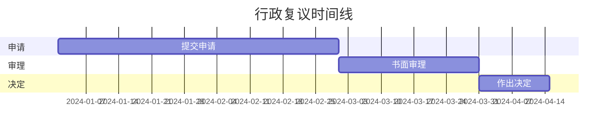

## 图片渲染测试

### 网络图片

### 本地相对路径图片

### 带标题的图片

## 图表渲染测试

### 流程图（Mermaid 语法）

### 序列图

### 甘特图

## 公式渲染测试

### 行内公式

贝叶斯公式：$P(A|B) = \frac{P(B|A) \cdot P(A)}{P(B)}$

欧拉恒等式：$e^{i\pi} + 1 = 0$

### 块级公式

$$
\mathcal{L}(\theta) = -\frac{1}{N} \sum_{i=1}^{N} \left[ y_i \log h_\theta(x_i) + (1 - y_i) \log(1 - h_\theta(x_i)) \right]
$$

$$
\nabla_\theta J(\theta) = \frac{1}{m} \sum_{i=1}^{m} \left( h_\theta(x^{(i)}) - y^{(i)} \right) x^{(i)}
$$

### 矩阵

$$
\mathbf{A} = \begin{pmatrix} a_{11} & a_{12} & \cdots & a_{1n} \\ a_{21} & a_{22} & \cdots & a_{2n} \\ \vdots & \vdots & \ddots & \vdots \\ a_{m1} & a_{m2} & \cdots & a_{mn} \end{pmatrix}
$$

## 荧光笔测试

这是一段普通文本，其中==重要内容应该被高亮显示==，而普通文本保持不变。

行政法的六大原则：==依法行政==、==合理行政==、==程序正当==、==诚实信用==、==高效便民==、==权责统一==。

==整段高亮测试：这段话全部应该被荧光笔标记。==
