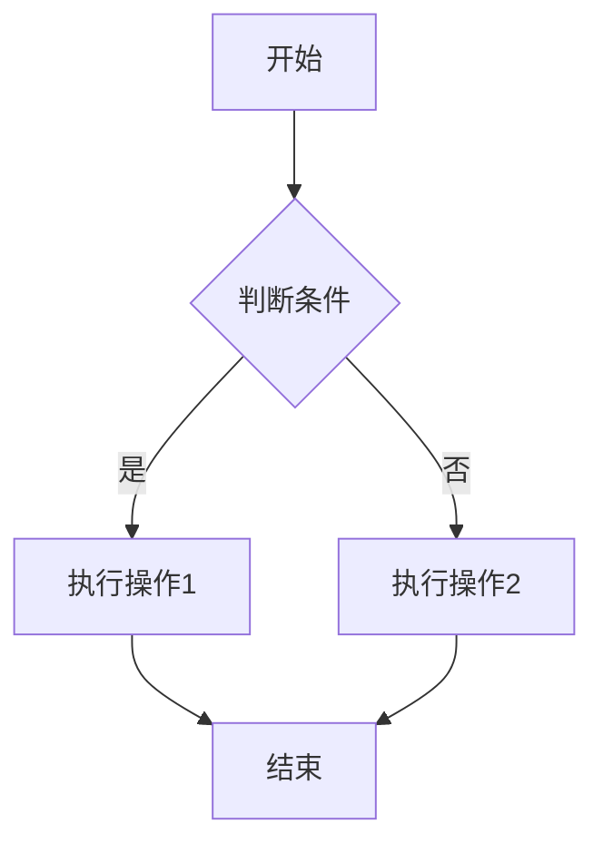
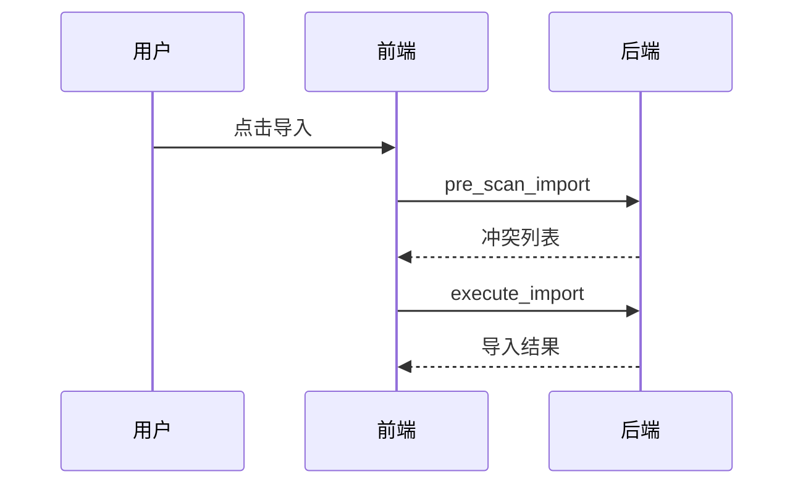
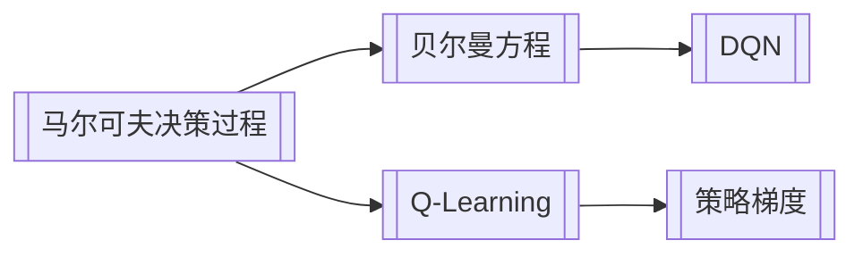
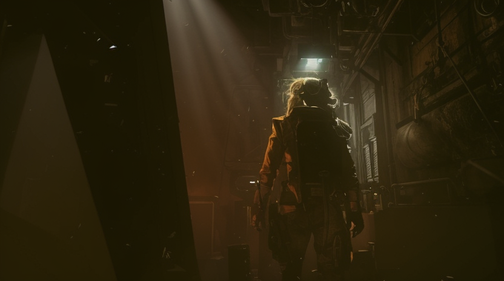

UNDO行一
## 图片渲染测试|
UNDO行二
# 小屁[[\h:yellow|[[\c:red|是]]]][[\h:green|[[\c:red|艾]][[\c:orange|斯]]]][[\c:orange|[[\h:yellow|比吗]]]]


### 图片


sad[[\h:#d2986f:#9a6ed0|**a撒*****大***]][[\h:green:gray|***苏打***]][[\h:#00cc00:#7721e0|***啊啊是大***]][[\h:green:gray|***da是adsad dadasd***]]
[[\h:#d2986f:#9a6ed0|***啊实打实a|***]]
[[\h:green:purple|***|sss***]]
[[\h:green:gray|***撒旦a的撒***]]

[[\h:blue:purple|*是****的***]]


[[\h:#d2986f:#9a6ed0|***撒旦飒飒的撒打算撒的撒大是***]]
[[\h:#d2986f:#9a6ed0|***撒打算***]]


### 本地相对路径图片


### 图片点击放大（Lightbox）
> 点击下方图片应弹出放大覆盖层


## Mermaid 图表测试

### 流程图



### 序列图



### 知识图谱结构



## 荧光笔测试

### 基础荧光笔

这是一段普通文本，[[\h|这里是默认黄色荧光笔]]，后面是普通文本。


### 带颜色荧光笔

- 默认（黄）：[[\h|一般重点内容]]
- 红色：[[\h:red|需注意/待核实内容]]
- 绿色：[[\h:green|已掌握/确认内容]]
- 蓝色：[[\h:blue|定义/术语内容]]
- 橙色：[[\h:orange|待复习内容]]


### 命名荧光笔


[[\h:hl-exam|考试必考知识点]]（sidecar 中可存 note="2024年真题"）

[[\h:hl-def:blue|核心定义]]（命名+颜色）

### 荧光笔嵌套链接

参见 [[\h:green|马尔可夫决策过程 [[mdp]] 的核心性质]]——荧光笔内含链接。

### 双色荧光笔（背景+前景）

- [[\h:yellow|黄底红字]] — 黄色背景配红色前景
- [[\h:green|绿底蓝字]] — 绿色背景配蓝色前景
- [[\h:blue|蓝底红字]] — 蓝色背景配红色前景
- [[\h:hl-exam|命名+红色前景]] — 命名荧光笔+前景色

## 字体颜色测试

- [[\c:red|红色字体]]
- [[\c:blue|蓝色字体]]
- [[\c:green|绿色字体]]
- [[\c:orange|橙色字体]]
- [[\c:purple|紫色字体]]
- [[\c:gray|灰色字体]]
- [[\c:#e91e63|自定义]][[\c:#e91e63|粉色字体]]
- [[\h:#ff0000|自定义红底]]
- [[\h:#ff5500:#000000|**?** *底* ***黑字*** ]]        ← 背景 + 前景都自定义
- [[\c:#ff8800|自定义橙色文字]]          ← 本来已支持
- [[\h:pink|粉色底]]                     ← 任意 CSS 颜色名


## 格式标记测试

### 粗体和斜体

- [[\b|粗体文本]]
- [[\i|斜体文本]]
- [[\b|粗体中含 [[mdp]] 链接]]

## 混合格式测试|

### 荧光笔 + Markdown 格式

- [[\h|**黄底粗体**]] — 荧光笔+markdown粗体
- [[\h:green|*绿底斜体*]] — 荧光笔+markdown斜体
- [[\h:yellow|[[\c:red|黄底红字]]]]   — 双色荧光笔
- [[\h:yellow:red|***黄底红字粗斜体***]] — 三重混合
- [[\c:red|**红色粗体**]] — 字体色+markdown粗体
- [[\h:blue|参见[[mdp]]核心定义]]  荧光笔内嵌链接（栈式解析关键测试）

### 与 C++ 等号运算符共存

以下 `==` 不应被解析为荧光笔：

- C++ 判断：`if (a == b)`
- Python 判断：`x == y`
- 数学等价：$A \iff B$

## 公式测试|

### 行内公式

爱因斯坦质能方程* ****$E = mc^2$*** 是物理学最著名的公式之一。

欧拉公式 $e^{i\pi} + 1 = 0$ 被誉为最美的数学公式。

贝叶斯定理[[\h:#ad4d09|：**$P(A|B) = frac{P(B|A) P(A)}{P(B)}$**]]

### 块[[\h:#ad4d09|级公式]]

$$
\mathcal{L}(\theta) = \mathbb{E}_{(s,a) \sim \mathcal{D}} \left[ \left( r + \gamma \max_{a'} Q(s', a'; \theta^-) - Q(s, a; \theta) \right)^2 \right]
$$

$$
\nabla_\theta J(\theta) = \mathbb{E}_{\pi_\theta} \left[ \nabla_\theta \log \pi_\theta(a|s) \cdot Q^{\pi_\theta}(s, a) \right]
$$

### 混合：**公式 +** 荧光笔

[[\h:#ad4d09:#9a6ed0|*注意力机制的核心公式*]]：

$$
\text{Attention}(Q, K, V) = \text{softmax}\left(\frac{QK^T}{\sqrt{d_k}}\right) V
$$

## 混合场景测试

### 图片 + 公式 + 荧光笔

[[\h:blue|马尔可夫性质]]：对于马尔可夫链，未来状态只依赖当前状态：
$$
P(s_{t+1} | s_t, s_{t-1}, \ldots, s_0) = P(s_{t+1} | s_t)
$$
### 表格 + 荧光笔

| 项目 | 状态 | 备注 | |
|------|------|------|-|
| 图片渲染 | [[\h:green|已实现]] | 网络+本地 |
| Mermaid | [[\h:orange|待实现]] | 需引入 mermaid.js |
| 荧光笔 | [[\h:red|待实现]] | 语法已设计 |
| 公式面板 | [[\h:orange|待实现]] | V2 阶段 |

### 代码块 + 荧光笔共存

```python
# Python 代码中的 == 不应被解析为荧光笔
if result == expected:
    print("测试通过")
```
代码外的 [[\h|荧光笔]] 正常渲染。

### AI 生成图（img2img，基于 Cyberpunk 2077 截图 + sd-turbo）


UNDO行一
## 图片渲染测试|
UNDO行二
# 小屁[[\h:yellow|[[\c:red|是]]]][[\h:green|[[\c:red|艾]][[\c:orange|斯]]]][[\c:orange|[[\h:yellow|比吗]]]]


### 图片


sad[[\h:#d2986f:#9a6ed0|**a撒*****大***]][[\h:green:gray|***苏打***]][[\h:#00cc00:#7721e0|***啊啊是大***]][[\h:green:gray|***da是adsad dadasd***]]
[[\h:#d2986f:#9a6ed0|***啊实打实a|***]]
[[\h:green:purple|***|sss***]]
[[\h:green:gray|***撒旦a的撒***]]

[[\h:blue:purple|*是****的***]]


[[\h:#d2986f:#9a6ed0|***撒旦飒飒的撒打算撒的撒大是***]]
[[\h:#d2986f:#9a6ed0|***撒打算***]]


### 本地相对路径图片


### 图片点击放大（Lightbox）
> 点击下方图片应弹出放大覆盖层


## Mermaid 图表测试

### 流程图


### 序列图


### 知识图谱结构


## 荧光笔测试

### 基础荧光笔

这是一段普通文本，[[\h|这里是默认黄色荧光笔]]，后面是普通文本。


### 带颜色荧光笔

- 默认（黄）：[[\h|一般重点内容]]
- 红色：[[\h:red|需注意/待核实内容]]
- 绿色：[[\h:green|已掌握/确认内容]]
- 蓝色：[[\h:blue|定义/术语内容]]
- 橙色：[[\h:orange|待复习内容]]


### 命名荧光笔


[[\h:hl-exam|考试必考知识点]]（sidecar 中可存 note="2024年真题"）

[[\h:hl-def:blue|核心定义]]（命名+颜色）

### 荧光笔嵌套链接

参见 [[\h:green|马尔可夫决策过程 [[mdp]] 的核心性质]]——荧光笔内含链接。

### 双色荧光笔（背景+前景）

- [[\h:yellow|黄底红字]] — 黄色背景配红色前景
- [[\h:green|绿底蓝字]] — 绿色背景配蓝色前景
- [[\h:blue|蓝底红字]] — 蓝色背景配红色前景
- [[\h:hl-exam|命名+红色前景]] — 命名荧光笔+前景色

## 字体颜色测试

- [[\c:red|红色字体]]
- [[\c:blue|蓝色字体]]
- [[\c:green|绿色字体]]
- [[\c:orange|橙色字体]]
- [[\c:purple|紫色字体]]
- [[\c:gray|灰色字体]]
- [[\c:#e91e63|自定义]][[\c:#e91e63|粉色字体]]
- [[\h:#ff0000|自定义红底]]
- [[\h:#ff5500:#000000|**?** *底* ***黑字*** ]]        ← 背景 + 前景都自定义
- [[\c:#ff8800|自定义橙色文字]]          ← 本来已支持
- [[\h:pink|粉色底]]                     ← 任意 CSS 颜色名


## 格式标记测试

### 粗体和斜体

- [[\b|粗体文本]]
- [[\i|斜体文本]]
- [[\b|粗体中含 [[mdp]] 链接]]

## 混合格式测试|

### 荧光笔 + Markdown 格式

- [[\h|**黄底粗体**]] — 荧光笔+markdown粗体
- [[\h:green|*绿底斜体*]] — 荧光笔+markdown斜体
- [[\h:yellow|[[\c:red|黄底红字]]]]   — 双色荧光笔
- [[\h:yellow:red|***黄底红字粗斜体***]] — 三重混合
- [[\c:red|**红色粗体**]] — 字体色+markdown粗体
- [[\h:blue|参见[[mdp]]核心定义]]  荧光笔内嵌链接（栈式解析关键测试）

### 与 C++ 等号运算符共存

以下 `==` 不应被解析为荧光笔：

- C++ 判断：`if (a == b)`
- Python 判断：`x == y`
- 数学等价：$A \iff B$

## 公式测试|

### 行内公式

爱因斯坦质能方程* ****$E = mc^2$*** 是物理学最著名的公式之一。

欧拉公式 $e^{i\pi} + 1 = 0$ 被誉为最美的数学公式。

贝叶斯定理[[\h:#ad4d09|：**$P(A|B) = frac{P(B|A) P(A)}{P(B)}$**]]

### 块[[\h:#ad4d09|级公式]]

$$
\mathcal{L}(\theta) = \mathbb{E}_{(s,a) \sim \mathcal{D}} \left[ \left( r + \gamma \max_{a'} Q(s', a'; \theta^-) - Q(s, a; \theta) \right)^2 \right]
$$

$$
\nabla_\theta J(\theta) = \mathbb{E}_{\pi_\theta} \left[ \nabla_\theta \log \pi_\theta(a|s) \cdot Q^{\pi_\theta}(s, a) \right]
$$

### 混合：**公式 +** 荧光笔

[[\h:#ad4d09:#9a6ed0|*注意力机制的核心公式*]]：

$$
\text{Attention}(Q, K, V) = \text{softmax}\left(\frac{QK^T}{\sqrt{d_k}}\right) V
$$

## 混合场景测试

### 图片 + 公式 + 荧光笔

[[\h:blue|马尔可夫性质]]：对于马尔可夫链，未来状态只依赖当前状态：
$$
P(s_{t+1} | s_t, s_{t-1}, \ldots, s_0) = P(s_{t+1} | s_t)
$$
### 表格 + 荧光笔

| 项目 | 状态 | 备注 | |
|------|------|------|-|
| 图片渲染 | [[\h:green|已实现]] | 网络+本地 |
| Mermaid | [[\h:orange|待实现]] | 需引入 mermaid.js |
| 荧光笔 | [[\h:red|待实现]] | 语法已设计 |
| 公式面板 | [[\h:orange|待实现]] | V2 阶段 |

### 代码块 + 荧光笔共存

```python
# Python 代码中的 == 不应被解析为荧光笔
if result == expected:
    print("测试通过")
```
代码外的 [[\h|荧光笔]] 正常渲染。

### AI 生成图（img2img，基于 Cyberpunk 2077 截图 + sd-turbo）


UNDO行一
## 图片渲染测试|
UNDO行二
# 小屁[[\h:yellow|[[\c:red|是]]]][[\h:green|[[\c:red|艾]][[\c:orange|斯]]]][[\c:orange|[[\h:yellow|比吗]]]]


### 图片


sad[[\h:#d2986f:#9a6ed0|**a撒*****大***]][[\h:green:gray|***苏打***]][[\h:#00cc00:#7721e0|***啊啊是大***]][[\h:green:gray|***da是adsad dadasd***]]
[[\h:#d2986f:#9a6ed0|***啊实打实a|***]]
[[\h:green:purple|***|sss***]]
[[\h:green:gray|***撒旦a的撒***]]

[[\h:blue:purple|*是****的***]]


[[\h:#d2986f:#9a6ed0|***撒旦飒飒的撒打算撒的撒大是***]]
[[\h:#d2986f:#9a6ed0|***撒打算***]]


### 本地相对路径图片


### 图片点击放大（Lightbox）
> 点击下方图片应弹出放大覆盖层


## Mermaid 图表测试

### 流程图


### 序列图


### 知识图谱结构


## 荧光笔测试

### 基础荧光笔

这是一段普通文本，[[\h|这里是默认黄色荧光笔]]，后面是普通文本。


### 带颜色荧光笔

- 默认（黄）：[[\h|一般重点内容]]
- 红色：[[\h:red|需注意/待核实内容]]
- 绿色：[[\h:green|已掌握/确认内容]]
- 蓝色：[[\h:blue|定义/术语内容]]
- 橙色：[[\h:orange|待复习内容]]


### 命名荧光笔


[[\h:hl-exam|考试必考知识点]]（sidecar 中可存 note="2024年真题"）

[[\h:hl-def:blue|核心定义]]（命名+颜色）

### 荧光笔嵌套链接

参见 [[\h:green|马尔可夫决策过程 [[mdp]] 的核心性质]]——荧光笔内含链接。

### 双色荧光笔（背景+前景）

- [[\h:yellow|黄底红字]] — 黄色背景配红色前景
- [[\h:green|绿底蓝字]] — 绿色背景配蓝色前景
- [[\h:blue|蓝底红字]] — 蓝色背景配红色前景
- [[\h:hl-exam|命名+红色前景]] — 命名荧光笔+前景色

## 字体颜色测试

- [[\c:red|红色字体]]
- [[\c:blue|蓝色字体]]
- [[\c:green|绿色字体]]
- [[\c:orange|橙色字体]]
- [[\c:purple|紫色字体]]
- [[\c:gray|灰色字体]]
- [[\c:#e91e63|自定义]][[\c:#e91e63|粉色字体]]
- [[\h:#ff0000|自定义红底]]
- [[\h:#ff5500:#000000|**?** *底* ***黑字*** ]]        ← 背景 + 前景都自定义
- [[\c:#ff8800|自定义橙色文字]]          ← 本来已支持
- [[\h:pink|粉色底]]                     ← 任意 CSS 颜色名


## 格式标记测试

### 粗体和斜体

- [[\b|粗体文本]]
- [[\i|斜体文本]]
- [[\b|粗体中含 [[mdp]] 链接]]

## 混合格式测试|

### 荧光笔 + Markdown 格式

- [[\h|**黄底粗体**]] — 荧光笔+markdown粗体
- [[\h:green|*绿底斜体*]] — 荧光笔+markdown斜体
- [[\h:yellow|[[\c:red|黄底红字]]]]   — 双色荧光笔
- [[\h:yellow:red|***黄底红字粗斜体***]] — 三重混合
- [[\c:red|**红色粗体**]] — 字体色+markdown粗体
- [[\h:blue|参见[[mdp]]核心定义]]  荧光笔内嵌链接（栈式解析关键测试）

### 与 C++ 等号运算符共存

以下 `==` 不应被解析为荧光笔：

- C++ 判断：`if (a == b)`
- Python 判断：`x == y`
- 数学等价：$A \iff B$

## 公式测试|

### 行内公式

爱因斯坦质能方程* ****$E = mc^2$*** 是物理学最著名的公式之一。

欧拉公式 $e^{i\pi} + 1 = 0$ 被誉为最美的数学公式。

贝叶斯定理[[\h:#ad4d09|：**$P(A|B) = frac{P(B|A) P(A)}{P(B)}$**]]

### 块[[\h:#ad4d09|级公式]]

$$
\mathcal{L}(\theta) = \mathbb{E}_{(s,a) \sim \mathcal{D}} \left[ \left( r + \gamma \max_{a'} Q(s', a'; \theta^-) - Q(s, a; \theta) \right)^2 \right]
$$

$$
\nabla_\theta J(\theta) = \mathbb{E}_{\pi_\theta} \left[ \nabla_\theta \log \pi_\theta(a|s) \cdot Q^{\pi_\theta}(s, a) \right]
$$

### 混合：**公式 +** 荧光笔

[[\h:#ad4d09:#9a6ed0|*注意力机制的核心公式*]]：

$$
\text{Attention}(Q, K, V) = \text{softmax}\left(\frac{QK^T}{\sqrt{d_k}}\right) V
$$

## 混合场景测试

### 图片 + 公式 + 荧光笔

[[\h:blue|马尔可夫性质]]：对于马尔可夫链，未来状态只依赖当前状态：
$$
P(s_{t+1} | s_t, s_{t-1}, \ldots, s_0) = P(s_{t+1} | s_t)
$$
### 表格 + 荧光笔

| 项目 | 状态 | 备注 | |
|------|------|------|-|
| 图片渲染 | [[\h:green|已实现]] | 网络+本地 |
| Mermaid | [[\h:orange|待实现]] | 需引入 mermaid.js |
| 荧光笔 | [[\h:red|待实现]] | 语法已设计 |
| 公式面板 | [[\h:orange|待实现]] | V2 阶段 |

### 代码块 + 荧光笔共存

```python
# Python 代码中的 == 不应被解析为荧光笔
if result == expected:
    print("测试通过")
```
代码外的 [[\h|荧光笔]] 正常渲染。

### AI 生成图（img2img，基于 Cyberpunk 2077 截图 + sd-turbo）


UNDO行一
## 图片渲染测试|
UNDO行二
# 小屁[[\h:yellow|[[\c:red|是]]]][[\h:green|[[\c:red|艾]][[\c:orange|斯]]]][[\c:orange|[[\h:yellow|比吗]]]]


### 图片


sad[[\h:#d2986f:#9a6ed0|**a撒*****大***]][[\h:green:gray|***苏打***]][[\h:#00cc00:#7721e0|***啊啊是大***]][[\h:green:gray|***da是adsad dadasd***]]
[[\h:#d2986f:#9a6ed0|***啊实打实a|***]]
[[\h:green:purple|***|sss***]]
[[\h:green:gray|***撒旦a的撒***]]

[[\h:blue:purple|*是****的***]]


[[\h:#d2986f:#9a6ed0|***撒旦飒飒的撒打算撒的撒大是***]]
[[\h:#d2986f:#9a6ed0|***撒打算***]]


### 本地相对路径图片


### 图片点击放大（Lightbox）
> 点击下方图片应弹出放大覆盖层


## Mermaid 图表测试

### 流程图


### 序列图


### 知识图谱结构


## 荧光笔测试

### 基础荧光笔

这是一段普通文本，[[\h|这里是默认黄色荧光笔]]，后面是普通文本。


### 带颜色荧光笔

- 默认（黄）：[[\h|一般重点内容]]
- 红色：[[\h:red|需注意/待核实内容]]
- 绿色：[[\h:green|已掌握/确认内容]]
- 蓝色：[[\h:blue|定义/术语内容]]
- 橙色：[[\h:orange|待复习内容]]


### 命名荧光笔


[[\h:hl-exam|考试必考知识点]]（sidecar 中可存 note="2024年真题"）

[[\h:hl-def:blue|核心定义]]（命名+颜色）

### 荧光笔嵌套链接

参见 [[\h:green|马尔可夫决策过程 [[mdp]] 的核心性质]]——荧光笔内含链接。

### 双色荧光笔（背景+前景）

- [[\h:yellow|黄底红字]] — 黄色背景配红色前景
- [[\h:green|绿底蓝字]] — 绿色背景配蓝色前景
- [[\h:blue|蓝底红字]] — 蓝色背景配红色前景
- [[\h:hl-exam|命名+红色前景]] — 命名荧光笔+前景色

## 字体颜色测试

- [[\c:red|红色字体]]
- [[\c:blue|蓝色字体]]
- [[\c:green|绿色字体]]
- [[\c:orange|橙色字体]]
- [[\c:purple|紫色字体]]
- [[\c:gray|灰色字体]]
- [[\c:#e91e63|自定义]][[\c:#e91e63|粉色字体]]
- [[\h:#ff0000|自定义红底]]
- [[\h:#ff5500:#000000|**?** *底* ***黑字*** ]]        ← 背景 + 前景都自定义
- [[\c:#ff8800|自定义橙色文字]]          ← 本来已支持
- [[\h:pink|粉色底]]                     ← 任意 CSS 颜色名


## 格式标记测试

### 粗体和斜体

- [[\b|粗体文本]]
- [[\i|斜体文本]]
- [[\b|粗体中含 [[mdp]] 链接]]

## 混合格式测试|

### 荧光笔 + Markdown 格式

- [[\h|**黄底粗体**]] — 荧光笔+markdown粗体
- [[\h:green|*绿底斜体*]] — 荧光笔+markdown斜体
- [[\h:yellow|[[\c:red|黄底红字]]]]   — 双色荧光笔
- [[\h:yellow:red|***黄底红字粗斜体***]] — 三重混合
- [[\c:red|**红色粗体**]] — 字体色+markdown粗体
- [[\h:blue|参见[[mdp]]核心定义]]  荧光笔内嵌链接（栈式解析关键测试）

### 与 C++ 等号运算符共存

以下 `==` 不应被解析为荧光笔：

- C++ 判断：`if (a == b)`
- Python 判断：`x == y`
- 数学等价：$A \iff B$

## 公式测试|

### 行内公式

爱因斯坦质能方程* ****$E = mc^2$*** 是物理学最著名的公式之一。

欧拉公式 $e^{i\pi} + 1 = 0$ 被誉为最美的数学公式。

贝叶斯定理[[\h:#ad4d09|：**$P(A|B) = frac{P(B|A) P(A)}{P(B)}$**]]

### 块[[\h:#ad4d09|级公式]]

$$
\mathcal{L}(\theta) = \mathbb{E}_{(s,a) \sim \mathcal{D}} \left[ \left( r + \gamma \max_{a'} Q(s', a'; \theta^-) - Q(s, a; \theta) \right)^2 \right]
$$

$$
\nabla_\theta J(\theta) = \mathbb{E}_{\pi_\theta} \left[ \nabla_\theta \log \pi_\theta(a|s) \cdot Q^{\pi_\theta}(s, a) \right]
$$

### 混合：**公式 +** 荧光笔

[[\h:#ad4d09:#9a6ed0|*注意力机制的核心公式*]]：

$$
\text{Attention}(Q, K, V) = \text{softmax}\left(\frac{QK^T}{\sqrt{d_k}}\right) V
$$

## 混合场景测试

### 图片 + 公式 + 荧光笔

[[\h:blue|马尔可夫性质]]：对于马尔可夫链，未来状态只依赖当前状态：
$$
P(s_{t+1} | s_t, s_{t-1}, \ldots, s_0) = P(s_{t+1} | s_t)
$$
### 表格 + 荧光笔

| 项目 | 状态 | 备注 | |
|------|------|------|-|
| 图片渲染 | [[\h:green|已实现]] | 网络+本地 |
| Mermaid | [[\h:orange|待实现]] | 需引入 mermaid.js |
| 荧光笔 | [[\h:red|待实现]] | 语法已设计 |
| 公式面板 | [[\h:orange|待实现]] | V2 阶段 |

### 代码块 + 荧光笔共存

```python
# Python 代码中的 == 不应被解析为荧光笔
if result == expected:
    print("测试通过")
```
代码外的 [[\h|荧光笔]] 正常渲染。

### AI 生成图（img2img，基于 Cyberpunk 2077 截图 + sd-turbo）


