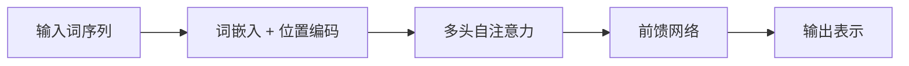

## 词嵌入

要让神经网络处理文字，先要把离散的词映射成稠密向量，即词嵌入。相近语义的词在向量空间里彼此靠近，典型例子：`国王 − 男人 + 女人 ≈ 女王`。

词嵌入是 [[attention|注意力]] 时代的表示基础；现代大模型用无监督语料训练得到上下文相关的表示，见 [[unsupervised|无监督学习]] 的表示学习分支。

## 卷积神经网络

卷积神经网络用滑动的小卷积核提取局部模式：底层识别边缘，中层识别纹理部件，高层识别完整物体。卷积的“参数共享”使其远少于全连接层参数，配合池化获得平移不变性。

CNN 是 [[mlp|多层感知机]] 在图像上的结构化改进，主要面向视觉；处理文本顺序时，人们转向 [[rnn|循环神经网络]]。

## 循环神经网络

循环神经网络让隐藏状态随时间步传递，天然适合序列数据：语言模型、语音、时间序列。但朴素 RNN 存在长程依赖下的[[backprop|梯度消失]]，LSTM/GRU 用门控机制缓解了这一问题。

RNN 的问题是难以并行——后一个时刻依赖前一个时刻。注意力机制的登场改变了这一局面。

## 注意力机制

注意力机制让模型在每一步“有选择地看”输入中相关的位置。查询 Q 与键 K 算相似度得到权重，再对值 V 加权求和：

$$
\text{Attention}(Q,K,V) = \text{softmax}\!\left(\frac{QK^{\top}}{\sqrt{d_k}}\right) V
$$

多头注意力并行计算多组注意力，让模型同时关注多种关系。注意力解决了 RNN 的并行与长程问题，直接催生了 [[transformer|Transformer]]。

## Transformer

Transformer 由自注意力层与逐位置前馈层堆叠而成，没有循环结构，整句并行处理。它先用于翻译，随后以“预训练 + 微调”范式席卷 NLP：BERT、GPT 皆为其子孙。

Transformer 的架构图常以 mermaid 的 sequence/block 描述（此处用 Mermaid 展示处理流）：

从[[mlp|多层感知机]]到 Transformer，主线一直是“更强的特征交互 + 更大的容量 + 更稳的训练”。
