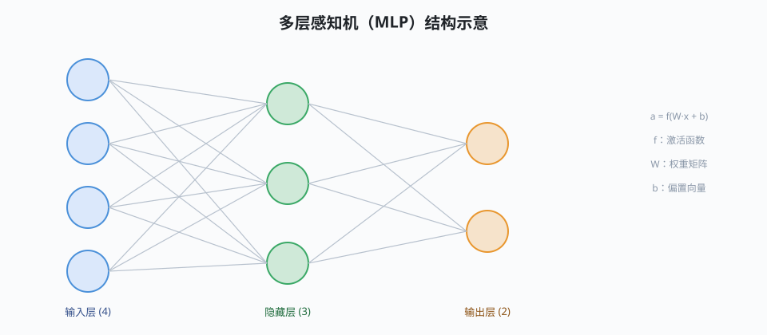

## 感知机

感知机是最早的人工神经元：对输入加权求和，超过阈值就输出 1，否则输出 0。单个感知机只能划分**线性可分**的数据，连“异或”都学不出来——这一局限曾让神经网络研究陷入低谷。

不过感知机奠定了现代神经元的形式：线性加权 + 非线性。后来的发展只是把它“堆叠”并换用可导的 [[activation|激活函数]]。

## 多层感知机

多层感知机（MLP）把神经元组织成层：输入层 → 隐藏层 → 输出层，层与层之间全连接。只要隐藏层足够宽，MLP 理论上可逼近任意连续函数——这就是“万能逼近定理”。

下图是 MLP 的结构示意（图片模块：定宽居中 + 名称字号演示）：

训练 MLP 需要两件东西：衡量差错的 [[loss|损失函数]] 与让损失下降的 [[backprop|反向传播]]。MLP 属于 [[supervised|监督学习]] 的经典模型，也是深度学习的起点。

## 激活函数

激活函数给网络注入非线性。没有它，多层线性变换仍等价于一层线性变换。

| 名称 | 公式 | 特点 |
|---|---|---|
| Sigmoid | $1/(1+e^{-x})$ | 平滑但两端梯度饱和 |
| tanh | $(e^x-e^{-x})/(e^x+e^{-x})$ | 零中心，仍有饱和 |
| ReLU | $\max(0,x)$ | 计算快、缓解饱和 |
| Leaky ReLU | $\max(\alpha x, x)$ | 负区间不“死” |

ReLU 的导数要么 0 要么 1，在深网中显著缓解了[[backprop|梯度消失]]，是当下默认选择。

## 反向传播

反向传播用链式法则把输出端的误差逐层传回，算出每个权重的梯度，再交给梯度下降更新。公式上看：

$$
\frac{\partial L}{\partial W^{(l)}} = \delta^{(l)} \cdot (a^{(l-1)})^{\top}, \qquad
\delta^{(l)} = (W^{(l+1)})^{\top}\delta^{(l+1)} \odot f'(z^{(l)})
$$

实现层面，现代框架自动微分取代了手写 BP，但其原理仍是训练一切的基石。

## 损失函数

损失函数量化“预测与真相的差距”，训练即最小化它。回归常用均方误差，分类常用交叉熵：

$$
L_{CE} = -\frac{1}{m}\sum_{i=1}^{m} \sum_{k=1}^{K} y_k^{(i)} \log \hat{y}_k^{(i)}
$$

交叉熵配合 softmax 输出（见 [[logistic-regression|逻辑回归]]）让梯度数值稳定，是分类网络的标配。损失与[[activation|激活函数]]要匹配使用，否则会出现梯度消失。

从 MLP 继续延伸，见 [[embedding|词嵌入]] 与 [[cnn|卷积神经网络]] 页面。
