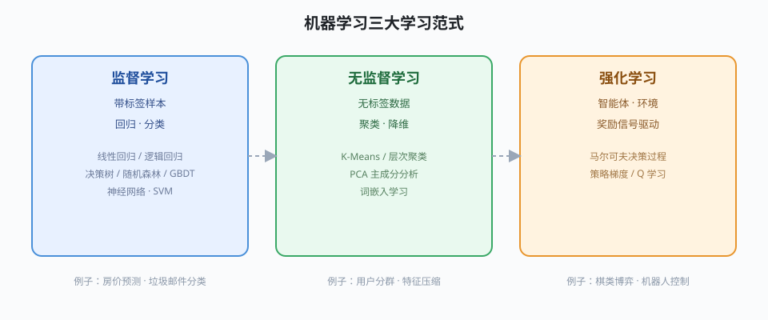

## 机器学习

机器学习是让计算机**从数据中自动学习规律**、而不是由人逐条编写规则的一类方法。一个典型流程是：收集样本 → 用算法拟合模型 → 用模型对未知输入做预测。

机器学习方法按数据形态被划分为三大范式：

### 监督学习

训练样本自带“标准答案”（标签），算法学习输入到标签的映射，用于回归与分类等任务。详见 [[supervised|监督学习概览]] 与 [[linear-regression|回归]]、[[logistic-regression|分类]]。

### 无监督学习

训练样本没有标签，算法从结构中发现规律，用于聚类与降维。详见 [[unsupervised|无监督学习概览]]。

### 强化学习

智能体与环境持续交互，靠奖励信号学习最优决策，详见 [[rl-intro|强化学习]]。

三种范式的分工与例子见下图的“图片模块演示”——居中展示并限定宽度：

## 泛化与过拟合

[[机器学习]] 的目标不是背下训练数据，而是对**从未见过的新样本**给出正确预测，这种能力称为泛化。泛化是贯穿所有范式的核心问题，[[generalization|本词条]] 与 [[model-eval|评估与诊断]] 一起构成模型的“体检”方法。

最常见的失败模式是过拟合：模型记住了噪声而非规律，训练集得分高、测试集反而差。偏差-方差分解给出解释——欠拟合对应高偏差，过拟合对应高方差。缓解手段包括增加数据、[[feature-engineering|特征工程]]、正则化与交叉验证。

关于学习曲线与正则化的定量讨论，继续阅读 [[supervised|监督学习概览]] 与 [[decision-tree|决策树]] 页面。
