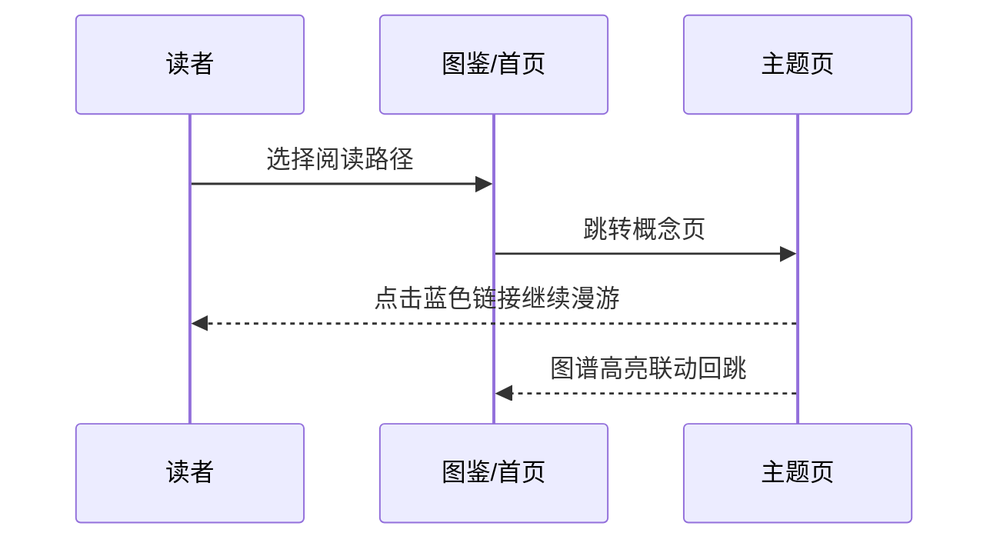

## 样式与文本演示

本页集中演示预览支持的书写格式（权威说明见仓库 `docs/reference/preview-formats.md`）。首先是文字样式命令：

- 高亮：[[\h|重点内容]]、[[\h:green|绿色底强调]]、[[\h:blue|蓝色底]]、[[\h:orange:purple|橙底紫字]]
- 颜色与字号：[[\c:red|红色警告]]、[[\c:gray|灰色注释]]、[[\s:20px|大字号]]、[[\s:0.8em|小字号]]
- 基础排版：[[\b|命令式粗体]] 与 **标准粗体**、*斜体*、~~删除线~~、`行内代码`、[[\sup|上标]]²、[[\sub|下标]]₂

**混合嵌套**（样式命令内不再套命令，改用标准 Markdown 或内嵌链接）：[[\h:yellow:red|***粗斜体红色内容***]]、[[\h:green|参见 [[linear-regression|线性回归]] 的公式与代码]]。

**块级嵌套**：引用套引用、列表套列表、代码块、公式、表格在其它页面均已出现，此处再给一个多级引用：

> 外层引用：模型评估要诚实。
> > 内层引用：测试集只能碰一次，否则它就不“测试”了。
> > > 更深一层：因此要用独立的验证集做调参。

有序列表套无序列表：

1. 建模流程
   - 清洗与 [[feature-engineering|特征工程]]
   - 选择基线模型
2. 评估与迭代
   - 交叉验证
   - 记录实验

无序列表套有序列表：

- 三大范式（有序分支）
  1. [[supervised|监督学习]]
  2. [[unsupervised|无监督学习]]
  3. [[rl-intro|强化学习]]

## 图片样式演示

图片模块支持尺寸、对齐、标题与名称控制（权威说明见仓库 `docs/reference/image-features.md`）。同一张图以不同属性渲染如下。

**默认样式**：不限宽时按默认比例显示，下方自动带图片名称（alt）——单击可进入编辑工具栏，双击可放大（Lightbox）：

**定宽 + 居中**：`width=360` 居中，显式尺寸会解除默认宽度钳制：

**纯标题模式**：title 不是键值对时，整体作为图片标题（悬停提示）渲染：

**右对齐 + 名称字号**：`align=right` 与 `name-size` 控制名称大小：

**隐藏名称**：`name=hide` 时不再显示下方名称文字：

## 链接与关系模式

Memoria 图谱把“知识点之间的关系”建模为三类边，覆盖链接设计的多目标与环路模式：

- **reference（引用/相关）**：默认链接类型，如 [[generalization|泛化]] 被多个页面引用，见 [[ml-overview|机器学习]] 页面。
- **extend（扩展/细化）**：概念被延伸出的子实现引用，见 [[ensemble|集成学习]] → [[random-forest|随机森林]]、[[gbdt|梯度提升树]]。
- **contain（包含）**：由正文标题层级自动生成（例如本文件各「## 」段属于图鉴这个大主题），不手工建边。

**多目标链接**：一个锚点可同时指向多个知识点，例如本图鉴的三大范式锚点一次指向三页：

- [[supervised|监督学习]] 与 [[unsupervised|无监督学习]] 与 [[rl-intro|强化学习]] 并称机器学习三大范式。

**环路演示**：[[ml-overview|机器学习]] → [[supervised|监督学习]] → [[model-eval|评估与诊断]] → [[generalization|泛化与过拟合]] → 回到概念原点。

**虚链演示**：指向尚未建立知识点概念的链接会显示为灰色不可点，且不会自动创建空文件——两条悬空虚链（自动机器学习 / 大模型智能体）的演示放在**本库 README**（无知识点的页面，避免被计入完整性检查），本页正文不再重复。

**结构图**：用 Mermaid 展示本库知识网络的组织方式（sequence 型）：

## 搜索与同义词演示

Memoria 的搜索会同时命中知识点名称与**别名**，因此口语化、同义的提问都能找到目标。本库在侧车为常用概念登记了别名（aliases），例如：

- [[linear-regression|线性回归]]：最小二乘回归、线性模型
- [[logistic-regression|逻辑回归]]：逻辑分类、LR
- [[pca|主成分分析]]：PCA、降维
- [[attention|注意力机制]]：Attention、自注意力
- [[gbdt|梯度提升树]]：GBDT、梯度提升

试试在搜索框输入 `最小二乘`、`PCA` 或 `逻辑分类`——它们会命中对应的知识点并跳到正文位置。模糊输入（如 `gbdt` 写小写）也由别名与检索策略兜底。
