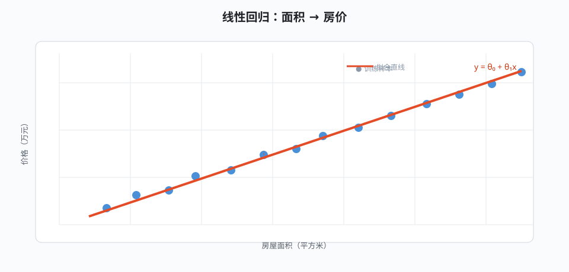

## 监督学习概览

监督学习使用带标签样本学习输入到输出的映射。若输出是连续数值，任务是**回归**；若输出是离散类别，任务是**分类**。在动手建模之前，应确认 [[feature-engineering|特征]] 与 [[model-eval|评估协议]]，否则模型再精巧也无从衡量好坏。

## 线性回归

线性回归假设输出与特征是线性组合关系 $y = \theta_0 + \theta_1 x_1 + \dots + \theta_n x_n$，用最小二乘拟合参数。目标函数是残差平方和：

$$
\min_{\theta} \sum_{i=1}^{m} \left( y^{(i)} - \theta^{\top} x^{(i)} \right)^2
$$

下图演示“面积 → 房价”的单变量拟合（图片模块：默认宽度 + 仅标题，双击可放大 Lightbox）：



求解可用正规方程或梯度下降。梯度下降按负梯度迭代参数，学习率过大会震荡、过小则收敛慢——这正是 [[ml-overview|机器学习]] 中最先遇到的工程细节之一。

## 逻辑回归

分类任务最常用的基线是逻辑回归：对线性得分施加 sigmoid 压缩，输出介于 0 到 1 的类别概率：

$$
\sigma(z) = \frac{1}{1 + e^{-z}}, \quad \hat{y} = \sigma(\theta^{\top} x)
$$

训练目标为交叉熵损失，详见 [[loss|损失函数]]。逻辑回归虽然名字带“回归”，却是**分类**算法的代表，常作为深度模型的对照基线。

## 支持向量机

支持向量机寻找“间隔最大”的分隔超平面，样本到分界线的距离越大，泛化越有把握。对线性不可分数据，可通过核函数把样本隐式映射到高维空间再线性划分，这就是“核技巧”。

支持向量机训练等价于求解一个凸优化问题，因此能保证全局最优——这是它与神经网络（局部最优，见 [[backprop|反向传播]]）的重要差异。

## 特征工程

模型的输入特征质量往往比模型本身更关键。常用手段包括：归一化（让量纲不同的特征可比）、对长尾分布取对数、把类别变量做编码、用 PCA 压缩维度（见 [[pca|主成分分析]]）。

好的特征让 [[decision-tree|决策树]] 等简单模型也能表现优异；“垃圾进、垃圾出”是数据科学最朴素的告诫。

## 评估与诊断

评估要回答三个问题：模型在测试集上有多准、结论是否稳定、错误来自偏差还是方差。

常用指标：回归看 MSE/MAE；分类看准确率、精确率、召回率与 F1。交叉验证把数据切成 k 份轮流当验证集，比单次划分更稳健。配合 [[generalization|泛化与过拟合]] 中的学习曲线，就能判断该加数据还是该加复杂度。

附一个极简训练脚本（代码块展示，无语法高亮）：

```python
import numpy as np

def fit_linear(X, y):
    X = np.c_[np.ones(len(X)), X]      # 增广截距列
    return np.linalg.pinv(X.T @ X) @ X.T @ y   # 正规方程
```

对比不同算法的取舍，继续阅读 [[decision-tree|决策树与集成]] 与 [[perceptron|神经网络]] 页面。
