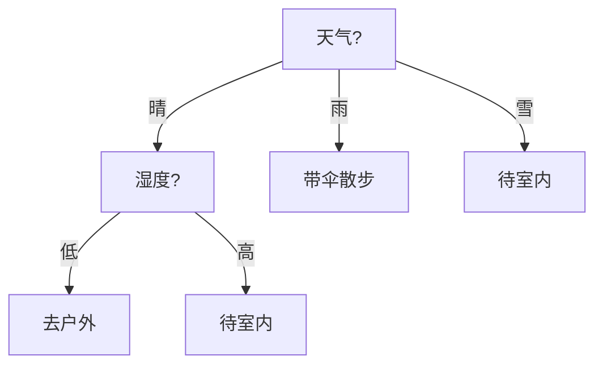

## 决策树

决策树用“如果…那么…”的规则树来决策：每个内部节点按一个特征做判断，叶节点给出预测。树的构造目标是让划分后的子集尽可能“纯”，常用信息增益（ID3）或基尼不纯度（CART）：

$$
\text{Gain}(D, A) = H(D) - \sum_{v} \frac{|D_v|}{|D|} H(D_v)
$$

下图用 Mermaid 画一棵“是否适合户外运动”的迷你树（Mermaid 图形演示）：

决策树的优点是**可解释**：每一条从根到叶的路径都能读成一句人话。缺点是单棵树容易过拟合，把噪声学进分支——解决思路是 [[ensemble|集成学习]]。

## 集成学习

“三个臭皮匠顶个诸葛亮”：把多个弱模型组合起来通常比单个强模型更稳，这就是集成学习。两大流派分别是并行独立的 **Bagging**（降低方差）与串行纠错的 **Boosting**（降低偏差）。

集成思想是 [[random-forest|随机森林]] 与 [[gbdt|梯度提升树]] 的共同母题，也与“把多模型结果平均”的朴素思路一脉相承。

## 随机森林

随机森林 = Bagging + 决策树 + 随机特征子集。训练多棵并行的树，每棵只看到一部分样本、在每次分裂时只考虑一部分特征，最终投票/平均。

由于树之间互不相关，方差被显著压低，随机森林是**开箱即用**的高基线：几乎不需要调参，对[[feature-engineering|特征缩放]]也不敏感。

## 梯度提升树

与随机森林相反，梯度提升树（GBDT）让新树拟合前序模型的**残差方向**（负梯度），逐棵把损失降下去。XGBoost / LightGBM 是其工程化代表，长期霸榜表格类数据竞赛。

GBDT 与 [[random-forest|随机森林]] 的对比见下表（表格样式演示）：

| 维度 | 随机森林 | GBDT |
|---|---|---|
| 建树方式 | 并行、独立 | 串行、拟合残差 |
| 主要作用 | 降方差 | 降偏差 |
| 调参敏感度 | 低 | 较高 |
| 训练速度 | 快 | 相对慢 |

如果只能先学一个，推荐从决策树到随机森林建立直觉，再用 [[model-eval|评估与诊断]] 的方法做细粒度对比。
