# IELTS 词汇教练 · 上手与部署指引

> AAA_Vocab —— 一个 Memoria 知识库 + 一个 Trae 智能体。把「背单词」换成「能被批改的主动输出训练」。
>
> A Memoria knowledge base + a Trae agent. Setup & deployment guide.
>
> 本文件是 `index.html`（GitHub Pages 版）的 Markdown 版本，两者内容一致；改一处记得同步另一处。

---

## 中文

### 你会得到什么

一个可以对话的 IELTS 词汇教练：音标与听力陷阱、词典释义（英英 + 中文，标注 Oxford / Cambridge / Collins 来源）、词族与高频搭配矩阵、近义词辨析矩阵、主动输出练习（口语 / 写作场景、填空、词组编织），以及基于间隔重复（SM-2 改良）的**复习排程与学习记录**。全部数据存在你自己的磁盘上。

### 准备（两件东西）

| 需要 | 从哪来 |
|---|---|
| **Trae**（AI IDE，免费） | 国内版官网 <https://www.trae.cn/> 下载安装（就是第 1 步那张截图）。若在海外、或需要国际版模型（GPT / Claude 等），用国际版 <https://www.trae.ai/>；两版能力与交互一致，区别主要在模型与计价 |
| **Memoria**（本知识库的编辑器，Windows 免安装） | [Releases](https://github.com/Fresh-Tim-Lam/Memoria/releases) 下 `Memoria-v*-win64.zip`（内置模型，完全离线）或 `-lite.zip`（约 34 MB，首次用语义检索时联网取模型），解压后跑 `Memoria.exe` |

> 只想用智能体、不想装 Memoria？见下方「捷径」。

### 准备知识库

本页只讲「怎么用」，词汇库本体在 Memoria 仓库里：[`docs/example/AAA_Vocab`](https://github.com/Fresh-Tim-Lam/Memoria/tree/main/docs/example/AAA_Vocab)。把它 clone / 下载到本地（或直接 clone 整个 Memoria 仓库），下一步用它作为知识库目录。

### 步骤

1. **下载并安装 Trae**：打开 <https://www.trae.cn/> → 点「下载 TraeCode」→ 按提示安装并登录。

   
   > 中文官网（trae.cn）下载页：`下载 TraeCode` / `下载中心`。

2. **用 Memoria 打开词汇库**：启动 Memoria → 欢迎页点「打开知识库」→ 在「选择知识库文件夹」里选中 `AAA_Vocab` 目录（判断标准：这一层能看到 `vocab/`、`expressions/`）。

   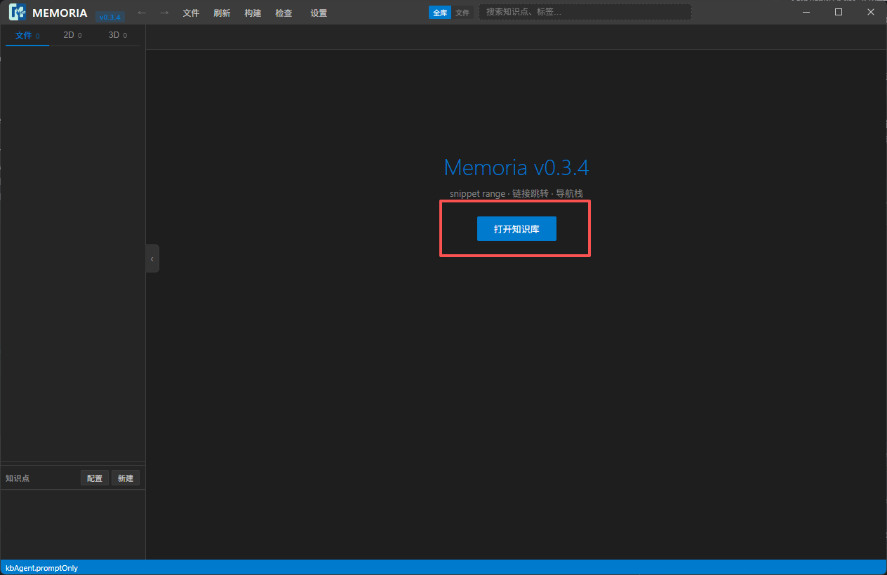
   > Memoria v0.3.4 主界面（欢迎页 / 空态）。

   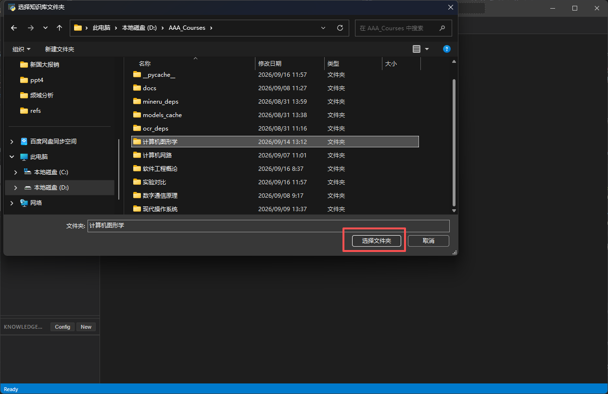
   > 系统「选择知识库文件夹」对话框：选中 AAA_Vocab 目录。

3. **创建 Trae 智能体**：顶栏「文件」→「创建 Trae 智能体」。

   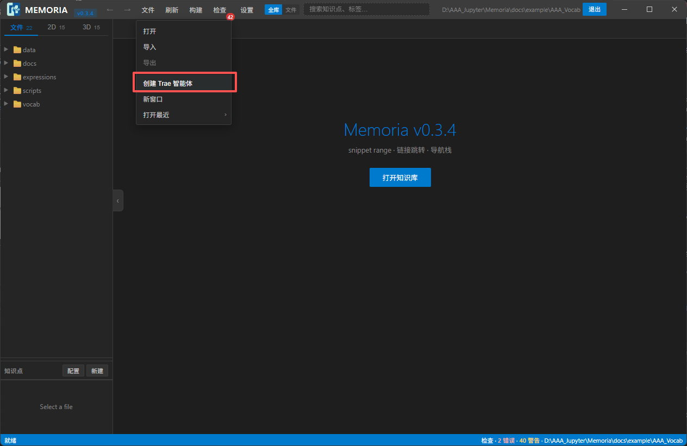
   > 「文件」菜单：打开 / 导入 / 导出 / **创建 Trae 智能体** / 新窗口 / 打开最近。

4. **复制指令**：弹出「智能体工具包已生成」——它把工具包写进 `<本库>/.memoria/agent/`（幂等，不会覆盖你的复习记录），点右下「复制指令」把完整指令复制到剪贴板。

   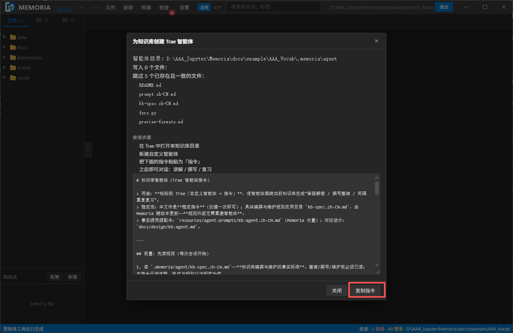
   > 弹窗含「智能体目录」、写入/跳过的文件清单、4 条使用步骤，以及底部的指令全文与「复制指令」。

5. **在 Trae 里新建自定义智能体**：在 Trae 中打开本知识库目录 → 智能体面板点「Create Agent」→ 名称随意（如 `IELTS Coach`）→ 把刚复制的指令粘进「指令 / Prompt」框 → 创建。

   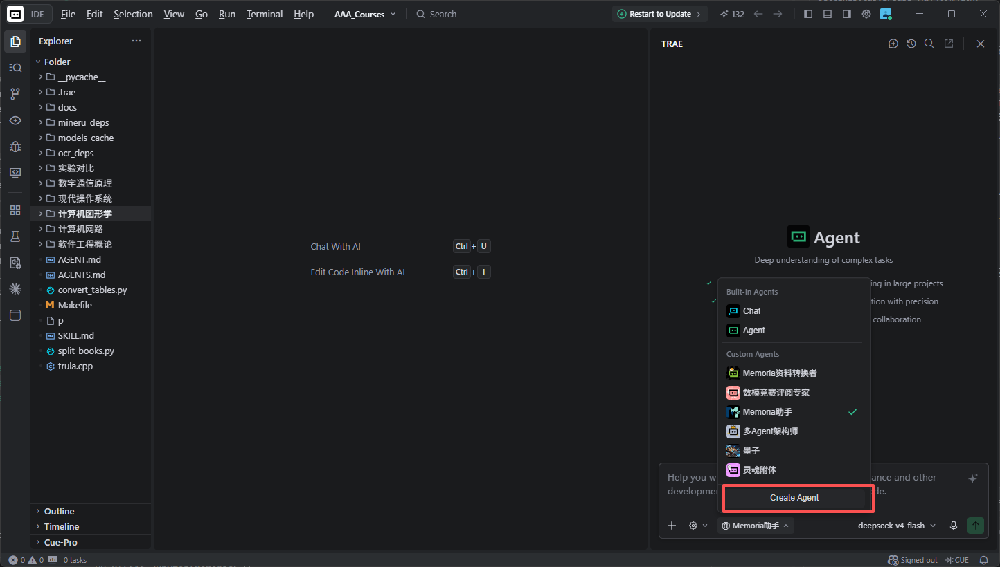
   > Trae 的 Create Agent：Name / Prompt（Paste Here）/ Smart Generate / Create。

6. **开始对话**：在 Agents 面板选中刚建好的智能体，直接说一句，例如：

   > 用我的词汇库开始今天的复习

   它会读 `vocab/`，按 `.memoria/agent/` 里的规范与复习排程脚本给你出题、讲解、批改。

   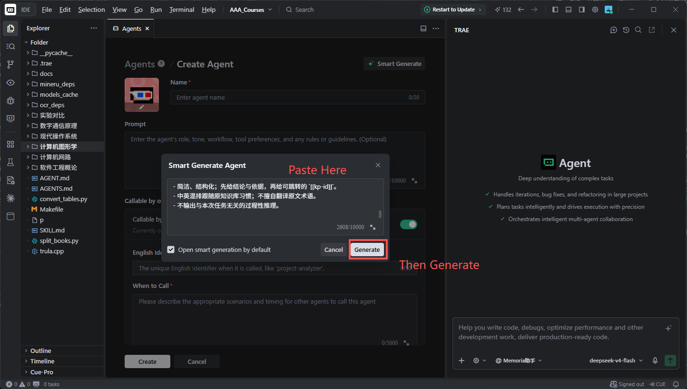
   > Trae 的 Agents 面板：选中自定义智能体。

   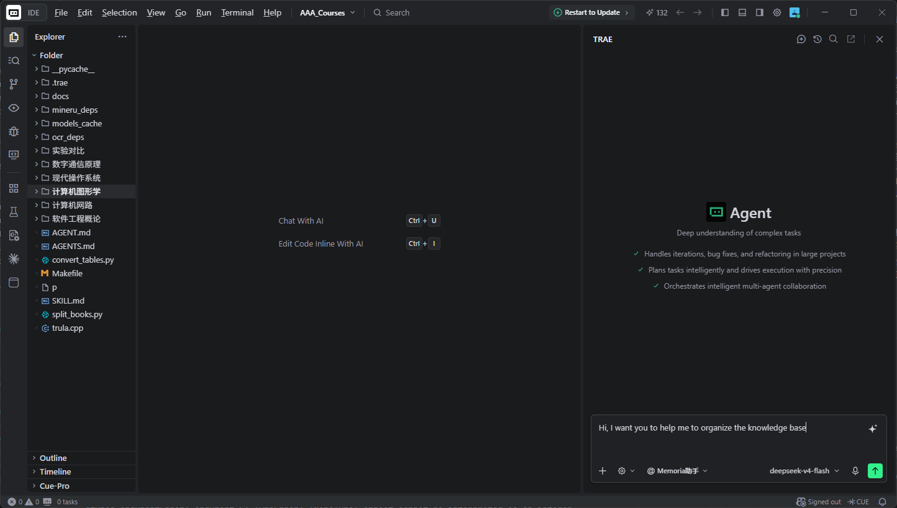
   > 开始对话（示例：让它帮你整理 / 复习本知识库）。

### 推荐提示词（试试这个）

词汇库自带一份**主动输出型**提示词：[`docs/example/AAA_Vocab/prompts/IELTS-vocab.md`](https://github.com/Fresh-Tim-Lam/Memoria/blob/main/docs/example/AAA_Vocab/prompts/IELTS-vocab.md)（在词汇库目录里直接打开也行）。

把它的内容贴给刚建好的智能体，然后说一句：

> 按这份提示词处理 `vocab/legacy.md`（或：帮我过一遍 `vocab/` 里的词）

> **它规定的是「输出格式」**：音标与听力陷阱 → 词典释义（英英 + 中文）→ 词族/搭配矩阵 → 近义词辨析矩阵 → 主动输出练习 → 复习标签。配合本仓库的词汇文件，就是一套可以直接开口练的素材。

### 捷径：不装 Memoria 也能用

智能体要读的那份指令也随 Memoria 仓库公开：`resources/agent-prompts/kb-agent.zh-CN.md`。直接在 Trae 里打开词汇库目录 → 新建自定义智能体 → 把这份指令粘进去即可。

- `resources/agent-prompts/kb-agent.zh-CN.md` —— 智能体指令（建智能体时粘一次）
- `resources/agent-prompts/kb-spec.zh-CN.md` —— 知识库编撰 / 维护规范（智能体每次会话先读）
- [`prompts/IELTS-vocab.md`](https://github.com/Fresh-Tim-Lam/Memoria/blob/main/docs/example/AAA_Vocab/prompts/IELTS-vocab.md) —— 推荐的主动输出提示词（在词汇库里）
- `docs/`（词汇库内）—— 词条格式 / 需求 / 智能体规格

> 用 Memoria 打开过本库的话，它会把工具包自动写到 `.memoria/agent/`（指令 + 规范 + `fsrs.py` 复习排程脚本）；这些属于运行时产物，不随仓库公开。

### 数据与隐私

- 全部本地：词汇是普通 Markdown 文件，学习记录在 `.memoria/`；没有账号、没有云同步。
- 想备份 / 同步：把词汇库目录用 Git 管起来推到自己账号，或直接网盘同步整个文件夹。
- 复习记录：`.memoria/agent/review/`。

### 常见问题

- **打开知识库后左侧是空的？** 确认选中的是 `AAA_Vocab` 目录本身（有 `vocab/`、`expressions/` 的那层），而不是它的上一级。
- **智能体答得太泛？** 先让它读 `.memoria/agent/kb-spec.zh-CN.md`，并明确「按推荐的 IELTS 提示词格式输出」。
- **想改词条格式？** 见词汇库里的 `docs/vocab_format.md` 与 `docs/format.md`。
- **中文站打不开 / 提示区域不支持？** trae.cn 有地域围栏（大陆版），境外访问用国际版 <https://www.trae.ai/>。

---

## English

### What you get

A conversational IELTS vocabulary coach: IPA & listening traps, dictionary-based definitions (English first, Chinese in parentheses, with Oxford / Cambridge / Collins attribution), word families and high-frequency collocations, a near-synonym confusion matrix, active-output drills (speaking / writing scenarios, gap-fill, word weaving), plus **spaced-repetition scheduling and learning records**. All data stays on your own disk.

### Prerequisites (two things)

| What | Where |
|---|---|
| **Trae** (AI IDE, free) | Download from the international site <https://www.trae.ai/> (this is the screenshot in step 1). Mainland China users should use the China edition <https://www.trae.cn/> instead — same capabilities and UX, different models and pricing |
| **Memoria** (editor for this knowledge base; portable on Windows) | Grab `Memoria-v*-win64.zip` (models bundled, fully offline) or `-lite.zip` (~34 MB, fetches models on first use) from [Releases](https://github.com/Fresh-Tim-Lam/Memoria/releases), unzip and run `Memoria.exe` |

> Only want the agent and don't want to install Memoria? See "Shortcut" below.

### Get the vocabulary library

This page only covers *how to use it*; the library itself lives in the Memoria repository: [`docs/example/AAA_Vocab`](https://github.com/Fresh-Tim-Lam/Memoria/tree/main/docs/example/AAA_Vocab). Clone or download it locally (cloning the whole Memoria repo is fine too) — that folder is what you open next.

### Steps

1. **Download and install Trae**: open <https://www.trae.ai/> → `Download TraeCode` → install and sign in.

   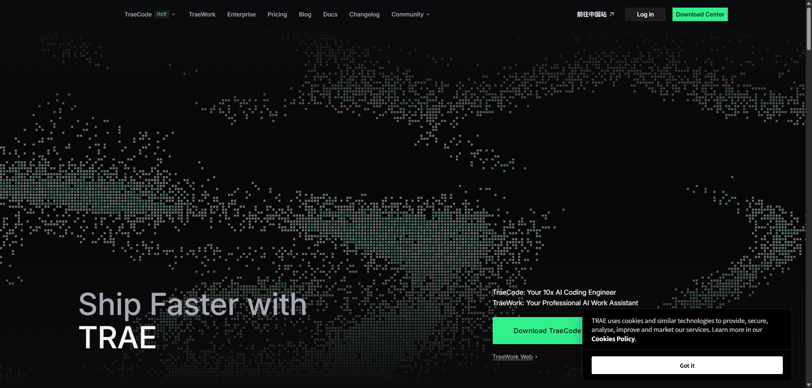
   > International site (trae.ai): `Download TraeCode` / `Download Center`.

2. **Open the vocabulary library in Memoria**: launch Memoria → `Open knowledge base` → pick the `AAA_Vocab` folder you just downloaded (it is the one containing `vocab/` and `expressions/`).

   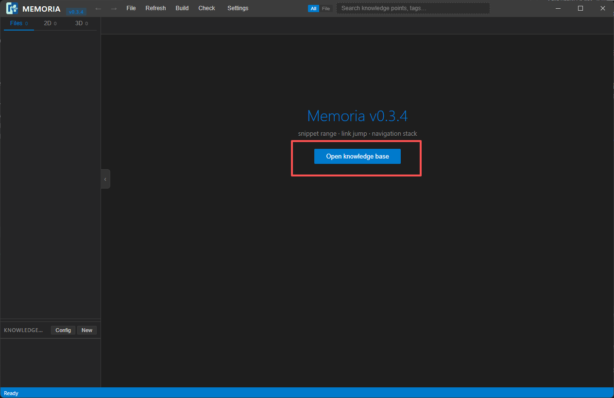
   > Memoria (English UI) before a knowledge base is opened.

   
   > The system "select folder" dialog — choose the AAA_Vocab folder.

3. **Create the Trae agent kit**: menu `File` → `Create Trae Agent`.

   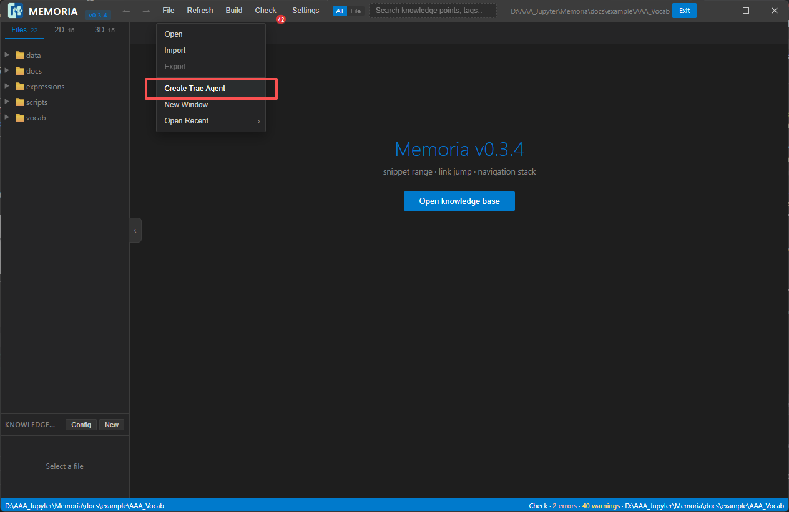
   > The `File` menu: Open / Import / Export / **Create Trae Agent** / New Window / Open Recent.

4. **Copy the instructions**: the "Agent kit generated" dialog writes the kit into `<kb>/.memoria/agent/` (idempotent — it never overwrites your review records). Click `Copy instructions` at the bottom right.

   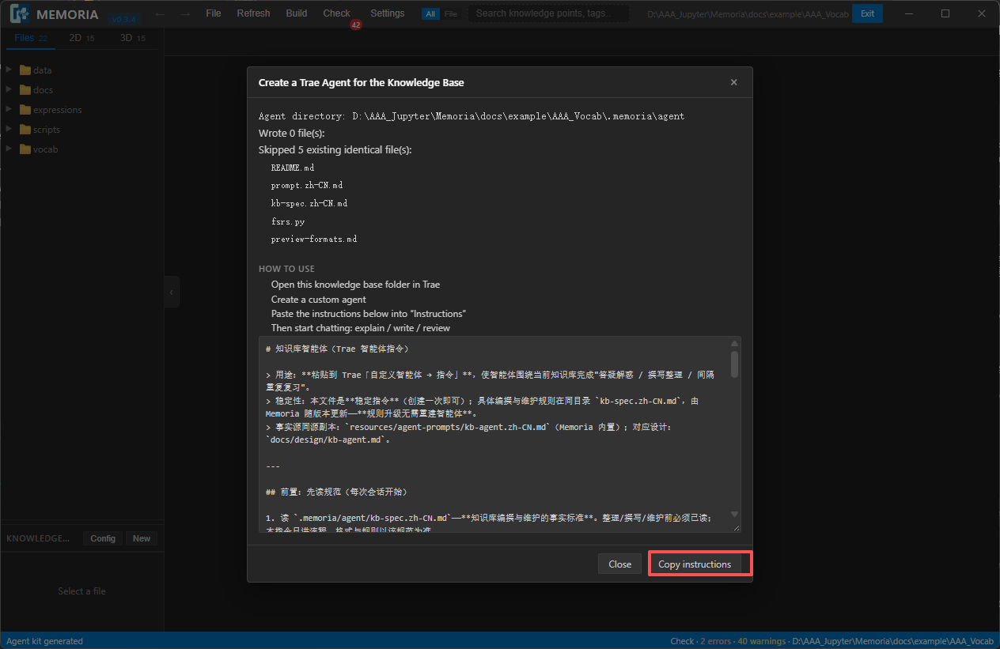
   > Shows the agent directory, written/skipped files, the 4 usage steps, the full instruction text and `Copy instructions`.

5. **Create a custom agent in Trae**: open this repository folder in Trae → click `Create Agent` in the Agents panel → name it anything (e.g. `IELTS Coach`) → paste the copied instructions into the `Prompt` box → Create. (Trae's own UI is English in both language versions, so the screenshot below is shared.)

   
   > Trae's Create Agent dialog: Name / Prompt (Paste Here) / Smart Generate / Create.

6. **Start chatting**: select the agent you just created in the Agents panel, then simply say:

   > Start today's review with my vocabulary library.

   It reads `vocab/` and follows the spec and review-scheduling script in `.memoria/agent/` to quiz, explain and grade you.

   
   > Trae's Agents panel with the custom agent selected.

   
   > Start the conversation (example: ask it to organize / review this knowledge base).

### Recommended prompt (try this one)

The library ships an **active-output** prompt: [`docs/example/AAA_Vocab/prompts/IELTS-vocab.md`](https://github.com/Fresh-Tim-Lam/Memoria/blob/main/docs/example/AAA_Vocab/prompts/IELTS-vocab.md) (you can also just open it inside the library folder).

Paste its content to the agent you just created, then say:

> Process `vocab/legacy.md` with this prompt (or: walk me through every word in `vocab/`)

> **What it defines is the output format**: pronunciation & listening traps → dictionary definitions (English + Chinese) → word family / collocation matrix → confusion matrix → active-output drills → revision tags. Together with the vocabulary files here it becomes material you can immediately practise out loud.

### Shortcut: use it without Memoria

The agent instructions also ship publicly with the Memoria repository: `resources/agent-prompts/kb-agent.zh-CN.md`. Open the library folder in Trae → create a custom agent → paste those instructions.

- `resources/agent-prompts/kb-agent.zh-CN.md` — agent instructions (paste once when creating the agent)
- `resources/agent-prompts/kb-spec.zh-CN.md` — knowledge-base authoring / maintenance spec (read at the start of every session)
- [`prompts/IELTS-vocab.md`](https://github.com/Fresh-Tim-Lam/Memoria/blob/main/docs/example/AAA_Vocab/prompts/IELTS-vocab.md) — the recommended active-output prompt (inside the library)
- `docs/` (inside the library) — entry format / requirements / agent spec

> If you *do* open this library in Memoria, it writes the kit into `.memoria/agent/` (instructions + spec + the `fsrs.py` review scheduler); those are runtime artifacts and are not published with this repository.

### Data & privacy

- Everything is local: vocabulary lives in plain Markdown files, learning records in `.memoria/`. No account, no cloud sync.
- To back up / sync: put the library folder under Git and push it to your own account, or sync the folder with any cloud drive.
- Review records: `.memoria/agent/review/`.

### Troubleshooting

- **Left pane is empty after opening the KB?** Make sure you picked the `AAA_Vocab` folder itself (the one containing `vocab/` and `expressions/`), not its parent.
- **Agent answers are too generic?** Ask it to read `.memoria/agent/kb-spec.zh-CN.md` first and to follow the recommended IELTS prompt format.
- **Want to change the entry format?** See `docs/vocab_format.md` and `docs/format.md` inside the library.
- **trae.cn unreachable / region blocked?** The China edition has a regional fence; use the international site <https://www.trae.ai/> from outside mainland China.

---

## 这一页是怎么部署的

本页的源文件在 Memoria 仓库的 `site/` 目录（本页 = `site/index.html`，配图在 `site/images/`），由 `.github/workflows/pages.yml` 用 GitHub Actions 发布 —— 该 workflow **只上传 `site/`**，所以 Memoria 自己的 `docs/` 与词汇库都不会跟着上站。

1. **一次性开启**：仓库 → **Settings → Pages** → `Source` 选 **GitHub Actions** → 保存。（这一步不会让你选分支/目录——路径由 workflow 里的 `path:` 决定。）
2. **日常更新**：只要 push 改动 `site/**`，Actions 自动重建；也可以在 Actions 页手动 `Run workflow`。
3. **站点地址**：`https://<owner>.github.io/Memoria/` —— 打开就是这份指引（Settings → Pages 顶部也会显示）。

### 想发布到自己的账号 / 自己的仓库？

这页是纯静态的（`index.html` + `images/`），换个仓库照样能发：

1. **新建仓库**：`New repository` → 选 **Public** → *不要*勾选 "Add a README" → Create。
2. **上传本目录内容**：网页版 `Add file` → `Upload files` 拖进去即可；命令行：

   ```bash
   cd <本目录>
   git init -b main
   git add .
   git commit -m "IELTS vocabulary knowledge base + setup guide"
   git remote add origin https://github.com/<你的用户名>/<仓库名>.git
   git push -u origin main
   ```
3. **开启 Pages**：**Settings → Pages** → `Source` 选 **Deploy from a branch** → `Branch` 选 **main** + **/ (root)** → `Save`。
4. **拿到网址**：`https://<你的用户名>.github.io/<仓库名>/`（等 1 分钟左右）。

> **如果 404 或页面没样式：** ① 仓库必须是 **Public**（私有仓库的 Pages 要付费计划）；② `index.html` 必须在**站点根**（本仓库里是 `site/index.html`，与 `site/images/` 同级）；③ 用 Actions 发布时，Pages 的 `Source` 必须是 **GitHub Actions**（不是 "Deploy from a branch"）；④ 首次部署有时要等 1–2 分钟。

---

*本文件 = `index.html` 的 Markdown 版；图片在 `images/`。*
